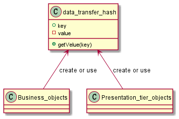

## Also known as

* data transfer hash

## Intent

Providing a  class called data transfer hash, in order to send message between other class.

## Explanation


> Data transfer hashes may be implemented as simple hash tables (or HashMaps). 
A more robust implementation uses a container object to hold the hash, as well as identifying information, type-safe data retrieval methods, and well-known keys.
> https://www.oreilly.com/library/view/j2ee-design-patterns/0596004273/re12.html

**Programmatic Example**

We have an function `create` and `get`.

```java
public static void main( String[] args )
    {
        Hash hash= new Hash();
        Business business=new Business();
        Presentation presentation=new Presentation();
        business.create("a", "aaa", hash);
        System.out.println("Business create "+"aaa");
        business.create("b", "bbb", hash);
        System.out.println("Business create "+"bbb");
        business.create("c", "ccc", hash);
        System.out.println("Business create "+"ccc");

        presentation.get("a", hash);
        System.out.println("Presentation heard "+presentation.get("a", hash));
        presentation.get("b", hash);
        System.out.println("Presentation heard "+presentation.get("b", hash));
    }

```


Program output:

```java
Business create aaa
Business create bbb
Business create ccc
Presentation heard aaa
Presentation heard bbb
```

## Class Diagram



## Applicability

Use the data transfer hash pattern when you only care about the creation of a object, not how to create 
and manage it.

* Not only string but other types canbe value but key must be string

