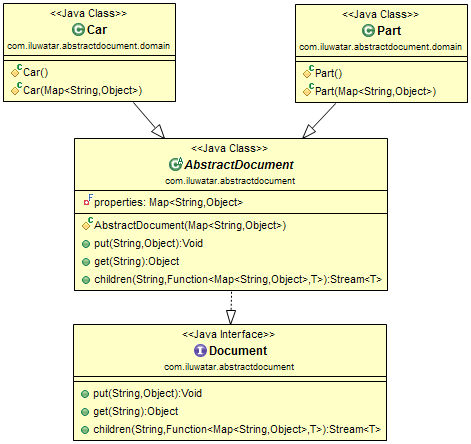

## Intent
Achieve flexibility of untyped languages and keep the type-safety 

## Applicability
Use the Abstract Document Pattern when

* there is a need to add new properties on the fly
* you want a flexible way to organize domain in tree like structure
* you want more loosely coupled system

## Credits

* [Wikipedia: Abstract Document Pattern](https://en.wikipedia.org/wiki/Abstract_Document_Pattern)
* [Martin Fowler: Dealing with properties](http://martinfowler.com/apsupp/properties.pdf)