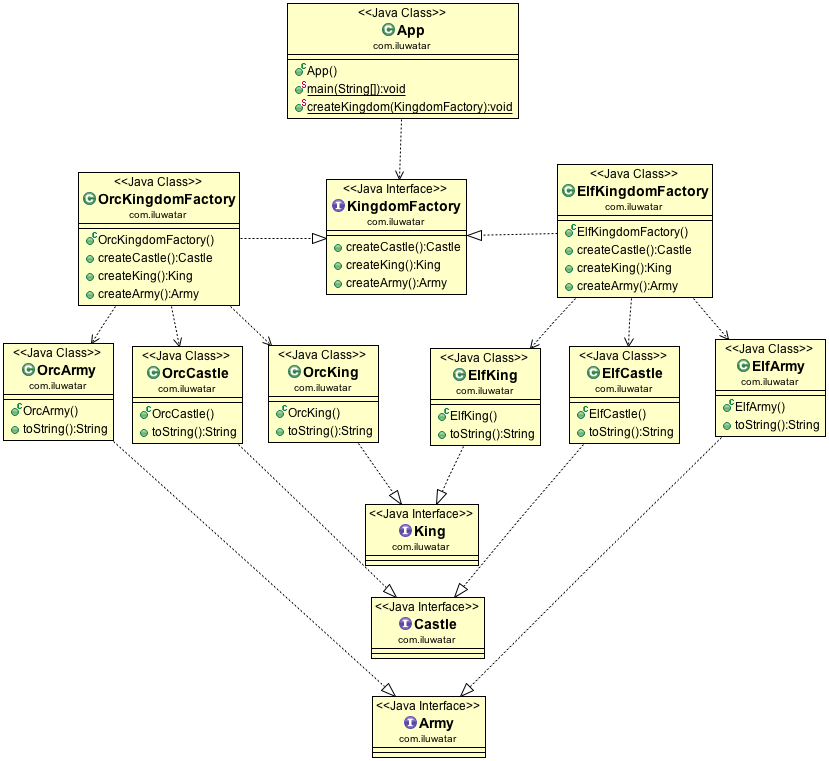

## Also known as
Kit

## Intent
Provide an interface for creating families of related or dependent
objects without specifying their concrete classes.

## Applicability
Use the Abstract Factory pattern when

* a system should be independent of how its products are created, composed and represented
* a system should be configured with one of multiple families of products
* a family of related product objects is designed to be used together, and you need to enforce this constraint
* you want to provide a class library of products, and you want to reveal just their interfaces, not their implementations

## Real world examples

* [javax.xml.parsers.DocumentBuilderFactory](http://docs.oracle.com/javase/8/docs/api/javax/xml/parsers/DocumentBuilderFactory.html)

## Credits

* [Design Patterns: Elements of Reusable Object-Oriented Software](http://www.amazon.com/Design-Patterns-Elements-Reusable-Object-Oriented/dp/0201633612)
