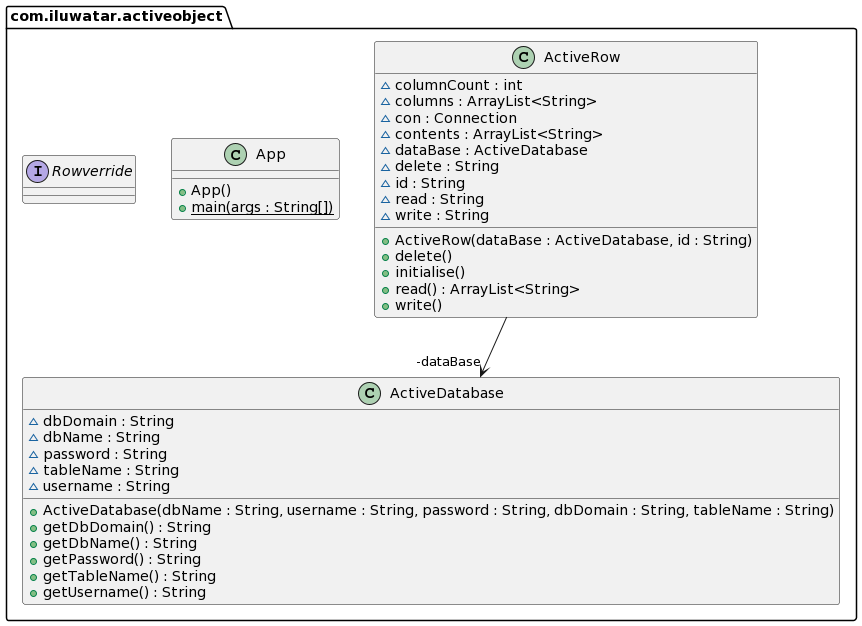

**Intent:** Active record is an object that wraps a row in a database table or view,
 encapsulates the database access, and adds domain logic on that data. Active Record
 uses the most obvious approach, putting data access logic in the domain object.

**Applicability:** Use active record pattern when

* objects correspond directly to the database tables
* business logic is not too complex

**Real world examples:**

* [ActiveJDBC](https://en.wikipedia.org/wiki/ActiveJDBC)