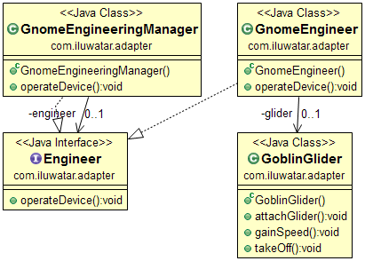

## Also known as
Wrapper

## Intent
Convert the interface of a class into another interface the clients
expect. Adapter lets classes work together that couldn't otherwise because of
incompatible interfaces.

## Applicability
Use the Adapter pattern when

* you want to use an existing class, and its interface does not match the one you need
* you want to create a reusable class that cooperates with unrelated or unforeseen classes, that is, classes that don't necessarily have compatible interfaces
* you need to use several existing subclasses, but it's impractical to adapt their interface by subclassing every one. An object adapter can adapt the interface of its parent class.

## Real world examples

* [java.util.Arrays#asList()](http://docs.oracle.com/javase/8/docs/api/java/util/Arrays.html#asList%28T...%29)
* [java.util.Collections#list()](https://docs.oracle.com/javase/8/docs/api/java/util/Collections.html#list-java.util.Enumeration-)
* [java.util.Collections#enumeration()](https://docs.oracle.com/javase/8/docs/api/java/util/Collections.html#enumeration-java.util.Collection-)
* [javax.xml.bind.annotation.adapters.XMLAdapter](http://docs.oracle.com/javase/8/docs/api/javax/xml/bind/annotation/adapters/XmlAdapter.html#marshal-BoundType-)

## Credits

* [Design Patterns: Elements of Reusable Object-Oriented Software](http://www.amazon.com/Design-Patterns-Elements-Reusable-Object-Oriented/dp/0201633612)
* [J2EE Design Patterns](http://www.amazon.com/J2EE-Design-Patterns-William-Crawford/dp/0596004273/ref=sr_1_2)
