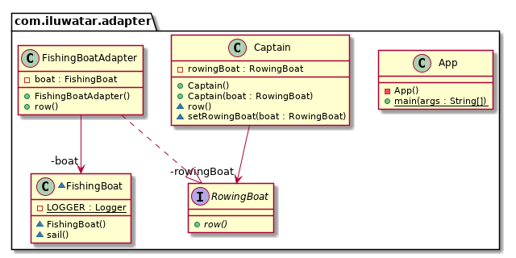

## Also known as
Wrapper

## Intent
Convert the interface of a class into another interface the clients expect. Adapter lets classes work together that 
couldn't otherwise because of incompatible interfaces.

## Explanation

Real world example

> Consider that you have some pictures in your memory card and you need to transfer them to your computer. In order to transfer them you need some kind of adapter that is compatible with your computer ports so that you can attach memory card to your computer. In this case card reader is an adapter.
> Another example would be the famous power adapter; a three legged plug can't be connected to a two pronged outlet, it needs to use a power adapter that makes it compatible with the two pronged outlet.
> Yet another example would be a translator translating words spoken by one person to another

In plain words

> Adapter pattern lets you wrap an otherwise incompatible object in an adapter to make it compatible with another class.

Wikipedia says

> In software engineering, the adapter pattern is a software design pattern that allows the interface of an existing class to be used as another interface. It is often used to make existing classes work with others without modifying their source code.

**Programmatic Example**

Consider a captain that can only use rowing boats and cannot sail at all.

First we have interfaces `RowingBoat` and `FishingBoat`

```java
public interface RowingBoat {
  void row();
}

@Slf4j
public class FishingBoat {
  public void sail() {
    LOGGER.info("The fishing boat is sailing");
  }
}
```

And captain expects an implementation of `RowingBoat` interface to be able to move

```java
public class Captain {

  private final RowingBoat rowingBoat;
  // default constructor and setter for rowingBoat
  public Captain(RowingBoat rowingBoat) {
    this.rowingBoat = rowingBoat;
  }

  public void row() {
    rowingBoat.row();
  }
}
```

Now let's say the pirates are coming and our captain needs to escape but there is only fishing boat available. We need to create an adapter that allows the captain to operate the fishing boat with his rowing boat skills.

```java
@Slf4j
public class FishingBoatAdapter implements RowingBoat {

  private final FishingBoat boat;

  public FishingBoatAdapter() {
    boat = new FishingBoat();
  }

  @Override
  public void row() {
    boat.sail();
  }
}
```

And now the `Captain` can use the `FishingBoat` to escape the pirates.

```java
var captain = new Captain(new FishingBoatAdapter());
captain.row();
```

## Class diagram


## Applicability
Use the Adapter pattern when

* you want to use an existing class, and its interface does not match the one you need
* you want to create a reusable class that cooperates with unrelated or unforeseen classes, that is, classes that don't necessarily have compatible interfaces
* you need to use several existing subclasses, but it's impractical to adapt their interface by subclassing every one. An object adapter can adapt the interface of its parent class.
* most of the applications using third party libraries use adapters as a middle layer between the application and the 3rd party library to decouple the application from the library. If another library has to be used only an adapter for the new library is required without having to change the application code.

## Consequences:
Class and object adapters have different trade-offs. A class adapter

*	adapts Adaptee to Target by committing to a concrete Adaptee class. As a consequence, a class adapter won’t work when we want to adapt a class and all its subclasses.
*	let’s Adapter override some of Adaptee’s behavior, since Adapter is a subclass of Adaptee.
*	introduces only one object, and no additional pointer indirection is needed to get to the adaptee.

An object adapter	

*	let’s a single Adapter work with many Adaptees—that is, the Adaptee itself and all of its subclasses (if any). The Adapter can also add functionality to all Adaptees at once.
*	makes it harder to override Adaptee behavior. It will require subclassing Adaptee and making Adapter refer to the subclass rather than the Adaptee itself.


## Real world examples

* [java.util.Arrays#asList()](http://docs.oracle.com/javase/8/docs/api/java/util/Arrays.html#asList%28T...%29)
* [java.util.Collections#list()](https://docs.oracle.com/javase/8/docs/api/java/util/Collections.html#list-java.util.Enumeration-)
* [java.util.Collections#enumeration()](https://docs.oracle.com/javase/8/docs/api/java/util/Collections.html#enumeration-java.util.Collection-)
* [javax.xml.bind.annotation.adapters.XMLAdapter](http://docs.oracle.com/javase/8/docs/api/javax/xml/bind/annotation/adapters/XmlAdapter.html#marshal-BoundType-)


## Credits

* [Design Patterns: Elements of Reusable Object-Oriented Software](https://www.amazon.com/gp/product/0201633612/ref=as_li_tl?ie=UTF8&camp=1789&creative=9325&creativeASIN=0201633612&linkCode=as2&tag=javadesignpat-20&linkId=675d49790ce11db99d90bde47f1aeb59)
* [J2EE Design Patterns](https://www.amazon.com/gp/product/0596004273/ref=as_li_tl?ie=UTF8&camp=1789&creative=9325&creativeASIN=0596004273&linkCode=as2&tag=javadesignpat-20&linkId=48d37c67fb3d845b802fa9b619ad8f31)
* [Head First Design Patterns: A Brain-Friendly Guide](https://www.amazon.com/gp/product/0596007124/ref=as_li_tl?ie=UTF8&camp=1789&creative=9325&creativeASIN=0596007124&linkCode=as2&tag=javadesignpat-20&linkId=6b8b6eea86021af6c8e3cd3fc382cb5b)
* [Refactoring to Patterns](https://www.amazon.com/gp/product/0321213351/ref=as_li_tl?ie=UTF8&camp=1789&creative=9325&creativeASIN=0321213351&linkCode=as2&tag=javadesignpat-20&linkId=2a76fcb387234bc71b1c61150b3cc3a7)
