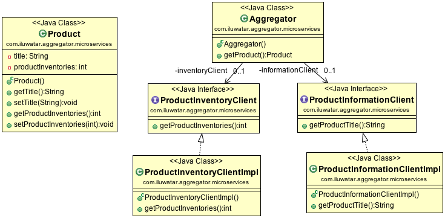

## Intent

The user makes a single call to the Aggregator, and the aggregator then calls each relevant microservice and collects
the data, apply business logic to it, and further publish is as a REST Endpoint.
More variations of the aggregator are: 
- Proxy Microservice Design Pattern: A different microservice is called upon the business need. 
- Chained Microservice Design Pattern: In this case each microservice is dependent/ chained to a series 
of other microservices.

## Class diagram

## Applicability

Use the Aggregator Microservices pattern when you need a unified API for various microservices, regardless the client device.

## Credits

* [Microservice Design Patterns](http://blog.arungupta.me/microservice-design-patterns/)
