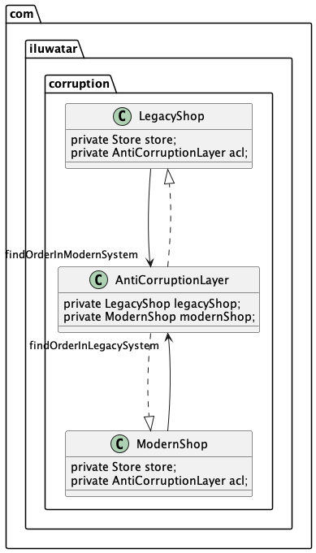

## Also known as

* ACL
* Interface layer
* Translation layer

## Intent

Implement a façade or adapter layer between different subsystems that don't share the same semantics. It translates between different data formats and systems, ensuring that the integration between systems does not lead to corruption of business logic or data integrity.

## Explanation

Real-world example

> Imagine a large retail company transitioning its inventory management system from an old legacy software to a new modern platform. The legacy system has been in use for decades and contains complex business rules and data formats that are incompatible with the new system. Instead of directly connecting the new system to the legacy one, the company implements an Anti-Corruption Layer (ACL).
> 
> The ACL acts as a mediator, translating and adapting data between the two systems. When the new system requests inventory data, the ACL translates the request into a format the legacy system understands, retrieves the data, and then translates it back into a format suitable for the new system. This approach ensures that the new system remains unaffected by the intricacies of the legacy system, preventing corruption of data and business logic while facilitating a smooth transition.

In plain words

> The Anti-Corruption Layer design pattern protects a system from the complexities and changes of external systems by providing an intermediary translation layer.

[Microsoft's documentation](https://learn.microsoft.com/en-us/azure/architecture/patterns/anti-corruption-layer) says

> Implement a façade or adapter layer between different subsystems that don't share the same semantics. This layer translates requests that one subsystem makes to the other subsystem. Use this pattern to ensure that an application's design is not limited by dependencies on outside subsystems. This pattern was first described by Eric Evans in Domain-Driven Design.

**Programmatic Example**

The example shows why the anti-corruption layer is needed.

Here are 2 shop-ordering systems: `Legacy` and `Modern`.

The aforementioned systems have different domain models and have to operate simultaneously. Since they work independently the orders can come either from the `Legacy` or `Modern` system. Therefore, the system that receives the legacyOrder needs to check if the legacyOrder is valid and not present in the other system. Then it can place the legacyOrder in its own system.

But for that, the system needs to know the domain model of the other system and to avoid that, the anti-corruption layer(ACL) is introduced. The ACL is a layer that translates the domain model of the `Legacy` system to the domain model of the `Modern` system and vice versa. Also, it hides all other operations with the other system, uncoupling the systems.

Domain model of the `Legacy` system:

```java
public class LegacyOrder {
    private String id;
    private String customer;
    private String item;
    private String qty;
    private String price;
}
```

Domain model of the `Modern` system:

```java
public class ModernOrder {
    private String id;
    private Customer customer;

    private Shipment shipment;

    private String extra;
}

public class Customer {
    private String address;
}

public class Shipment {
    private String item;
    private String qty;
    private String price;
}
```

Anti-corruption layer:

```java
public class AntiCorruptionLayer {

    @Autowired
    private ModernShop modernShop;

    @Autowired
    private LegacyShop legacyShop;

    public Optional<LegacyOrder> findOrderInModernSystem(String id) {
        return modernShop.findOrder(id).map(o -> /* map to legacyOrder*/);
    }

    public Optional<ModernOrder> findOrderInLegacySystem(String id) {
        return legacyShop.findOrder(id).map(o -> /* map to modernOrder*/);
    }

}
```

The connection between the systems. Wherever the `Legacy` or `Modern` system needs to communicate with the counterpart the ACL needs to be used to avoid corrupting the current domain model. The example below shows how the `Legacy` system places an order with a validation from the `Modern` system.

```java
public class LegacyShop {
    @Autowired
    private AntiCorruptionLayer acl;

    public void placeOrder(LegacyOrder legacyOrder) throws ShopException {

        String id = legacyOrder.getId();

        Optional<LegacyOrder> orderInModernSystem = acl.findOrderInModernSystem(id);

        if (orderInModernSystem.isPresent()) {
            // order is already in the modern system
        } else {
            // place order in the current system
        }
    }
}
```

## Class diagram



## Applicability

Use this pattern when:

* A migration is planned to happen over multiple stages, but integration between new and legacy systems needs to be maintained
* Two or more subsystems have different semantics, but still need to communicate
* When integrating with legacy systems or external systems where direct integration might pollute the domain model of the new system
* In scenarios where different subsystems within a larger system use different data formats or structures
* When there is a need to ensure loose coupling between different subsystems or external services to facilitate easier maintenance and scalability

## Tutorials

* [Anti-Corruption Layer (Microsoft)](https://learn.microsoft.com/en-us/azure/architecture/patterns/anti-corruption-layer)
* [Anti-Corruption Layer Pattern (Amazon)](https://docs.aws.amazon.com/prescriptive-guidance/latest/cloud-design-patterns/acl.html)

## Known Uses

* Microservices architectures where individual services must communicate without being tightly coupled to each other’s data schemas
* Enterprise systems integration, especially when integrating modern systems with legacy systems
* In bounded contexts within Domain-Driven Design (DDD) to maintain the integrity of a domain model when interacting with external systems or subsystems

## Consequences

Benefits:

* Protects the integrity of the domain model by providing a clear boundary
* Promotes loose coupling between systems, making the system more resilient to changes in external systems
* Facilitates cleaner and more maintainable code by isolating integration code from business logic

Trade-offs:

* Introduces additional complexity and potential performance overhead due to the translation process
* Requires extra effort in design and implementation to ensure the layer is effective without becoming a bottleneck
* Can lead to duplication of models if not carefully managed

## Related Patterns

* [Adapter](https://java-design-patterns.com/patterns/adapter/): The Anti-Corruption Layer can be implemented using the Adapter pattern to translate between different data formats or structures
* [Facade](https://java-design-patterns.com/patterns/facade/): The Anti-Corruption Layer can be seen as a specialized form of the Facade pattern that is used to isolate different subsystems
* [Gateway](https://java-design-patterns.com/patterns/gateway/): The Anti-Corruption Layer can be used as a Gateway to external systems to provide a unified interface

## Credits

* [Domain-Driven Design: Tackling Complexity in the Heart of Software](https://amzn.to/3vptcJz)
* [Implementing Domain-Driven Design](https://amzn.to/3ISOSRA)
* [Patterns of Enterprise Application Architecture](https://amzn.to/3WfKBPR)
