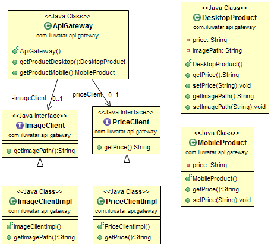

## Intent

The API Gateway design pattern aims to provide a unified interface to a set of microservices. It acts as a single entry point for clients, routing requests to the appropriate microservices and aggregating results, thereby simplifying the client-side code.

## Also known as

* API Facade
* Backend for Frontends (BFF)

## Explanation

Real world example

> In a large e-commerce platform, an API Gateway is used as the single entry point for all client requests. When a user visits the site or uses the mobile app, their requests for product information, user authentication, order processing, and payment are all routed through the API Gateway. The gateway handles tasks such as user authentication, rate limiting to prevent abuse, and logging for monitoring purposes. This setup simplifies the client interface and ensures that all backend microservices, like the product catalog service, user service, order service, and payment service, can evolve independently without affecting the client directly. This also enhances security by providing a centralized point to enforce policies and monitor traffic.

In plain words

> For a system implemented using microservices architecture, API Gateway is the single entry point that aggregates the calls to the individual microservices.

Wikipedia says

> API Gateway is a server that acts as an API front-end, receives API requests, enforces throttling and security policies, passes requests to the back-end service and then passes the response back to the requester. A gateway often includes a transformation engine to orchestrate and modify the requests and responses on the fly. A gateway can also provide functionality such as collecting analytics data and providing caching. The gateway can provide functionality to support authentication, authorization, security, audit and regulatory compliance.

**Programmatic Example**

This implementation shows what the API Gateway pattern could look like for an e-commerce site. The`ApiGateway` makes calls to the Image and Price microservices using the `ImageClientImpl` and `PriceClientImpl` respectively. Customers viewing the site on a desktop device can see both price information and an image of a product, so the `ApiGateway` calls both of the microservices and aggregates the data in the `DesktopProduct` model. However, mobile users only see price information; they do not see a product image. For mobile users, the `ApiGateway` only retrieves price information, which it uses to populate the `MobileProduct`.

Here's the Image microservice implementation.

```java
public interface ImageClient {
    String getImagePath();
}

public class ImageClientImpl implements ImageClient {
    @Override
    public String getImagePath() {
        var httpClient = HttpClient.newHttpClient();
        var httpGet = HttpRequest.newBuilder()
                .GET()
                .uri(URI.create("http://localhost:50005/image-path"))
                .build();

        try {
            var httpResponse = httpClient.send(httpGet, BodyHandlers.ofString());
            return httpResponse.body();
        } catch (IOException | InterruptedException e) {
            e.printStackTrace();
        }

        return null;
    }
}
```

Here's the Price microservice implementation.

```java
public interface PriceClient {
    String getPrice();
}

public class PriceClientImpl implements PriceClient {

    @Override
    public String getPrice() {
        var httpClient = HttpClient.newHttpClient();
        var httpGet = HttpRequest.newBuilder()
                .GET()
                .uri(URI.create("http://localhost:50006/price"))
                .build();

        try {
            var httpResponse = httpClient.send(httpGet, BodyHandlers.ofString());
            return httpResponse.body();
        } catch (IOException | InterruptedException e) {
            e.printStackTrace();
        }

        return null;
    }
}
```

Here we can see how API Gateway maps the requests to the microservices.

```java
public class ApiGateway {

    @Resource
    private ImageClient imageClient;

    @Resource
    private PriceClient priceClient;

    @RequestMapping(path = "/desktop", method = RequestMethod.GET)
    public DesktopProduct getProductDesktop() {
        var desktopProduct = new DesktopProduct();
        desktopProduct.setImagePath(imageClient.getImagePath());
        desktopProduct.setPrice(priceClient.getPrice());
        return desktopProduct;
    }

    @RequestMapping(path = "/mobile", method = RequestMethod.GET)
    public MobileProduct getProductMobile() {
        var mobileProduct = new MobileProduct();
        mobileProduct.setPrice(priceClient.getPrice());
        return mobileProduct;
    }
}
```

## Class diagram



## Applicability

* When building a microservices architecture, and there's a need to abstract the complexity of microservices from the client.
* When multiple microservices need to be consumed in a single request.
* For authentication, authorization, and security enforcement at a single point.
* To optimize communication between clients and services, especially in a cloud environment.

## Tutorials

* [Exploring the New Spring Cloud Gateway (Baeldung)](https://www.baeldung.com/spring-cloud-gateway)
* [Spring Cloud - Gateway(tutorialspoint)](https://www.tutorialspoint.com/spring_cloud/spring_cloud_gateway.htm)
* [Getting Started With Spring Cloud Gateway (DZone)](https://dzone.com/articles/getting-started-with-spring-cloud-gateway)

## Consequences

Benefits:

* Decouples client from microservices, allowing services to evolve independently.
* Simplifies client by aggregating requests to multiple services.
* Centralized location for cross-cutting concerns like security, logging, and rate limiting.
* Potential for performance optimizations like caching and request compression.

Trade-offs:

* Introduces a single point of failure, although this can be mitigated with high availability setups.
* Can become a bottleneck if not properly scaled.
* Adds complexity in terms of deployment and management.

## Known uses

* E-commerce platforms where multiple services (product info, pricing, inventory) are aggregated for a single view.
* Mobile applications that consume various backend services but require a simplified interface for ease of use.
* Cloud-native applications that leverage multiple microservices architectures.

## Related patterns

* [Aggregator Microservice](https://java-design-patterns.com/patterns/aggregator-microservices/) - The API Gateway pattern is often used in conjunction with the Aggregator Microservice pattern to provide a unified interface to a set of microservices.
* [Circuit Breaker](https://java-design-patterns.com/patterns/circuit-breaker/) - API Gateways can use the Circuit Breaker pattern to prevent cascading failures when calling multiple microservices.
* [Proxy](https://java-design-patterns.com/patterns/proxy/) - The API Gateway pattern is a specialized form of the Proxy pattern, where the gateway acts as a single entry point for clients, routing requests to the appropriate microservices and aggregating results.

## Credits

* [Building Microservices](https://amzn.to/3UACtrU)
* [Cloud Native Patterns: Designing change-tolerant software](https://amzn.to/3uV12WN)
* [Designing Data-Intensive Applications](https://amzn.to/3PfRk7Y)
* [Microservices Patterns: With examples in Java](https://amzn.to/3UyWD5O)
* [API Gateway (microservices.io)](http://microservices.io/patterns/apigateway.html)
* [Building Microservices: Using an API Gateway (nginx)](https://www.nginx.com/blog/building-microservices-using-an-api-gateway/)
