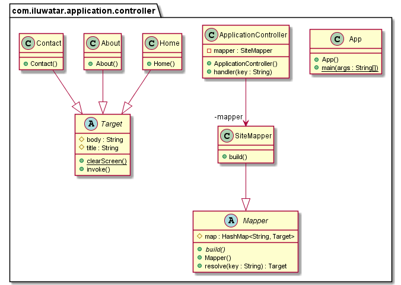

## Intent
Separate request management behaviors from a Front Controller and encapsulate
action management and view management in an Application Controller class.
The Application Controller will match designated commands for execution
against a model and will invoke the corresponding view to use based on the 
application context.

## Class diagram

## Applicability
Use the Application Controller pattern when

* You want to centralize and modularize action and view management

## Credits

* [Martin Fowler - Application Controller](https://martinfowler.com/eaaCatalog/applicationController.html)
* [Core J2EE Patterns](http://www.corej2eepatterns.com/ApplicationController.htm)
* [Core J2EE Patterns](https://www.amazon.com/Core-J2EE-Patterns-Practices-Strategies/dp/0131422464/)
