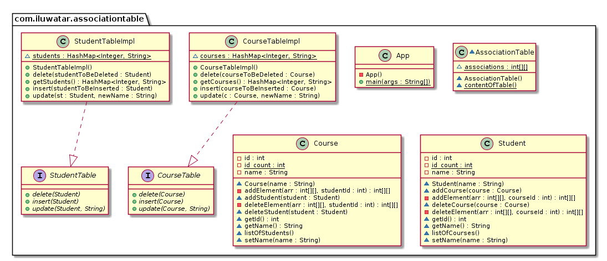

## Intent
The basic idea behind Association Table Mapping is using a link table to store the association. This table has only the foreign key IDs for the two tables that are linked together, 
it has one row for each pair of associated objects.
The link table has no corresponding in-memory object. As a result, it has no ID. Its primary key is the compound of the two primary keys of the tables that are associated.

## Class diagram

## Real world examples
* For example, a many-to-many relationship exists between employees and skills: an employee can have multiple skills, and skill can be associated with many employees.
The primary key Skill ID uniquely identifies each skill in the skills table. The primary key Employee ID uniquely identifies each employee in the Employees table. The 
skill-employees (association) table contains the foreign keys skill ID and employee ID.

## Credits
* [Association Table Mapping Pattern](https://ramj2ee.blogspot.com/2013/08/association-table-mapping-design-pattern.html)

