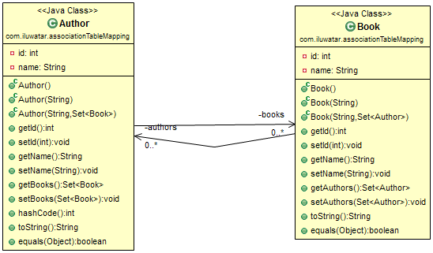
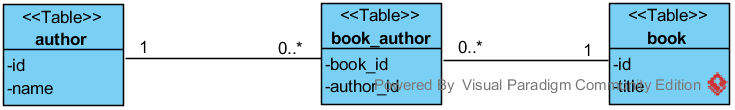

## Intent
The Association Table Mapping is pattern used for mapping many-to-many relationship between two classes into relational database. The relationship is represented as additional table containing two keys. The first key references to book and the second to author. 

## Applicability
Use the Association Table Mapping pattern when

* you have many-to-many association between objects, which you want to map into database

## Credits

* [Association Table Mapping](http://martinfowler.com/eaaCatalog/associationTableMapping.html)
