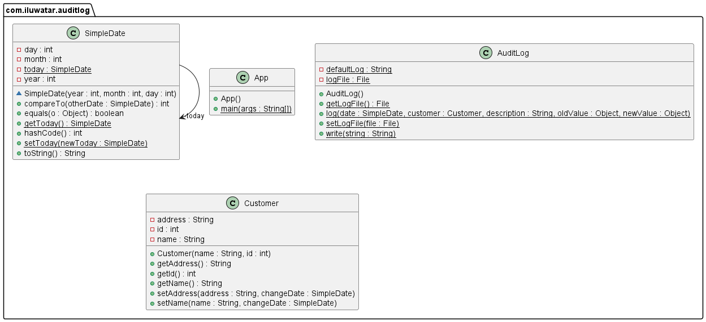

## Name / classification

Audit Log.

## Also known as

Audit trail.

## Intent

Have a simple log of changes, intended to be easily written and non-intrusive.

## Explanation

Real-world example

> A customer changes their address, we want an independent record that this change occured, and 
> when it has occurred.

In plain words

> Whenever some property changes, log the change in a file.

Wikipedia says

> An audit trail (also called audit log) is a security-relevant chronological record, set of 
> records, and/or destination and source of records that provide documentary evidence of the 
> sequence of activities that have affected at any time a specific operation, procedure, event, 
> or device.  

**Programmatic Example**:

In this example implementation, `Customer` is an object that is being logged by an Audit Log, 
`AuditLog`, and changes to the `Customer`'s address, or name will be logged by the logger.

Here are the relevant parts of `Customer`,

```java
public class Customer {
  private String address;
  private String name;
  private final int id;

  public Customer(String name, int id) {
    this.name = name;
    this.id = id;
  }

  public void setAddress(String address, SimpleDate changeDate) {
    AuditLog.log(changeDate, this, "change of address", this.address, address);
    this.address = address;
  }

  public void setName(String name, SimpleDate changeDate) {
    AuditLog.log(changeDate, this, "change of name", this.name, name);
    this.name = name;
  }
}
```

And here are the relevant parts of `AuditLog`

```java
public class AuditLog {
  private static File logFile;

  public static void write(String string) throws IOException {
    Files.write(getLogFile().toPath(), string.getBytes(StandardCharsets.UTF_8),
            StandardOpenOption.APPEND);
  }

  public static void log(SimpleDate date, Customer customer, String description, Object oldValue,
                         Object newValue) {
    try {
      write(SimpleDate.getToday().toString() + "\t" + customer.getId() + "\t" + customer.getName()
              + "\t" + description + "\t" + oldValue + "\t" + newValue + "\t"
              + date.toString() + "\n");
    } catch (IOException e) {
      e.printStackTrace();
    }

  }
}
```

Then, with an empty log file, we have an application using the log.
```java
  public static void main(String[] args) {
    SimpleDate.setToday(new SimpleDate(2000, 5, 7));
    Customer john = new Customer("John Smith", 1);

    john.setAddress("1234 Street St", new SimpleDate(1999, 1, 4));

    // change dates to simulate time passing
    SimpleDate.setToday(new SimpleDate(2001, 6, 3));

    // note that john's address and name have changed in the past
    john.setName("John Johnson", new SimpleDate(2001, 4, 17));
    john.setAddress("4321 House Ave", new SimpleDate(2000, 8, 23));
  }
```

Then, the formatted log file after this has been run is 
```
2000-05-07  1  John Smith  change of address  null            1234 Street St  1999-01-04
2001-06-03  1  John Smith  change of name     John Smith      John Dough      2001-04-17
2001-06-03  1  John Dough  change of address  1234 Street St  4321 House Ave  2000-08-23
```

## Class diagram



## Applicability

Use the Audit Log pattern when 
* You want to track changes to temporal properties in your implementation

## Tutorials

[Creating an Audit Trail for Spring Controllers](https://www.stackhawk.com/blog/creating-an-audit-trail-for-spring-controllers/)

## Known uses

[Log4j Audit](https://logging.apache.org/log4j-audit/latest/index.html)

## Consequences
Pros:
* Have a simple log of temporal variable changes.

Cons:
* Is difficult to process, the tighter the accessing of temporal information is integrated, the 
  less useful Audit Logs are.

## Related patterns
* [Temporal Property](https://martinfowler.com/eaaDev/TemporalProperty.html)
* [Temporal Object](https://martinfowler.com/eaaDev/TemporalObject.html)
* [Effectivity](https://martinfowler.com/eaaDev/Effectivity.html)

## Credits
* [Martin Fowler](https://martinfowler.com/eaaDev/AuditLog.html)
