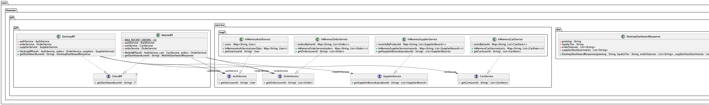

## Also known as

* Backend For Frontend
* BFF Pattern

## Intent of Backends For Frontends Pattern

Provide each client-side application (mobile, desktop, chatbot, and so on) with its own dedicated
backend service, so every client gets an API shaped exactly for its own needs instead of sharing
one general-purpose backend with every other client.

## Detailed Explanation of Backends For Frontends Pattern with Real-World Examples

Real-world example

> Imagine a retail company whose mobile app, desktop back-office tool, and support chatbot all
> need customer, cart, order and supplier data -- but a phone screen wants a short summary while
> the back-office desktop tool wants full order and stock detail. Rather than exposing one shared
> API that every client has to filter or over-fetch from, the company stands up a small BFF service
> for the mobile clients and a separate BFF service for the intranet clients. Each BFF calls only
> the downstream microservices its client needs and returns a payload shaped for that client.

In plain words

> Give every kind of client its own tailor-made backend, instead of forcing all clients through one
> one-size-fits-all API.

Sam Newman, who popularized the pattern, says

> Create separate backend services to be consumed by specific frontend applications or interfaces.

## Architecture Diagram

```
node mobile{
 component iosapp as "ios app"
 component androidapp as "android app"
}
node intranet{
 component desktop as "desktop app"
 component chatbot
}
component bff as "BFF server"{
 component iosbff as "ios BFF"
 component androidbff as "android BFF"
 component chatbotbff as "chatbot BFF"
 component desktopbff as "desktop BFF"
}
node intranetserv as "intranet services server"{
 component ss as "supplier service API"
}
cloud onlypublic as "public cloud"{
 component cas as "customer authentication service API"
 component cs as "cart service API"
}
cloud cloudserv as "managed cloud"{
 component os as "order service API"
}
iosapp -- iosbff
androidapp -- androidbff
chatbot -- chatbotbff
desktop -- desktopbff
iosbff -- cas
androidbff -- cas
iosbff -- cs
androidbff -- cs
iosbff -- os
androidbff -- os
chatbotbff -- os
desktopbff -- os
chatbotbff -- ss
desktopbff -- ss
```

This example implements a simplified version of the diagram above with two client-facing BFFs
instead of four, to keep the demo focused: a **Mobile BFF** standing in for the ios/android BFFs,
and a **Desktop BFF** standing in for the desktop/chatbot BFFs. Both call into the same shared
downstream services (`AuthService`, `OrderService`), while `CartService` is only used by the
Mobile BFF and `SupplierService` is only reachable from the Desktop BFF, matching the fan-out
shown in the diagram.

## Class Diagram



## When to Use the Backends For Frontends Pattern in Java

* Different client types (mobile, web, desktop, voice/chat) need meaningfully different shapes,
  granularity, or aggregation of the same underlying data.
* A single shared API has grown a large number of client-specific conditional branches, optional
  fields, or query parameters to accommodate every consumer.
* Different client teams need to iterate on their own API independently without coordinating
  changes through one shared backend team.
* Some clients (e.g. mobile) need aggressively trimmed payloads for bandwidth/latency reasons,
  while others (e.g. an internal desktop tool) need much richer data.

## Benefits and Trade-offs of Backends For Frontends Pattern

Benefits:

* Each client gets an API optimized for its own needs, improving performance and simplicity on
  the client side.
* Client teams can evolve their BFF independently, reducing cross-team coordination.
* Downstream microservices stay generic and reusable; client-specific logic lives in the BFF
  layer instead of leaking into shared services.

Trade-offs:

* Introduces additional services to build, deploy, and operate.
* Logic that is genuinely shared across clients can end up duplicated across BFFs if not
  carefully factored out.
* Adds an extra network hop between the client and the downstream services.

## How to Implement Backends For Frontends Pattern in Java

1. Identify the distinct client types that need meaningfully different data shapes.
2. Define the downstream services each client's data actually depends on (`AuthService`,
   `CartService`, `OrderService`, `SupplierService` in this example).
3. Create one BFF per client type, implementing a shared `ClientBff<T>` contract, where each BFF
   only depends on the downstream services its client needs.
4. Have each BFF aggregate and reshape the downstream data into a response DTO tailored to its
   client (`MobileDashboardResponse`, `DesktopDashboardResponse`).
5. Wire the client applications to call their own BFF rather than the downstream services
   directly.

## Source Code

* [Pattern: Backends For Frontends](https://samnewman.io/patterns/architectural/bff/) by Sam Newman
* [Microservices Patterns: With examples in Java](https://www.amazon.com/Microservices-Patterns-examples-Chris-Richardson/dp/1617294543) by Chris Richardson

## References and Credits

* [Building Microservices](https://www.oreilly.com/library/view/building-microservices-2nd/9781492034018/) by Sam Newman
* [Pattern: Backend for frontend (microservices.io)](https://microservices.io/patterns/apigateway.html)
