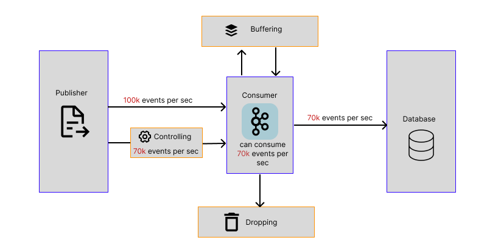

## Intent of the Backpressure Design Pattern

The Backpressure Design Pattern is a strategy used in software systems (especially in data streaming, reactive programming, and distributed systems) 
to handle situations where a fast producer overwhelms a slow consumer. The intent is to prevent system instability, resource exhaustion, or crashes by managing the flow of data between components.

## Detailed Explanation of Backpressure Pattern with Real-World Examples

### Real-world examples

#### 1. Real-Time Data Streaming (Reactive Systems)
- **Stock Market Data**
  - High-frequency trading systems generate millions of price updates per second, but analytics engines can't process them all in real time.
  - Backpressure mechanisms (e.g., in RxJava, Akka, Reactor) throttle or drop excess data to avoid overwhelming downstream systems.
- **IoT Sensor DataQ**
  - Thousands of IoT devices (e.g., smart factories, wearables) send continuous telemetry, but cloud processing has limited capacity.
  - Reactive frameworks apply backpressure to buffer, drop, or slow down data emission.

#### 2. Message Queues (Kafka, RabbitMQ)
- **E-Commerce Order Processing**
    - During flash sales (e.g., Black Friday), order requests spike, but payment and inventory systems can’t keep up.
    - Message queues like Kafka and RabbitMQ use, Limited queue sizes to drop or reject messages when full or Consumer acknowledgments to slow producers if consumers lag.
- **Log Aggregation**
    - Microservices generate massive logs, but centralized logging (E.g.: ELK Stack) can’t ingest them all at once.
    - Kafka applies backpressure by pausing producers when consumers are slow.

#### 3. Stream Processing (Apache Flink, Spark)
- **Social Media Trends (Twitter, TikTok)**
    - Viral posts create sudden spikes in data, but trend analysis is computationally expensive.
    - Backpressure in Spark Streaming prioritizes recent data and discards older, less relevant updates.
- **Fraud Detection in Banking**
    - Millions of transactions flow in, but fraud detection models take time to analyze each one.
    - slow down ingestion if processing lags (Throttling), save progress to recover from backpressure-induced delays (Checkpointing).

### In plain words

The Backpressure design pattern is a flow control mechanism that prevents overwhelming a system by regulating data production based on the consumer’s processing capacity.

### Wikipedia says

Back pressure (or backpressure) is the term for a resistance to the desired flow of fluid through pipes. Obstructions or tight bends create backpressure via friction loss and pressure drop.

In distributed systems in particular event-driven architecture, back pressure is a technique to regulate flow of data, ensuring that components do not become overwhelmed.

### Architectural Diagram


## Programmatic Example of Backpressure Pattern in Java

First we will create a publisher that generates a data stream.
This publisher can generate a stream of integers.

```java
public class Publisher {
    public static Flux<Integer> publish(int start, int count, int delay) {
        return Flux.range(start, count).delayElements(Duration.ofMillis(delay)).log();
    }
}
```

Then we can create a custom subscriber based on reactor BaseSubscriber.
It will take 500ms to process one item to simulate slow processing.
This subscriber will override following methods to apply backpressure on the publisher.
- hookOnSubscribe method and initially request for 10 items
- hookOnNext method which will process 5 items and request for 5 more items

```java
public class Subscriber extends BaseSubscriber<Integer> {

    private static final Logger logger = LoggerFactory.getLogger(Subscriber.class);

    @Override
    protected void hookOnSubscribe(@NonNull Subscription subscription) {
        logger.info("subscribe()");
        request(10); //request 10 items initially
    }

    @Override
    protected void hookOnNext(@NonNull Integer value) {
        processItem();
        logger.info("process({})", value);
        if (value % 5 == 0) {
            // request for the next 5 items after processing first 5
            request(5);
        }
    }

    @Override
    protected void hookOnComplete() {
        //completed processing.
    }

    private void processItem() {
        try {
            Thread.sleep(500); // simulate slow processing
        } catch (InterruptedException e) {
            logger.error(e.getMessage(), e);
        }
    }
}
```

Then we can create the stream using the publisher and subscribe to that stream.

```java
public static void main(String[] args) throws InterruptedException {
    Subscriber sub = new Subscriber();
    Publisher.publish(1, 8, 200).subscribe(sub);
    Thread.sleep(5000); //wait for execution
    
}
```

Program output:

```
23:09:55.746 [main] DEBUG reactor.util.Loggers -- Using Slf4j logging framework
23:09:55.762 [main] INFO reactor.Flux.ConcatMapNoPrefetch.1 -- onSubscribe(FluxConcatMapNoPrefetch.FluxConcatMapNoPrefetchSubscriber)
23:09:55.762 [main] INFO com.iluwatar.backpressure.Subscriber -- subscribe()
23:09:55.763 [main] INFO reactor.Flux.ConcatMapNoPrefetch.1 -- request(10)
23:09:55.969 [parallel-1] INFO reactor.Flux.ConcatMapNoPrefetch.1 -- onNext(1)
23:09:56.475 [parallel-1] INFO com.iluwatar.backpressure.Subscriber -- process(1)
23:09:56.680 [parallel-2] INFO reactor.Flux.ConcatMapNoPrefetch.1 -- onNext(2)
23:09:57.185 [parallel-2] INFO com.iluwatar.backpressure.Subscriber -- process(2)
23:09:57.389 [parallel-3] INFO reactor.Flux.ConcatMapNoPrefetch.1 -- onNext(3)
23:09:57.894 [parallel-3] INFO com.iluwatar.backpressure.Subscriber -- process(3)
23:09:58.099 [parallel-4] INFO reactor.Flux.ConcatMapNoPrefetch.1 -- onNext(4)
23:09:58.599 [parallel-4] INFO com.iluwatar.backpressure.Subscriber -- process(4)
23:09:58.805 [parallel-5] INFO reactor.Flux.ConcatMapNoPrefetch.1 -- onNext(5)
23:09:59.311 [parallel-5] INFO com.iluwatar.backpressure.Subscriber -- process(5)
23:09:59.311 [parallel-5] INFO reactor.Flux.ConcatMapNoPrefetch.1 -- request(5)
23:09:59.516 [parallel-6] INFO reactor.Flux.ConcatMapNoPrefetch.1 -- onNext(6)
23:10:00.018 [parallel-6] INFO com.iluwatar.backpressure.Subscriber -- process(6)
23:10:00.223 [parallel-7] INFO reactor.Flux.ConcatMapNoPrefetch.1 -- onNext(7)
23:10:00.729 [parallel-7] INFO com.iluwatar.backpressure.Subscriber -- process(7)
23:10:00.930 [parallel-8] INFO reactor.Flux.ConcatMapNoPrefetch.1 -- onNext(8)
23:10:01.436 [parallel-8] INFO com.iluwatar.backpressure.Subscriber -- process(8)
23:10:01.437 [parallel-8] INFO reactor.Flux.ConcatMapNoPrefetch.1 -- onComplete()
```

## When to Use the Backpressure Pattern

- Producers Are Faster Than Consumers
    - If a producer generates data at a much faster rate than the consumer can handle, backpressure prevents resource overload.
    - Example: A server emitting events 10x faster than the client can process.

- There’s Limited Memory or Resource Capacity
    - Without flow control, queues or buffers can grow indefinitely, leading to out-of-memory errors or system crashes.
    - Example: Streaming large datasets into a low-memory microservice.

- Building Reactive or Event-Driven Architectures
    - Reactive systems thrive on non-blocking, asynchronous flows—and backpressure is a core component of the Reactive Streams specification.
    - Example: Using RxJava, Project Reactor, Akka Streams, or Node.js streams.

- Unpredictable Workloads
    - If the rate of data production or consumption can vary, backpressure helps adapt dynamically.
    - Example: APIs receiving unpredictable spikes in traffic.

- Need to Avoid Data Loss or Overflow
    - Instead of dropping data arbitrarily, backpressure lets you control flow intentionally.
    - Example: Video or audio processing pipelines where dropping frames is costly.

## When to avoid the Backpressure Pattern

- For batch processing or simple linear flows with well-matched speeds.
- If data loss is acceptable and simpler strategies like buffering or throttling are easier to manage.
- When using fire-and-forget patterns (e.g., log shipping with retries instead of slowing the producer).

## Benefits and Trade-offs of Backpressure Pattern

### Benefits:

-  Improved System Stability
    - Prevents overload by controlling data flow.
    - Reduces chances of out-of-memory errors, thread exhaustion, or service crashes.
- Efficient Resource Usage
    - Avoids excessive buffering and unnecessary computation.
    - Enables systems to do only the work they can handle.
- Better Responsiveness
    - Keeps queues short, which improves latency and throughput.
    - More consistent performance under load.
- Graceful Degradation
    - If the system can't keep up, it slows down cleanly rather than failing unpredictably.
    - Consumers get a chance to control the pace, leading to predictable behavior.
- Fits Reactive Programming
    - It's essential in Reactive Streams, RxJava, Project Reactor, and Akka Streams.
    - Enables composing async streams safely and effectively.

### Trade-offs:

- Complexity in Debugging
    - Adds logic for flow control, demand signaling, and failure handling.
    - More state to manage (e.g., request counts, pause/resume, buffer sizes).
- Harder Debugging & Testing
    - Asynchronous flow + demand coordination = trickier to test and debug.
    - Race conditions or deadlocks may occur if not handled carefully.
- Potential for Bottlenecks
    - A slow consumer can throttle the entire system, even if other parts are fast.
    - Needs smart handling (e.g., buffer + drop + retry strategies).

## Related Java Design Patterns
* [Publish-Subscribe Pattern](https://github.com/sanurah/java-design-patterns/blob/master/publish-subscribe/): Pub-Sub pattern decouples producers from consumers so they can communicate without knowing about each other. Backpressure manages flow control between producer and consumer to avoid overwhelming the consumer.
* [Observer Pattern](https://github.com/sanurah/java-design-patterns/blob/master/observer/): Both involve a producer (subject/publisher) notifying consumers (observers/subscribers). Observer is synchronous & tightly coupled (observers know the subject). Pub-Sub is asynchronous & decoupled (via a message broker).
* [Mediator Pattern](https://github.com/sanurah/java-design-patterns/blob/master/mediator/): A mediator centralizes communication between components (like a message broker in Pub-Sub). Mediator focuses on reducing direct dependencies between objects. Pub-Sub focuses on broadcasting events to unknown subscribers.

## References and Credits

* [Reactive Streams Specification](https://www.reactive-streams.org/)
* [Reactive Programming with RxJava by Tomasz Nurkiewicz & Ben Christensen](https://www.oreilly.com/library/view/reactive-programming-with/9781491931646/)
* [RedHat Developers Blog](https://developers.redhat.com/articles/backpressure-explained)
