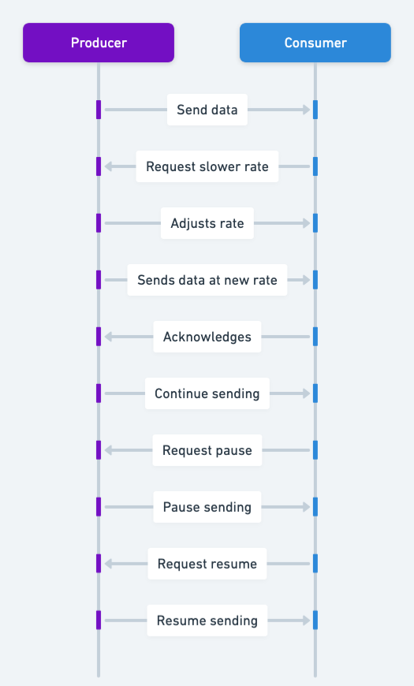

## Also known as

* Flow Control
* Rate Limiting Mechanism

## Intent of the Backpressure Design Pattern

Control the rate of data production so downstream consumers are not overwhelmed by excessive load.

## Detailed Explanation of Backpressure Pattern with Real-World Examples

Real-world example

> Imagine a busy coffee shop where multiple baristas brew drinks (producers), and a single barista is responsible for carefully crafting latte art (consumer). If drinks are brewed faster than the latte-art barista can decorate them, they pile up, risking quality issues or discarded drinks. By introducing a pacing system—only sending new cups once the latte-art barista is ready—everyone stays synchronized, ensuring minimal waste and a consistently enjoyable customer experience.

In plain words

> The Backpressure design pattern is a flow control mechanism that prevents overwhelming a system by regulating data production based on the consumer’s processing capacity.

Wikipedia says

> Back pressure (or backpressure) is the term for a resistance to the desired flow of fluid through pipes. Obstructions or tight bends create backpressure via friction loss and pressure drop. In distributed systems in particular event-driven architecture, back pressure is a technique to regulate flow of data, ensuring that components do not become overwhelmed.

Sequence diagram



## Programmatic Example of Backpressure Pattern in Java

This example demonstrates how backpressure can be implemented using Project Reactor. We begin by creating a simple publisher that emits a stream of integers, introducing a small delay to mimic a slower production rate:

```java
public class Publisher {
    public static Flux<Integer> publish(int start, int count, int delay) {
        return Flux.range(start, count).delayElements(Duration.ofMillis(delay)).log();
    }
}
```

Next, we define a custom subscriber by extending Reactor’s BaseSubscriber. It simulates slow processing by sleeping for 500ms per item. Initially, the subscriber requests ten items; for every five items processed, it requests five more:

```java
public class Subscriber extends BaseSubscriber<Integer> {

    private static final Logger logger = LoggerFactory.getLogger(Subscriber.class);

    @Override
    protected void hookOnSubscribe(@NonNull Subscription subscription) {
        logger.info("subscribe()");
        request(10); //request 10 items initially
    }

    @Override
    protected void hookOnNext(@NonNull Integer value) {
        processItem();
        logger.info("process({})", value);
        if (value % 5 == 0) {
            // request for the next 5 items after processing first 5
            request(5);
        }
    }

    @Override
    protected void hookOnComplete() {
        //completed processing.
    }

    private void processItem() {
        try {
            Thread.sleep(500); // simulate slow processing
        } catch (InterruptedException e) {
            logger.error(e.getMessage(), e);
        }
    }
}
```

Finally, in the `main` method, we publish a range of integers and subscribe using the custom subscriber. A short sleep in the main thread allows the emission, backpressure requests, and processing to be fully observed:

```java
public static void main(String[] args) throws InterruptedException {
    Subscriber sub = new Subscriber();
    Publisher.publish(1, 8, 200).subscribe(sub);
    Thread.sleep(5000); //wait for execution
    
}
```

Below is an example of the program’s output. It shows the subscriber’s log entries, including when it requests more data and when each integer is processed:

```
23:09:55.746 [main] DEBUG reactor.util.Loggers -- Using Slf4j logging framework
23:09:55.762 [main] INFO reactor.Flux.ConcatMapNoPrefetch.1 -- onSubscribe(FluxConcatMapNoPrefetch.FluxConcatMapNoPrefetchSubscriber)
23:09:55.762 [main] INFO com.iluwatar.backpressure.Subscriber -- subscribe()
23:09:55.763 [main] INFO reactor.Flux.ConcatMapNoPrefetch.1 -- request(10)
23:09:55.969 [parallel-1] INFO reactor.Flux.ConcatMapNoPrefetch.1 -- onNext(1)
23:09:56.475 [parallel-1] INFO com.iluwatar.backpressure.Subscriber -- process(1)
23:09:56.680 [parallel-2] INFO reactor.Flux.ConcatMapNoPrefetch.1 -- onNext(2)
23:09:57.185 [parallel-2] INFO com.iluwatar.backpressure.Subscriber -- process(2)
23:09:57.389 [parallel-3] INFO reactor.Flux.ConcatMapNoPrefetch.1 -- onNext(3)
23:09:57.894 [parallel-3] INFO com.iluwatar.backpressure.Subscriber -- process(3)
23:09:58.099 [parallel-4] INFO reactor.Flux.ConcatMapNoPrefetch.1 -- onNext(4)
23:09:58.599 [parallel-4] INFO com.iluwatar.backpressure.Subscriber -- process(4)
23:09:58.805 [parallel-5] INFO reactor.Flux.ConcatMapNoPrefetch.1 -- onNext(5)
23:09:59.311 [parallel-5] INFO com.iluwatar.backpressure.Subscriber -- process(5)
23:09:59.311 [parallel-5] INFO reactor.Flux.ConcatMapNoPrefetch.1 -- request(5)
23:09:59.516 [parallel-6] INFO reactor.Flux.ConcatMapNoPrefetch.1 -- onNext(6)
23:10:00.018 [parallel-6] INFO com.iluwatar.backpressure.Subscriber -- process(6)
23:10:00.223 [parallel-7] INFO reactor.Flux.ConcatMapNoPrefetch.1 -- onNext(7)
23:10:00.729 [parallel-7] INFO com.iluwatar.backpressure.Subscriber -- process(7)
23:10:00.930 [parallel-8] INFO reactor.Flux.ConcatMapNoPrefetch.1 -- onNext(8)
23:10:01.436 [parallel-8] INFO com.iluwatar.backpressure.Subscriber -- process(8)
23:10:01.437 [parallel-8] INFO reactor.Flux.ConcatMapNoPrefetch.1 -- onComplete()
```

## When to Use the Backpressure Pattern In Java

* Use in Java systems where data is produced at high velocity and consumers risk overload.
* Applicable in reactive or event-driven architectures to maintain stability under varying load conditions.

## Benefits and Trade-offs of Backpressure Pattern

Benefits:

* Protects consumers from saturation and resource exhaustion.

Trade-offs:

* Introduces possible delays if production must slow down to match consumer capacity.
* Requires careful orchestration in complex systems with multiple concurrent data sources.

## Related Java Design Patterns

* [Observer Pattern](https://java-design-patterns.com/patterns/observer/): Both patterns involve a producer notifying consumers. Observer is synchronous and tightly coupled (observers know the subject).
* [Publish-Subscribe Pattern](https://java-design-patterns.com/patterns/publish-subscribe/): Both patterns deal with asynchronous data flow and can work together to manage message distribution and consumption effectively.

## References and Credits

* [Backpressure Explained (RedHat Developers Blog)](https://developers.redhat.com/articles/backpressure-explained)
* [Hands-On Reactive Programming in Spring 5](https://amzn.to/3YuYfyO)
* [Reactive Programming with RxJava: Creating Asynchronous, Event-Based Applications](https://amzn.to/42negbf)
* [Reactive Streams in Java](https://amzn.to/3RJjUzA)
* [Reactive Streams Specification](https://www.reactive-streams.org/)
