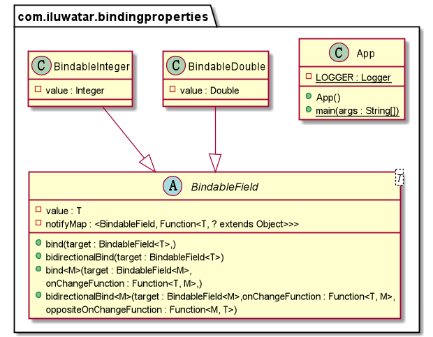

## Intent
Binding properties pattern is used to bind different properties (fields) of objects together, to allow them change simultaneously. There shall be multiple and circular dependencies. If we sketch the dependency of fields as a graph, the topological relationship might be extremely complicated.

## Explanation
Usually, when we want some properties to change along with another property, we shall use the observer pattern. But in some of the cases, these changing dependencies are much more complicated. For example, a GUI program has color of window background, color value in a text area and predifined color value that shall be updated by a checkbox. Any change of the properties above may result in changes in remaning properties, updating the checkbox or input a new color to the text area will immediately change the background color, also make the text area or the checkbox synchronized. This requires us to apply another mechanism to deal with complicated changing behavoiur dependencies. The required solotion here is **Binding Properties Pattern**, which is widely used in real-world GUI programming.

**Programmatic Example**
To avoid introtucing complexity, here we will not use a GUI framework like JavaFX to illustrate. Instead, we will build a simple scene for this pattern.</br>
First, prepare the abstract class for bindable:</br>
```java
public abstract class BindableField<T> {
  protected T value;
  protected HashMap<BindableField, Function<T, ? extends Object>> notifyMap;
  public void bind(BindableField<T> target) {
    notifyMap.put(target, (newValue) -> newValue);
  }
  public void bidirectionalBind(BindableField<T> target) {
    notifyMap.put(target, (newValue) -> newValue);
    target.bind(this);
  }
  protected void beforePropertyChanged(T newValue) {
    notifyMap.forEach((x, y) -> x.setValue(y.apply(newValue)));
  }
  public abstract void setValue(T newValue);
  public abstract T getValue();
}
```
In real-world examples, binding properties pattern is used along with event handlers. Here we use an implementation of a functional interface for calculating the new value to substitute the event handler. Whenever the set method is invoked, it should notify all the bound properties to change according to a given function. We then add unidirectional and bidirectional bind methods for it. The default changing behavior is to let a pair of bound properties keep mutually equal.</br>


What if we want to define some behaviors other than keeping the properties same? We can add the following code into the abstract class:</br>
```java
public <M> void bind(BindableField<M> target, Function<T, M> onChangeFunction) {
  notifyMap.put(target, onChangeFunction);
}

public <M> void bidirectionalBind(BindableField<M> target,
                                  Function<T, M> onChangeFunction,
                                  Function<M, T> oppositeOnChangeFunction) {
  notifyMap.put(target, onChangeFunction);
  target.bind(this, oppositeOnChangeFunction);
}
```
Becareful, circulate bindings might introduce infinity loops. Here we can allow the property to resist changing temporarily:</br>
```java
protected boolean blockPropagation;
protected void block() {
  blockPropagation = true;
}

protected void unBlock() {
  blockPropagation = false;
}
```
If the propagation is block, the set method invocation should be ignored.</br>

Inherit the class to build concrete bindable properties:</br>
```java
class BindableDouble extends BindableField<Double> {

  public BindableDouble(Double value) {
    this.value = value;
    notifyMap = new HashMap<>();
  }

  @Override
  public void setValue(Double newValue) {
    if (blockPropagation) {
      return;
    }
    beforePropertyChanged(newValue);
    value = newValue;
  }

  @Override
  public Double getValue() {
    return value;
  }
}
public class BindableInteger extends BindableField<Integer> {

  public BindableInteger(Integer value) {
    this.value = value;
    notifyMap = new HashMap<>();
  }

  @Override
  public void setValue(Integer newValue) {
    if (blockPropagation) {
      return;
    }
    beforePropertyChanged(newValue);
    value = newValue;
  }

  @Override
  public Integer getValue() {
    return value;
  }
}
```
Now we can make use of our binding properties. We have a little warrior that has HP, MP (for casting spells) and some remaining lives. Every time the little warrior's HP is healed or damaged, he will gain the same amount of recovering or damaging on MP. Whenever the HP is lower than 0, he must respawn himself until he does not have remaining lives. Besides, we need to display his HP and MP percentages on the screen. Now we need a mechanism to let all the values changes simultaneously. So we let his HP, MP, HP percentage, MP percentage to be bindable:</br>
```java
public class MyLittleWarrior {
  private BindableInteger remainLives;
  private BindableDouble myHp;
  private BindableDouble myMp;
  private BindableDouble myHpPercentage;
  private BindableDouble myMpPercentage;
  private double maxHp;
  private double maxMp;
  private static final Logger LOGGER = LoggerFactory.getLogger(MyLittleWarrior.class);

  public MyLittleWarrior(double maxHp, double maxMp, int remain) {
    this.maxHp = maxHp;
    this.maxMp = maxMp;
    remainLives = new BindableInteger(remain);
    myHp = new BindableDouble(maxHp);
    myMp = new BindableDouble(maxMp);
    myHpPercentage = new BindableDouble(100.0);
    myMpPercentage = new BindableDouble(100.0);
    myHp.bind(myMp,
            (newHp) -> Math.min(Math.max(myMp.getValue() + (newHp - myHp.getValue()), 0), maxMp));
    myHp.bidirectionalBind(myHpPercentage,
            (newHp) -> Math.min(Math.max((newHp / maxHp) * 100.0, 0.0), 100.0),
            (newPercentage) -> Math.min(Math.max(newPercentage / 100.0 * maxHp, 0.0), 50.0));
    myMp.bidirectionalBind(myMpPercentage,
            (newMp) -> Math.min(Math.max((newMp / maxMp) * 100.0, 0.0), 100.0),
            (newPercentage) -> Math.min(Math.max(newPercentage / 100.0 * maxMp, 0.0), 50.0));
    myHp.bind(remainLives,
            newHp -> newHp <= 0.0 ? remainLives.getValue() - 1 : remainLives.getValue());
  }

  public void displayMyStatus() {
    LOGGER.info("HP:{}  MP:{}  HP percentage:{}  MP percentage:{}  Remaining Lives:{}",
            myHp.getValue(), myMp.getValue(),
            myHpPercentage.getValue(), myMpPercentage.getValue(), remainLives.getValue());
  }

  public void damage(double value) {
    myHp.setValue(Math.min(Math.max(myHp.getValue() - value, 0), maxHp));
  }

  public void heal(double value) {
    myHp.setValue(Math.min(Math.max(myHp.getValue() + value, 0), maxHp));
  }

  public void castSpell(double cost) {
    myMp.setValue(Math.min(Math.max(myMp.getValue() - cost, 0), maxMp));
  }

  public int getRemainLives() {
    return remainLives.getValue();
  }
}
```

Now we can let his adventure begin to check whether the data changing dependencies are correctly built:</br>


## Class diagram


## Applicability
Use this design pattern when

* Your want to keep multiple properties syncronized according to certain rules.
## Known uses
[Binding interface in JavaFX](https://docs.oracle.com/javafx/2/api/javafx/beans/binding/Binding.html)
[BindableObject class in .NET Xamarin](https://docs.microsoft.com/en-us/dotnet/api/xamarin.forms.bindableobject?view=xamarin-forms)
