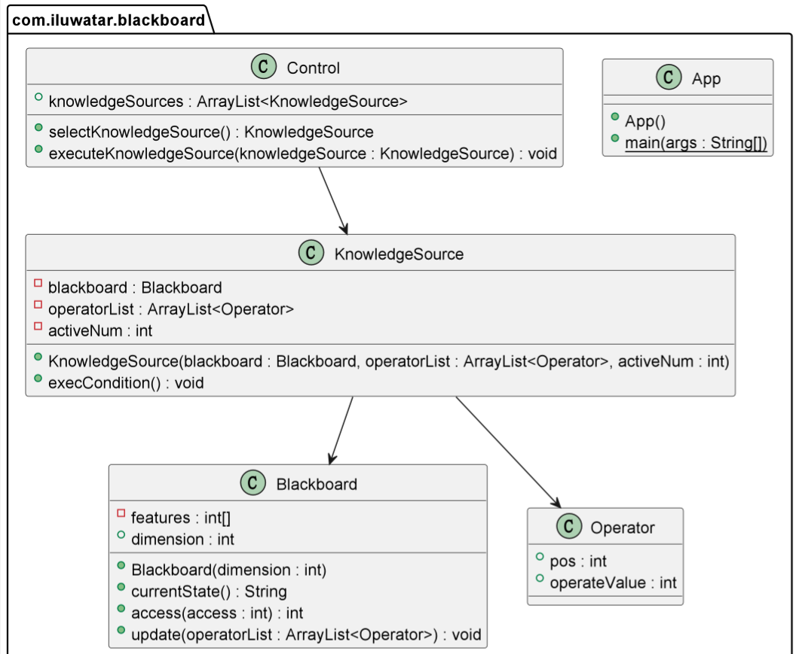

## Intent
Provides a computational framework for the design and implementation of systems that integrate large and diverse specialized modules, and implement complex, non-deterministic control strategies.

## Explanation

Real-world example

> There is a blackboard, whose message is represented
> by a set of integers. A knowledge source can modify
> one or more features through adding different numbers
> The control component would choose the knowledge source
> with highest priority. In this program, I choose a
> FIFO rule to determine the priority of each 
> knowledge source

In plain words

> Knowledge sources can read and write relevant
> data in a blackboard.

*Programmatic Example**

Here is the Blackboard class.

```java
public class Blackboard {
  private int[] features;
  public int dimension;
  public Blackboard(int dimension) {
    features = new int[dimension];
    this.dimension = dimension;
  }

  public String currentState() {
    final StringBuilder res = new StringBuilder(String.valueOf(features[0]));
    for (int i = 1; i < features.length; i++) {
      res.append(',').append(features[i]);
    }
    return res.toString();
  }

  public void showState() {
    LOGGER.info("Current state is {}", currentState());
  }

  public int access(int target) {
    return features[target];
  }

  public void update(ArrayList<Operator> operatorList) {
    for (final Operator tempOperator : operatorList) {
      features[tempOperator.pos] += tempOperator.operateValue;
    }
  }
}
```
Here is the code of control component
```java
public class Control {
  public ArrayList<KnowledgeSource> knowledgeSources = new ArrayList<>();
  
  public KnowledgeSource selectKnowledgeSource() {
    if (knowledgeSources.size() > 0) {
      return knowledgeSources.get(0);
    } else {
      return null;
    }
  }
  
  public void executeKnowledgeSource(KnowledgeSource knowledgeSource) {
    knowledgeSource.execCondition();
    knowledgeSources.remove(knowledgeSource);
  }
}
```
Here is the code of control KnowledgeSource and its Operator
```java
public class KnowledgeSource {
    
  private final Blackboard blackboard;
  
  private final ArrayList<Operator> operatorList;
  
  private final int activeNum;

  public KnowledgeSource(Blackboard blackboard, ArrayList<Operator> operatorList, int activeNum) {
    this.blackboard = blackboard;
    this.activeNum = activeNum;
    this.operatorList = new ArrayList<>();
    this.operatorList.addAll(operatorList);
  }

  public void execCondition() {
    int state = 0;
    for (int i = 0; i < blackboard.dimension; i++) {
      state += blackboard.access(i);
    }
    if (state % 2 == activeNum) {
      blackboard.update(operatorList);
    }
  }
}
```
Here is the full example of how the blackboard works
```java
public class App {
    public static void main(String[] args) {
        final ArrayList<Operator> operators1 = new ArrayList<>();
        operators1.add(new Operator(0, 2));
        operators1.add(new Operator(3, -1));
        operators1.add(new Operator(4, 4));

        final ArrayList<Operator> operators2 = new ArrayList<>();
        operators2.add(new Operator(1, 1));
        operators2.add(new Operator(2, -3));
        operators2.add(new Operator(4, -5));

        final ArrayList<Operator> operators3 = new ArrayList<>();
        operators3.add(new Operator(0, -2));
        operators3.add(new Operator(1, 3));
        operators3.add(new Operator(2, -5));

        final Blackboard blackboard = new Blackboard(5);
        final KnowledgeSource ks1 = new KnowledgeSource(blackboard, operators1, 0);
        final KnowledgeSource ks2 = new KnowledgeSource(blackboard, operators2, 1);
        final Control control = new Control();
        control.knowledgeSources.add(ks1);
        control.knowledgeSources.add(ks2);
        control.executeKnowledgeSource(control.selectKnowledgeSource());
        blackboard.showState();
        final KnowledgeSource ks3 = new KnowledgeSource(blackboard, operators3, 0);
        control.knowledgeSources.add(ks3);
        control.executeKnowledgeSource(control.selectKnowledgeSource());
        blackboard.showState();
        control.executeKnowledgeSource(control.selectKnowledgeSource());
        blackboard.showState();
    }
}
```

Program output:

```java
    Current state is 2,0,0,-1,4
    Current state is 2,1,-3,-1,-1
    Current state is 0,4,-8,-1,-1
```

## Class diagram



## Credits
* [The description of the pattern](http://hillside.net/plop/plop97/Proceedings/lalanda.pdf)