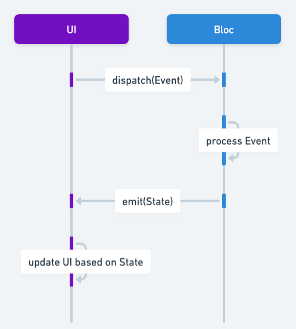

## Also known as

* Business Logic Component
* Business Logic Controller

## Intent of the Bloc Pattern

The Bloc pattern manages the state of an object and allows for dynamically notifying interested listeners about state changes. It separates state management logic from the rest of the application, improving code organization and flexibility.

## Detailed explanation of the Bloc pattern with real-World examples

Real-world example

> Consider a digital counter application where multiple parts of the UI need to be updated whenever the counter changes. For example, a label displaying the counter value and an activity log showing changes. Instead of directly modifying these UI components, the Bloc pattern manages the counter state and notifies all registered listeners about the state change. Listeners can dynamically subscribe or unsubscribe from receiving updates.

In plain words

> The Bloc pattern manages a single state object and dynamically notifies registered listeners whenever the state changes.

Wikipedia says

> While not a formalized "Gang of Four" design pattern, Bloc is widely used in state-driven applications. It centralizes state management and propagates state changes to registered observers, following principles of separation of concerns.

Sequence diagram



## Programmatic Example of the Bloc Pattern in Java

This example demonstrates how to implement the Bloc pattern using Java and Swing. The pattern separates the state of the application from UI components, and provides a reactive, event-driven approach to managing updates.

Core components of the Bloc Pattern include a `State` object, a `Bloc` class responsible for managing and updating that state, and interfaces (`StateListener` and `ListenerManager`) for subscribing to changes.

The `State` class represents the application's data at any given time.

```java
public record State(int value) {}
```

The `ListenerManager` interface declares methods to add and remove listeners, as well as retrieve them.

```java
public interface ListenerManager<T> {
  void addListener(StateListener<T> listener);
  void removeListener(StateListener<T> listener);
  List<StateListener<T>> getListeners();
}
```

The `StateListener` interface defines how a listener reacts to state changes.

```java
public interface StateListener<T> {
  void onStateChange(T state);
}
```

The `Bloc` class maintains the current state and notifies listeners of updates. It provides `increment` and `decrement` methods to update state and automatically notify registered listeners.

```java
public class Bloc implements ListenerManager<State> {

  private State currentState;
  private final List<StateListener<State>> listeners = new ArrayList<>();

  public Bloc() {
    this.currentState = new State(0);
  }

  @Override
  public void addListener(StateListener<State> listener) {
    listeners.add(listener);
    listener.onStateChange(currentState);
  }

  @Override
  public void removeListener(StateListener<State> listener) {
    listeners.remove(listener);
  }

  @Override
  public List<StateListener<State>> getListeners() {
    return Collections.unmodifiableList(listeners);
  }

  private void emitState(State newState) {
    currentState = newState;
    for (StateListener<State> listener : listeners) {
      listener.onStateChange(currentState);
    }
  }

  public void increment() {
    emitState(new State(currentState.value() + 1));
  }

  public void decrement() {
    emitState(new State(currentState.value() - 1));
  }
}
```

This class demonstrates how to integrate the Bloc pattern with a simple Swing GUI. It sets up a counter, buttons to change the state, and a toggle to enable or disable the listener dynamically.

```java
public class Main {
  public static void main(String[] args) {
    BlocUi blocUi = new BlocUi();
    blocUi.createAndShowUi();
  }
}

public class BlocUi {

  public void createAndShowUi() {
    final Bloc bloc = new Bloc();

    JFrame frame = new JFrame("BloC example");
    frame.setDefaultCloseOperation(WindowConstants.EXIT_ON_CLOSE);
    frame.setSize(400, 300);

    JLabel counterLabel = new JLabel("Counter: 0", SwingConstants.CENTER);
    counterLabel.setFont(new Font("Arial", Font.BOLD, 20));

    JButton decrementButton = new JButton("Decrement");
    JButton toggleListenerButton = new JButton("Disable Listener");
    JButton incrementButton = new JButton("Increment");

    frame.setLayout(new BorderLayout());
    frame.add(counterLabel, BorderLayout.CENTER);
    frame.add(incrementButton, BorderLayout.NORTH);
    frame.add(decrementButton, BorderLayout.SOUTH);
    frame.add(toggleListenerButton, BorderLayout.EAST);

    StateListener<State> stateListener = state -> counterLabel.setText("Counter: " + state.value());

    bloc.addListener(stateListener);

    toggleListenerButton.addActionListener(
            e -> {
              if (bloc.getListeners().contains(stateListener)) {
                bloc.removeListener(stateListener);
                toggleListenerButton.setText("Enable Listener");
              } else {
                bloc.addListener(stateListener);
                toggleListenerButton.setText("Disable Listener");
              }
            });

    incrementButton.addActionListener(e -> bloc.increment());
    decrementButton.addActionListener(e -> bloc.decrement());

    frame.setVisible(true);
  }
}
```

### Program Output

- **On Increment**  
  `Counter: 1`

- **On Decrement**  
  `Counter: 0`

- **Dynamic Listener Toggle**  
  - Listener disabled: Counter stops updating.  
  - Listener enabled: Counter updates again.

## When to Use the Bloc Pattern

Use the Bloc pattern when:

* When you want a clean separation of business logic and UI in Java applications
* When you need a reactive approach to updating UI based on state changes
* When you want to avoid coupling controllers or presenters directly to data manipulation
* When multiple UI elements need access to the same business logic

## Real-World Applications of Bloc Pattern

* Java-based desktop applications that require real-time UI updates
* Backend-driven Java frameworks that separate service layers from presentation
* Cross-platform applications where the logic must remain consistent regardless of the UI technology

## Benefits and Trade-offs of Bloc Pattern

Benefits:

* Simplifies UI components by removing direct business logic
* Improves testability by isolating state and behavior
* Encourages code reuse by centralizing data flows
* Enhances maintainability through clear separation of concerns

Trade-offs:

* May introduce additional boilerplate code for managing streams or observers
* Requires careful design to avoid a monolithic “god” component
* Demands consistent reactive programming practices to be effective

## Related Patterns

- [Observer](https://java-design-patterns.com/patterns/observer/): Bloc is a specialized implementation of the Observer pattern.
- [Mediator](https://java-design-patterns.com/patterns/mediator/): Orchestrates interactions among multiple objects through a central component
- [MVC](https://java-design-patterns.com/patterns/model-view-controller/): Shares the idea of separating concerns between layers

## References and Credits

* [Bloc architecture(bloclibrary.dev)](https://bloclibrary.dev/architecture/)
* [Clean Architecture: A Craftsman's Guide to Software Structure and Design](https://amzn.to/3UoKkaR)
* [Design Patterns: Elements of Reusable Object-Oriented Software](https://amzn.to/3w0pvKI)
* [Effective Java](https://amzn.to/4cGk2Jz)
* [Event-Driven Programming in Java (Oracle)](https://www.oracle.com/java/)
* [Java Swing Documentation (Oracle)](https://docs.oracle.com/javase/tutorial/uiswing/)
