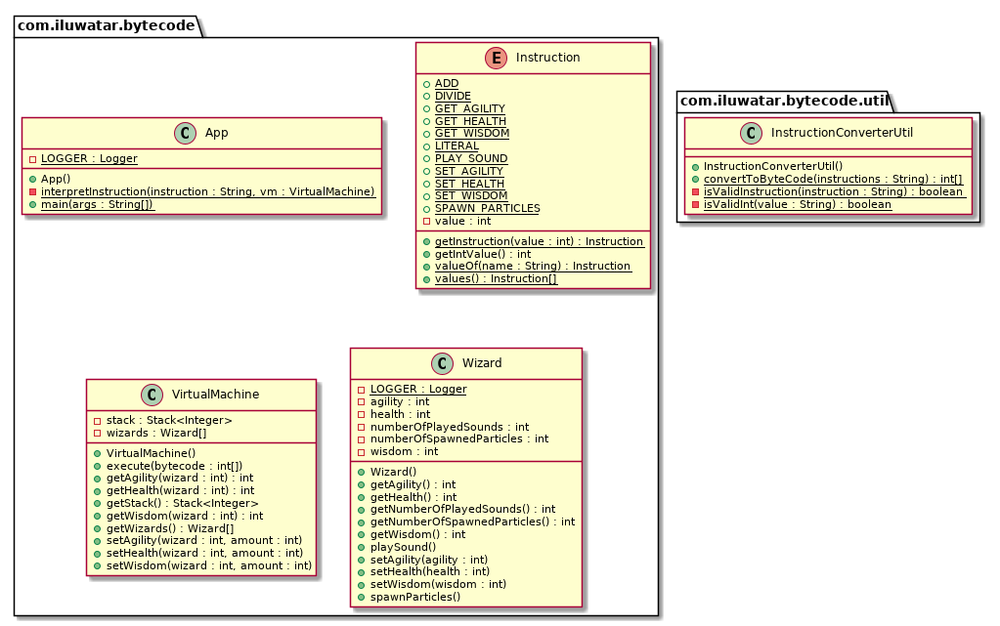

## Intent
Allows to encode behaviour as instructions for virtual machine.

## Class diagram

## Applicability
Use the Bytecode pattern when you have a lot of behavior you need to define and your
game’s implementation language isn’t a good fit because:

* it’s too low-level, making it tedious or error-prone to program in.
* iterating on it takes too long due to slow compile times or other tooling issues.
* it has too much trust. If you want to ensure the behavior being defined can’t break the game, you need to sandbox it from the rest of the codebase.

## Credits

* [Game programming patterns](http://gameprogrammingpatterns.com/bytecode.html)
