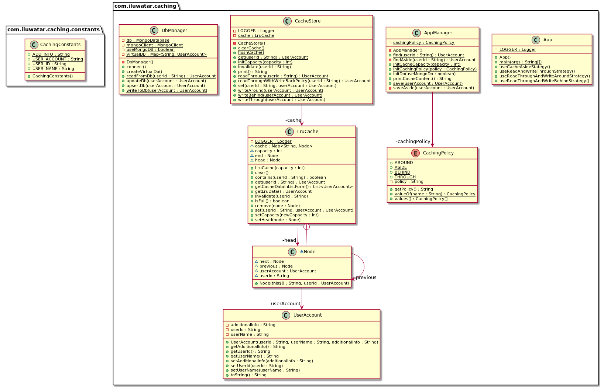

## Intent

The caching pattern avoids expensive re-acquisition of resources by not releasing them immediately after use. The resources retain their identity, are kept in some fast-access storage, and are re-used to avoid having to acquire them again.

## Also known as

* Cache
* Temporary Storage

## Explanation

Real-world example

> A real-world example of the Caching design pattern can be seen in a library's catalog system. When patrons frequently search for popular books, the system can cache the results of these searches. Instead of querying the database every time a user searches for a popular book, the system quickly retrieves the results from the cache. This reduces the load on the database and provides faster response times for users, enhancing their overall experience. However, the system must also ensure that the cache is updated when new books are added or existing ones are checked out, to maintain accurate information.

In plain words

> Caching pattern keeps frequently needed data in fast-access storage to improve performance.

Wikipedia says:

> In computing, a cache is a hardware or software component that stores data so that future requests for that data can be served faster; the data stored in a cache might be the result of an earlier computation or a copy of data stored elsewhere. A cache hit occurs when the requested data can be found in a cache, while a cache miss occurs when it cannot. Cache hits are served by reading data from the cache, which is faster than recomputing a result or reading from a slower data store; thus, the more requests that can be served from the cache, the faster the system performs.

**Programmatic Example**

A team is working on a website that provides new homes for abandoned cats. People can post their cats on the website after registering, but all the new posts require approval from one of the site moderators. The user accounts of the site moderators contain a specific flag and the data is stored in a MongoDB database. Checking for the moderator flag each time a post is viewed becomes expensive, and it's a good idea to utilize caching here.

Let's first look at the data layer of our application. The interesting classes are `UserAccount` which is a simple Java object containing the user account details, and `DbManager` interface which handles reading and writing of these objects to/from database.

```java

@Data
@AllArgsConstructor
@ToString
@EqualsAndHashCode
public class UserAccount {
    private String userId;
    private String userName;
    private String additionalInfo;
}

public interface DbManager {

    void connect();

    void disconnect();

    UserAccount readFromDb(String userId);

    UserAccount writeToDb(UserAccount userAccount);

    UserAccount updateDb(UserAccount userAccount);

    UserAccount upsertDb(UserAccount userAccount);
}
```

In the example, we are demonstrating various different caching policies

* Write-through writes data to the cache and DB in a single transaction
* Write-around writes data immediately into the DB instead of the cache
* Write-behind writes data into the cache initially whilst the data is only written into the DB when the cache is full
* Cache-aside pushes the responsibility of keeping the data synchronized in both data sources to the application itself
* Read-through strategy is also included in the aforementioned strategies, and it returns data from the cache to the caller if it exists, otherwise queries from DB and stores it into the cache for future use.

The cache implementation in `LruCache` is a hash table accompanied by a doubly linked-list. The linked-list helps in capturing and maintaining the LRU data in the cache. When data is queried (from the cache), added (to the cache), or updated, the data is moved to the front of the list to depict itself as the most-recently-used data. The LRU data is always at the end of the list.

```java

@Slf4j
public class LruCache {

    static class Node {
        String userId;
        UserAccount userAccount;
        Node previous;
        Node next;

        public Node(String userId, UserAccount userAccount) {
            this.userId = userId;
            this.userAccount = userAccount;
        }
    }

    // Other properties and methods...

    public LruCache(int capacity) {
        this.capacity = capacity;
    }

    public UserAccount get(String userId) {
        if (cache.containsKey(userId)) {
            var node = cache.get(userId);
            remove(node);
            setHead(node);
            return node.userAccount;
        }
        return null;
    }

    public void set(String userId, UserAccount userAccount) {
        if (cache.containsKey(userId)) {
            var old = cache.get(userId);
            old.userAccount = userAccount;
            remove(old);
            setHead(old);
        } else {
            var newNode = new Node(userId, userAccount);
            if (cache.size() >= capacity) {
                LOGGER.info("# Cache is FULL! Removing {} from cache...", end.userId);
                cache.remove(end.userId); // remove LRU data from cache.
                remove(end);
                setHead(newNode);
            } else {
                setHead(newNode);
            }
            cache.put(userId, newNode);
        }
    }

    public boolean contains(String userId) {
        return cache.containsKey(userId);
    }

    public void remove(Node node) { /* ... */ }

    public void setHead(Node node) { /* ... */ }

    public void invalidate(String userId) { /* ... */ }

    public boolean isFull() { /* ... */ }

    public UserAccount getLruData() { /* ... */ }

    public void clear() { /* ... */ }

    public List<UserAccount> getCacheDataInListForm() { /* ... */ }

    public void setCapacity(int newCapacity) { /* ... */ }
}
```

The next layer we are going to look at is `CacheStore` which implements the different caching strategies.

```java

@Slf4j
public class CacheStore {

    private static final int CAPACITY = 3;
    private static LruCache cache;
    private final DbManager dbManager;

    // Other properties and methods...

    public UserAccount readThrough(final String userId) {
        if (cache.contains(userId)) {
            LOGGER.info("# Found in Cache!");
            return cache.get(userId);
        }
        LOGGER.info("# Not found in cache! Go to DB!!");
        UserAccount userAccount = dbManager.readFromDb(userId);
        cache.set(userId, userAccount);
        return userAccount;
    }

    public void writeThrough(final UserAccount userAccount) {
        if (cache.contains(userAccount.getUserId())) {
            dbManager.updateDb(userAccount);
        } else {
            dbManager.writeToDb(userAccount);
        }
        cache.set(userAccount.getUserId(), userAccount);
    }

    public void writeAround(final UserAccount userAccount) {
        if (cache.contains(userAccount.getUserId())) {
            dbManager.updateDb(userAccount);
            // Cache data has been updated -- remove older
            cache.invalidate(userAccount.getUserId());
            // version from cache.
        } else {
            dbManager.writeToDb(userAccount);
        }
    }

    public static void clearCache() {
        if (cache != null) {
            cache.clear();
        }
    }

    public static void flushCache() {
        LOGGER.info("# flushCache...");
        Optional.ofNullable(cache)
                .map(LruCache::getCacheDataInListForm)
                .orElse(List.of())
                .forEach(DbManager::updateDb);
    }

    // ... omitted the implementation of other caching strategies ...

}
```

`AppManager` helps to bridge the gap in communication between the main class and the application's back-end. DB connection is initialized through this class. The chosen caching strategy/policy is also initialized here. Before the cache can be used, the size of the cache has to be set. Depending on the chosen caching policy, `AppManager` will call the appropriate function in the `CacheStore` class.

```java

@Slf4j
public final class AppManager {

    private static CachingPolicy cachingPolicy;
    private final DbManager dbManager;
    private final CacheStore cacheStore;

    private AppManager() {
    }

    public void initDb() { /* ... */ }

    public static void initCachingPolicy(CachingPolicy policy) { /* ... */ }

    public static void initCacheCapacity(int capacity) { /* ... */ }

    public UserAccount find(final String userId) {
        LOGGER.info("Trying to find {} in cache", userId);
        if (cachingPolicy == CachingPolicy.THROUGH
                || cachingPolicy == CachingPolicy.AROUND) {
            return cacheStore.readThrough(userId);
        } else if (cachingPolicy == CachingPolicy.BEHIND) {
            return cacheStore.readThroughWithWriteBackPolicy(userId);
        } else if (cachingPolicy == CachingPolicy.ASIDE) {
            return findAside(userId);
        }
        return null;
    }

    public void save(final UserAccount userAccount) {
        LOGGER.info("Save record!");
        if (cachingPolicy == CachingPolicy.THROUGH) {
            cacheStore.writeThrough(userAccount);
        } else if (cachingPolicy == CachingPolicy.AROUND) {
            cacheStore.writeAround(userAccount);
        } else if (cachingPolicy == CachingPolicy.BEHIND) {
            cacheStore.writeBehind(userAccount);
        } else if (cachingPolicy == CachingPolicy.ASIDE) {
            saveAside(userAccount);
        }
    }

    public static String printCacheContent() {
        return CacheStore.print();
    }

    // Other properties and methods...
}
```

Here is what we do in the main class of the application.

```java

@Slf4j
public class App {

    public static void main(final String[] args) {
        boolean isDbMongo = isDbMongo(args);
        if (isDbMongo) {
            LOGGER.info("Using the Mongo database engine to run the application.");
        } else {
            LOGGER.info("Using the 'in Memory' database to run the application.");
        }
        App app = new App(isDbMongo);
        app.useReadAndWriteThroughStrategy();
        String splitLine = "==============================================";
        LOGGER.info(splitLine);
        app.useReadThroughAndWriteAroundStrategy();
        LOGGER.info(splitLine);
        app.useReadThroughAndWriteBehindStrategy();
        LOGGER.info(splitLine);
        app.useCacheAsideStategy();
        LOGGER.info(splitLine);
    }

    public void useReadAndWriteThroughStrategy() {
        LOGGER.info("# CachingPolicy.THROUGH");
        appManager.initCachingPolicy(CachingPolicy.THROUGH);

        var userAccount1 = new UserAccount("001", "John", "He is a boy.");

        appManager.save(userAccount1);
        LOGGER.info(appManager.printCacheContent());
        appManager.find("001");
        appManager.find("001");
    }

    public void useReadThroughAndWriteAroundStrategy() { /* ... */ }

    public void useReadThroughAndWriteBehindStrategy() { /* ... */ }

    public void useCacheAsideStrategy() { /* ... */ }
}
```

The program output:

```
17:00:56.302 [main] INFO com.iluwatar.caching.App -- Using the 'in Memory' database to run the application.
17:00:56.304 [main] INFO com.iluwatar.caching.App -- # CachingPolicy.THROUGH
17:00:56.305 [main] INFO com.iluwatar.caching.AppManager -- Save record!
17:00:56.308 [main] INFO com.iluwatar.caching.App -- 
--CACHE CONTENT--
UserAccount(userId=001, userName=John, additionalInfo=He is a boy.)
----
17:00:56.308 [main] INFO com.iluwatar.caching.AppManager -- Trying to find 001 in cache
17:00:56.309 [main] INFO com.iluwatar.caching.CacheStore -- # Found in Cache!
17:00:56.309 [main] INFO com.iluwatar.caching.AppManager -- Trying to find 001 in cache
17:00:56.309 [main] INFO com.iluwatar.caching.CacheStore -- # Found in Cache!
17:00:56.309 [main] INFO com.iluwatar.caching.App -- ==============================================
17:00:56.309 [main] INFO com.iluwatar.caching.App -- # CachingPolicy.AROUND
17:00:56.309 [main] INFO com.iluwatar.caching.AppManager -- Save record!
17:00:56.309 [main] INFO com.iluwatar.caching.App -- 
--CACHE CONTENT--
----
17:00:56.309 [main] INFO com.iluwatar.caching.AppManager -- Trying to find 002 in cache
17:00:56.309 [main] INFO com.iluwatar.caching.CacheStore -- # Not found in cache! Go to DB!!
17:00:56.309 [main] INFO com.iluwatar.caching.App -- 
--CACHE CONTENT--
UserAccount(userId=002, userName=Jane, additionalInfo=She is a girl.)
----
17:00:56.309 [main] INFO com.iluwatar.caching.AppManager -- Trying to find 002 in cache
17:00:56.309 [main] INFO com.iluwatar.caching.CacheStore -- # Found in Cache!
17:00:56.309 [main] INFO com.iluwatar.caching.AppManager -- Save record!
17:00:56.309 [main] INFO com.iluwatar.caching.LruCache -- # 002 has been updated! Removing older version from cache...
17:00:56.309 [main] INFO com.iluwatar.caching.App -- 
--CACHE CONTENT--
----
17:00:56.309 [main] INFO com.iluwatar.caching.AppManager -- Trying to find 002 in cache
17:00:56.309 [main] INFO com.iluwatar.caching.CacheStore -- # Not found in cache! Go to DB!!
17:00:56.309 [main] INFO com.iluwatar.caching.App -- 
--CACHE CONTENT--
UserAccount(userId=002, userName=Jane G., additionalInfo=She is a girl.)
----
17:00:56.309 [main] INFO com.iluwatar.caching.AppManager -- Trying to find 002 in cache
17:00:56.309 [main] INFO com.iluwatar.caching.CacheStore -- # Found in Cache!
17:00:56.309 [main] INFO com.iluwatar.caching.App -- ==============================================
17:00:56.309 [main] INFO com.iluwatar.caching.App -- # CachingPolicy.BEHIND
17:00:56.309 [main] INFO com.iluwatar.caching.AppManager -- Save record!
17:00:56.309 [main] INFO com.iluwatar.caching.AppManager -- Save record!
17:00:56.310 [main] INFO com.iluwatar.caching.AppManager -- Save record!
17:00:56.310 [main] INFO com.iluwatar.caching.App -- 
--CACHE CONTENT--
UserAccount(userId=005, userName=Isaac, additionalInfo=He is allergic to mustard.)
UserAccount(userId=004, userName=Rita, additionalInfo=She hates cats.)
UserAccount(userId=003, userName=Adam, additionalInfo=He likes food.)
----
17:00:56.310 [main] INFO com.iluwatar.caching.AppManager -- Trying to find 003 in cache
17:00:56.310 [main] INFO com.iluwatar.caching.CacheStore -- # Found in cache!
17:00:56.310 [main] INFO com.iluwatar.caching.App -- 
--CACHE CONTENT--
UserAccount(userId=003, userName=Adam, additionalInfo=He likes food.)
UserAccount(userId=005, userName=Isaac, additionalInfo=He is allergic to mustard.)
UserAccount(userId=004, userName=Rita, additionalInfo=She hates cats.)
----
17:00:56.310 [main] INFO com.iluwatar.caching.AppManager -- Save record!
17:00:56.310 [main] INFO com.iluwatar.caching.CacheStore -- # Cache is FULL! Writing LRU data to DB...
17:00:56.310 [main] INFO com.iluwatar.caching.LruCache -- # Cache is FULL! Removing 004 from cache...
17:00:56.310 [main] INFO com.iluwatar.caching.App -- 
--CACHE CONTENT--
UserAccount(userId=006, userName=Yasha, additionalInfo=She is an only child.)
UserAccount(userId=003, userName=Adam, additionalInfo=He likes food.)
UserAccount(userId=005, userName=Isaac, additionalInfo=He is allergic to mustard.)
----
17:00:56.310 [main] INFO com.iluwatar.caching.AppManager -- Trying to find 004 in cache
17:00:56.310 [main] INFO com.iluwatar.caching.CacheStore -- # Not found in Cache!
17:00:56.310 [main] INFO com.iluwatar.caching.CacheStore -- # Cache is FULL! Writing LRU data to DB...
17:00:56.310 [main] INFO com.iluwatar.caching.LruCache -- # Cache is FULL! Removing 005 from cache...
17:00:56.310 [main] INFO com.iluwatar.caching.App -- 
--CACHE CONTENT--
UserAccount(userId=004, userName=Rita, additionalInfo=She hates cats.)
UserAccount(userId=006, userName=Yasha, additionalInfo=She is an only child.)
UserAccount(userId=003, userName=Adam, additionalInfo=He likes food.)
----
17:00:56.310 [main] INFO com.iluwatar.caching.App -- ==============================================
17:00:56.310 [main] INFO com.iluwatar.caching.App -- # CachingPolicy.ASIDE
17:00:56.310 [main] INFO com.iluwatar.caching.App -- 
--CACHE CONTENT--
----
17:00:56.310 [main] INFO com.iluwatar.caching.AppManager -- Save record!
17:00:56.310 [main] INFO com.iluwatar.caching.AppManager -- Save record!
17:00:56.310 [main] INFO com.iluwatar.caching.AppManager -- Save record!
17:00:56.310 [main] INFO com.iluwatar.caching.App -- 
--CACHE CONTENT--
----
17:00:56.310 [main] INFO com.iluwatar.caching.AppManager -- Trying to find 003 in cache
17:00:56.313 [main] INFO com.iluwatar.caching.App -- 
--CACHE CONTENT--
UserAccount(userId=003, userName=Adam, additionalInfo=He likes food.)
----
17:00:56.313 [main] INFO com.iluwatar.caching.AppManager -- Trying to find 004 in cache
17:00:56.313 [main] INFO com.iluwatar.caching.App -- 
--CACHE CONTENT--
UserAccount(userId=004, userName=Rita, additionalInfo=She hates cats.)
UserAccount(userId=003, userName=Adam, additionalInfo=He likes food.)
----
17:00:56.313 [main] INFO com.iluwatar.caching.App -- ==============================================
17:00:56.314 [Thread-0] INFO com.iluwatar.caching.CacheStore -- # flushCache...
```

## Class diagram



## Applicability

Use the Caching pattern when

* Repetitious acquisition, initialization, and release of the same resource cause unnecessary performance overhead
* In scenarios where the cost of recomputing or re-fetching data is significantly higher than storing and retrieving it from cache
* For read-heavy applications with relatively static data or data that changes infrequently

## Known Uses

* Web page caching to reduce server load and improve response time
* Database query caching to avoid repeated expensive SQL queries
* Caching results of CPU-intensive computations
* Content Delivery Networks (CDNs) for caching static resources like images, CSS, and JavaScript files closer to the end users

## Consequences

Benefits:

* Improved Performance: Significantly reduces data access latency, leading to faster application performance
* Reduced Load: Decreases the load on the underlying data source, which can lead to cost savings and increased longevity of the resource
* Scalability: Enhances the scalability of applications by efficiently handling increases in load without proportional increases in resource utilization

Trade-Offs:

* Complexity: Introduces complexity in terms of cache invalidation, consistency, and synchronization
* Resource Utilization: Requires additional memory or storage resources to maintain the cache
* Stale Data: There's a risk of serving outdated data if the cache is not properly invalidated or updated when the underlying data changes

## Related patterns

* [Proxy](https://java-design-patterns.com/patterns/proxy/): Caching can be implemented using the Proxy pattern, where the proxy object intercepts requests and returns cached data if available
* [Observer](https://java-design-patterns.com/patterns/observer/): Can be used to notify the cache when the underlying data changes, so that it can be updated or invalidated accordingly
* [Decorator](https://java-design-patterns.com/patterns/decorator/): Can be used to add caching behavior to an existing object without modifying its code
* [Strategy](https://java-design-patterns.com/patterns/strategy/): Different caching strategies can be implemented using the Strategy pattern, allowing the application to switch between them at runtime

## Credits

* [Effective Java](https://amzn.to/4cGk2Jz)
* [High Performance Browser Networking](https://amzn.to/3TiNNY4)
* [Java EE 8 High Performance](https://amzn.to/44T8vmH)
* [Java Performance: In-Depth Advice for Tuning and Programming Java 8, 11, and Beyond](https://amzn.to/3yyD58W)
* [Java Performance: The Definitive Guide: Getting the Most Out of Your Code](https://amzn.to/3Wu5neF)
* [Patterns of Enterprise Application Architecture](https://amzn.to/3PMAHRZ)
* [Scalable Internet Architectures](https://amzn.to/48V3ni9)
* [Write-through, write-around, write-back: Cache explained (ComputerWeekly)](http://www.computerweekly.com/feature/Write-through-write-around-write-back-Cache-explained)
* [Cache-Aside Pattern (Microsoft)](https://docs.microsoft.com/en-us/azure/architecture/patterns/cache-aside)
