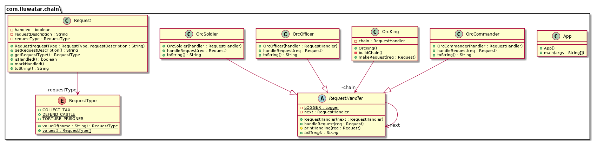

## Intent
Avoid coupling the sender of a request to its receiver by giving
more than one object a chance to handle the request. Chain the receiving
objects and pass the request along the chain until an object handles it.

## Explanation

Real world example

> The Orc King gives loud orders to his army. The closest one to react is the commander, then officer and then soldier. The commander, officer and soldier here form a chain of responsibility.

In plain words

> It helps building a chain of objects. Request enters from one end and keeps going from object to object till it finds the suitable handler.

Wikipedia says

> In object-oriented design, the chain-of-responsibility pattern is a design pattern consisting of a source of command objects and a series of processing objects. Each processing object contains logic that defines the types of command objects that it can handle; the rest are passed to the next processing object in the chain.

**Programmatic Example**

Translating our example with orcs from above. First we have the request class

```java
public class Request {

  private final RequestType requestType;
  private final String requestDescription;
  private boolean handled;

  public Request(final RequestType requestType, final String requestDescription) {
    this.requestType = Objects.requireNonNull(requestType);
    this.requestDescription = Objects.requireNonNull(requestDescription);
  }

  public String getRequestDescription() { return requestDescription; }

  public RequestType getRequestType() { return requestType; }

  public void markHandled() { this.handled = true; }

  public boolean isHandled() { return this.handled; }

  @Override
  public String toString() { return getRequestDescription(); }
}

public enum RequestType {
  DEFEND_CASTLE, TORTURE_PRISONER, COLLECT_TAX
}
```

Then the request handler hierarchy

```java
public abstract class RequestHandler {
  private static final Logger LOGGER = LoggerFactory.getLogger(RequestHandler.class);
  private RequestHandler next;

  public RequestHandler(RequestHandler next) {
    this.next = next;
  }

  public void handleRequest(Request req) {
    if (next != null) {
      next.handleRequest(req);
    }
  }

  protected void printHandling(Request req) {
    LOGGER.info("{} handling request \"{}\"", this, req);
  }

  @Override
  public abstract String toString();
}

public class OrcCommander extends RequestHandler {
  public OrcCommander(RequestHandler handler) {
    super(handler);
  }

  @Override
  public void handleRequest(Request req) {
    if (req.getRequestType().equals(RequestType.DEFEND_CASTLE)) {
      printHandling(req);
      req.markHandled();
    } else {
      super.handleRequest(req);
    }
  }

  @Override
  public String toString() {
    return "Orc commander";
  }
}

// OrcOfficer and OrcSoldier are defined similarly as OrcCommander

```

Then we have the Orc King who gives the orders and forms the chain

```java
public class OrcKing {
  RequestHandler chain;

  public OrcKing() {
    buildChain();
  }

  private void buildChain() {
    chain = new OrcCommander(new OrcOfficer(new OrcSoldier(null)));
  }

  public void makeRequest(Request req) {
    chain.handleRequest(req);
  }
}
```

Then it is used as follows

```java
var king = new OrcKing();
king.makeRequest(new Request(RequestType.DEFEND_CASTLE, "defend castle")); // Orc commander handling request "defend castle"
king.makeRequest(new Request(RequestType.TORTURE_PRISONER, "torture prisoner")); // Orc officer handling request "torture prisoner"
king.makeRequest(new Request(RequestType.COLLECT_TAX, "collect tax")); // Orc soldier handling request "collect tax"
```

## Class diagram


## Applicability
Use Chain of Responsibility when

* more than one object may handle a request, and the handler isn't known a priori. The handler should be ascertained automatically
* you want to issue a request to one of several objects without specifying the receiver explicitly
* the set of objects that can handle a request should be specified dynamically

## Real world examples

* [java.util.logging.Logger#log()](http://docs.oracle.com/javase/8/docs/api/java/util/logging/Logger.html#log%28java.util.logging.Level,%20java.lang.String%29)
* [Apache Commons Chain](https://commons.apache.org/proper/commons-chain/index.html)
* [javax.servlet.Filter#doFilter()](http://docs.oracle.com/javaee/7/api/javax/servlet/Filter.html#doFilter-javax.servlet.ServletRequest-javax.servlet.ServletResponse-javax.servlet.FilterChain-)

## Credits

* [Design Patterns: Elements of Reusable Object-Oriented Software](http://www.amazon.com/Design-Patterns-Elements-Reusable-Object-Oriented/dp/0201633612)
