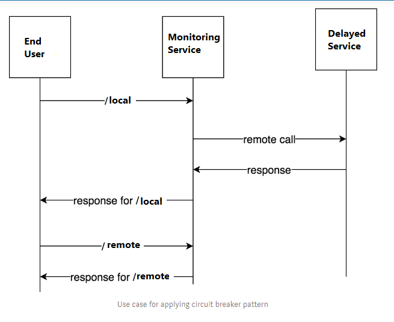

## Intent

Handle costly remote *procedure/service* calls in such a way that the failure of a **single** service/component cannot bring the whole application down, and we can reconnect to the service as soon as possible.

## Explanation

Real world example

> Imagine a Web App that has both local (example: files and images) and remote (example: database entries) to serve. The database might not be responding due to a variety of reasons, so if the application keeps trying to read from the database using multiple threads/processes, soon all of them will hang and our entire web application will crash. We should be able to detect this situation and show the user an appropriate message so that he/she can explore other parts of the app unaffected by the database failure without any problem. 

In plain words

> Allows us to save resources when we know a remote service failed. Useful when all parts of our application are highly decoupled from each other, and failure of one component doesn't mean the other parts will stop working.

Wikipedia says

> **Circuit breaker** is a design pattern used in modern software development. It is used to detect failures and encapsulates the logic of preventing a failure from constantly recurring, during maintenance, temporary external system failure or unexpected system difficulties.

So, how does this all come together?

## Programmatic Example
With the above example in mind we will imitate the functionality in a simple manner. We have two services: A *monitoring service* which will mimic the web app and will make both **local** and **remote** calls.

The service architecture is as follows:



In terms of code, the End user application is:

```java
public class App {
   
  private static final Logger LOGGER = LoggerFactory.getLogger(App.class);
    
  public static void main(String[] args) {
    var obj = new MonitoringService();
    var circuitBreaker = new CircuitBreaker(3000, 1, 2000 * 1000 * 1000); 
    var serverStartTime = System.nanoTime();
    while (true) {
      LOGGER.info(obj.localResourceResponse());
      LOGGER.info(obj.remoteResourceResponse(circuitBreaker, serverStartTime));
      LOGGER.info(circuitBreaker.getState());
      try {
        Thread.sleep(5 * 1000); 
      } catch (InterruptedException e) {
        LOGGER.error(e.getMessage());
      }
    }
  }
}
```

The monitoring service is: 

``` java
public class MonitoringService {

  public String localResourceResponse() {
    return "Local Service is working";
  }

  public String remoteResourceResponse(CircuitBreaker circuitBreaker, long serverStartTime) {
    try {
      return circuitBreaker.call("delayedService", serverStartTime);
    } catch (Exception e) {
      return e.getMessage();
    }
  }
}
```
As it can be seen, it does the call to get local resources directly, but it wraps the call to remote (costly) service in a circuit breaker object, which prevents faults as follows:

```java
public class CircuitBreaker {
  private final long timeout;
  private final long retryTimePeriod;
  long lastFailureTime;
  int failureCount;
  private final int failureThreshold;
  private State state;
  private final long futureTime = 1000 * 1000 * 1000 * 1000;

  CircuitBreaker(long timeout, int failureThreshold, long retryTimePeriod) {
    this.state = State.CLOSED;
    this.failureThreshold = failureThreshold;
    this.timeout = timeout;
    this.retryTimePeriod = retryTimePeriod;
    this.lastFailureTime = System.nanoTime() + futureTime;
    this.failureCount = 0;
  }
    
  private void reset() {
    this.failureCount = 0;
    this.lastFailureTime = System.nanoTime() + futureTime; 
    this.state = State.CLOSED;
  }

  private void recordFailure() {
    failureCount = failureCount + 1;
    this.lastFailureTime = System.nanoTime();
  }
    
  protected void setState() {
    if (failureCount > failureThreshold) { 
      if ((System.nanoTime() - lastFailureTime) > retryTimePeriod) {
        state = State.HALF_OPEN;
      } else {
        state = State.OPEN;
      }
    } else {
      state = State.CLOSED;
    }
  }
    
  public String getState() {
    return state.name();
  }
  
  public void setStateForBypass(State state) {
    this.state = state;
  }
   
  public String call(String serviceToCall, long serverStartTime) throws Exception {
    setState();
    if (state == State.OPEN) {
      return "This is stale response from API";
    } else {
      if (serviceToCall.equals("delayedService")) {
        var delayedService = new DelayedService(20);
        var response = delayedService.response(serverStartTime);
        if (response.split(" ")[3].equals("working")) {
          reset();
          return response;
        } else {
          recordFailure();
          throw new Exception("Remote service not responding");
        }
      } else {
        throw new Exception("Unknown Service Name");
      }
    }
  }
}
```

How does the above pattern prevent failures? Let's understand via this finite state machine implemented by it.


- We initialize the Circuit Breaker object with certain parameters: **timeout**, **failureThreshold** and **retryTimePeriod** which help determine how resilient the API is.
- Initially, we are in the **closed** state and the remote call to API happens.
- Every time the call succeeds, we reset the state to as it was in the beginning.
- If the number of failures cross a certain threshold, we move to the **open** state, which acts just like an open circuit and prevents remote service calls from being made, thus saving resources. (Here, we return the response called ```stale response from API```)
- Once we exceed the retry timeout period, we move to the **half-open** state and make another call to the remote service again to check if the service is working so that we can serve fresh content. A *failure* sets it back to **open** state and another attempt is made after retry timeout period, while a *success* sets it to **closed** state so that everything starts working normally again. 

## Class diagram


## Applicability
Use the Circuit Breaker pattern when

- Building a fault-tolerant application where failure of some services shouldn't bring the entire application down.
- Building an continuously incremental/continuous delivery application, as some of it's components can be upgraded without shutting it down entirely.

## Related Patterns

- [Retry Pattern](https://github.com/iluwatar/java-design-patterns/tree/master/retry)

## Real world examples

* [Spring Circuit Breaker module](https://spring.io/guides/gs/circuit-breaker)
* [Netflix Hystrix API](https://github.com/Netflix/Hystrix)

## Credits

* [Understanding Circuit Breaker Pattern](https://itnext.io/understand-circuitbreaker-design-pattern-with-simple-practical-example-92a752615b42)
* [Martin Fowler on Circuit Breaker](https://martinfowler.com/bliki/CircuitBreaker.html)
* [Fault tolerance in a high volume, distributed system](https://medium.com/netflix-techblog/fault-tolerance-in-a-high-volume-distributed-system-91ab4faae74a)
* [Microsoft docs](https://docs.microsoft.com/en-us/azure/architecture/patterns/circuit-breaker)
