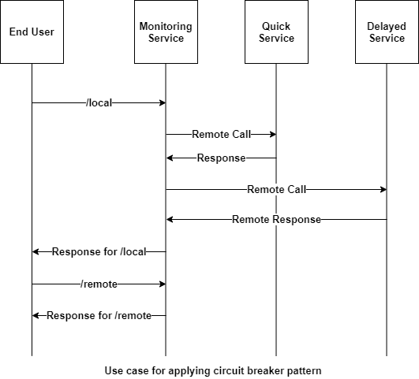
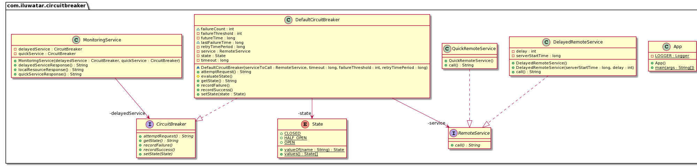

## Also known as

* Fault tolerance switch

## Intent

The Circuit Breaker pattern aims to prevent a software system from making calls to a part of the system that is either failing or showing signs of distress. It is a way to gracefully degrade functionality when a dependent service is not responding, rather than failing completely.

## Explanation

Real world example

> Imagine a web application that has both local files/images and remote services that are used for fetching data. These remote services may be either healthy and responsive at times, or may become slow and unresponsive at some point of time due to variety of reasons. So if one of the remote services is slow or not responding successfully, our application will try to fetch response from the remote service using multiple threads/processes, soon all of them will hang (also called[thread starvation](https://en.wikipedia.org/wiki/Starvation_(computer_science))) causing our entire web application to crash. We should be able to detect this situation and show the user an appropriate message so that he/she can explore other parts of the app unaffected by the remote serv'ice failure. Meanwhile, the other services that are working normally, should keep functioning unaffected by this failure.

In plain words

> Circuit Breaker allows graceful handling of failed remote services. It's especially useful when all parts of our application are highly decoupled from each other, and failure of one component doesn't mean the other parts will stop working.

Wikipedia says

> Circuit breaker is a design pattern used in modern software development. It is used to detect failures and encapsulates the logic of preventing a failure from constantly recurring, during maintenance, temporary external system failure or unexpected system difficulties.

## Programmatic Example

So, how does this all come together? With the above example in mind we will imitate the functionality in a simple example. A monitoring service mimics the web app and makes both local and remote calls.

The service architecture is as follows:



In terms of code, the end user application is:

```java

@Slf4j
public class App {

    private static final Logger LOGGER = LoggerFactory.getLogger(App.class);

    /**
     * Program entry point.
     *
     * @param args command line args
     */
    public static void main(String[] args) {

        var serverStartTime = System.nanoTime();

        var delayedService = new DelayedRemoteService(serverStartTime, 5);
        var delayedServiceCircuitBreaker = new DefaultCircuitBreaker(delayedService, 3000, 2,
                2000 * 1000 * 1000);

        var quickService = new QuickRemoteService();
        var quickServiceCircuitBreaker = new DefaultCircuitBreaker(quickService, 3000, 2,
                2000 * 1000 * 1000);

        //Create an object of monitoring service which makes both local and remote calls
        var monitoringService = new MonitoringService(delayedServiceCircuitBreaker,
                quickServiceCircuitBreaker);

        //Fetch response from local resource
        LOGGER.info(monitoringService.localResourceResponse());

        //Fetch response from delayed service 2 times, to meet the failure threshold
        LOGGER.info(monitoringService.delayedServiceResponse());
        LOGGER.info(monitoringService.delayedServiceResponse());

        //Fetch current state of delayed service circuit breaker after crossing failure threshold limit
        //which is OPEN now
        LOGGER.info(delayedServiceCircuitBreaker.getState());

        //Meanwhile, the delayed service is down, fetch response from the healthy quick service
        LOGGER.info(monitoringService.quickServiceResponse());
        LOGGER.info(quickServiceCircuitBreaker.getState());

        //Wait for the delayed service to become responsive
        try {
            LOGGER.info("Waiting for delayed service to become responsive");
            Thread.sleep(5000);
        } catch (InterruptedException e) {
            LOGGER.error("An error occurred: ", e);
        }
        //Check the state of delayed circuit breaker, should be HALF_OPEN
        LOGGER.info(delayedServiceCircuitBreaker.getState());

        //Fetch response from delayed service, which should be healthy by now
        LOGGER.info(monitoringService.delayedServiceResponse());
        //As successful response is fetched, it should be CLOSED again.
        LOGGER.info(delayedServiceCircuitBreaker.getState());
    }
}
```

The monitoring service:

```java
public class MonitoringService {

    private final CircuitBreaker delayedService;

    private final CircuitBreaker quickService;

    public MonitoringService(CircuitBreaker delayedService, CircuitBreaker quickService) {
        this.delayedService = delayedService;
        this.quickService = quickService;
    }

    //Assumption: Local service won't fail, no need to wrap it in a circuit breaker logic
    public String localResourceResponse() {
        return "Local Service is working";
    }

    /**
     * Fetch response from the delayed service (with some simulated startup time).
     *
     * @return response string
     */
    public String delayedServiceResponse() {
        try {
            return this.delayedService.attemptRequest();
        } catch (RemoteServiceException e) {
            return e.getMessage();
        }
    }

    /**
     * Fetches response from a healthy service without any failure.
     *
     * @return response string
     */
    public String quickServiceResponse() {
        try {
            return this.quickService.attemptRequest();
        } catch (RemoteServiceException e) {
            return e.getMessage();
        }
    }
}
```

As it can be seen, it does the call to get local resources directly, but it wraps the call to remote (costly) service in a circuit breaker object, which prevents faults as follows:

```java
public class DefaultCircuitBreaker implements CircuitBreaker {

    private final long timeout;
    private final long retryTimePeriod;
    private final RemoteService service;
    long lastFailureTime;
    private String lastFailureResponse;
    int failureCount;
    private final int failureThreshold;
    private State state;
    // Future time offset, in nanoseconds
    private final long futureTime = 1_000_000_000_000L;

    /**
     * Constructor to create an instance of Circuit Breaker.
     *
     * @param timeout          Timeout for the API request. Not necessary for this simple example
     * @param failureThreshold Number of failures we receive from the depended service before changing
     *                         state to 'OPEN'
     * @param retryTimePeriod  Time period after which a new request is made to remote service for
     *                         status check.
     */
    DefaultCircuitBreaker(RemoteService serviceToCall, long timeout, int failureThreshold,
                          long retryTimePeriod) {
        this.service = serviceToCall;
        // We start in a closed state hoping that everything is fine
        this.state = State.CLOSED;
        this.failureThreshold = failureThreshold;
        // Timeout for the API request.
        // Used to break the calls made to remote resource if it exceeds the limit
        this.timeout = timeout;
        this.retryTimePeriod = retryTimePeriod;
        //An absurd amount of time in future which basically indicates the last failure never happened
        this.lastFailureTime = System.nanoTime() + futureTime;
        this.failureCount = 0;
    }

    // Reset everything to defaults
    @Override
    public void recordSuccess() {
        this.failureCount = 0;
        this.lastFailureTime = System.nanoTime() + futureTime;
        this.state = State.CLOSED;
    }

    @Override
    public void recordFailure(String response) {
        failureCount = failureCount + 1;
        this.lastFailureTime = System.nanoTime();
        // Cache the failure response for returning on open state
        this.lastFailureResponse = response;
    }

    // Evaluate the current state based on failureThreshold, failureCount and lastFailureTime.
    protected void evaluateState() {
        if (failureCount >= failureThreshold) { //Then something is wrong with remote service
            if ((System.nanoTime() - lastFailureTime) > retryTimePeriod) {
                //We have waited long enough and should try checking if service is up
                state = State.HALF_OPEN;
            } else {
                //Service would still probably be down
                state = State.OPEN;
            }
        } else {
            //Everything is working fine
            state = State.CLOSED;
        }
    }

    @Override
    public String getState() {
        evaluateState();
        return state.name();
    }

    /**
     * Break the circuit beforehand if it is known service is down Or connect the circuit manually if
     * service comes online before expected.
     *
     * @param state State at which circuit is in
     */
    @Override
    public void setState(State state) {
        this.state = state;
        switch (state) {
            case OPEN -> {
                this.failureCount = failureThreshold;
                this.lastFailureTime = System.nanoTime();
            }
            case HALF_OPEN -> {
                this.failureCount = failureThreshold;
                this.lastFailureTime = System.nanoTime() - retryTimePeriod;
            }
            default -> this.failureCount = 0;
        }
    }

    /**
     * Executes service call.
     *
     * @return Value from the remote resource, stale response or a custom exception
     */
    @Override
    public String attemptRequest() throws RemoteServiceException {
        evaluateState();
        if (state == State.OPEN) {
            // return cached response if the circuit is in OPEN state
            return this.lastFailureResponse;
        } else {
            // Make the API request if the circuit is not OPEN
            try {
                //In a real application, this would be run in a thread and the timeout
                //parameter of the circuit breaker would be utilized to know if service
                //is working. Here, we simulate that based on server response itself
                var response = service.call();
                // Yay!! the API responded fine. Let's reset everything.
                recordSuccess();
                return response;
            } catch (RemoteServiceException ex) {
                recordFailure(ex.getMessage());
                throw ex;
            }
        }
    }
}
```

How does the above pattern prevent failures? Let's understand via this finite state machine implemented by it.


- We initialize the Circuit Breaker object with certain parameters: `timeout`, `failureThreshold` and `retryTimePeriod`which help determine how resilient the API is.
- Initially, we are in the `closed` state and nos remote calls to the API have occurred.
- Every time the call succeeds, we reset the state to as it was in the beginning.
- If the number of failures cross a certain threshold, we move to the `open` state, which acts just like an open circuit and prevents remote service calls from being made, thus saving resources. (Here, we return the response called ```stale response from API```)
- Once we exceed the retry timeout period, we move to the `half-open` state and make another call to the remote service again to check if the service is working so that we can serve fresh content. A failure sets it back to `open` state and another attempt is made after retry timeout period, while a success sets it to `closed` state so that everything starts working normally again.

## Class diagram



## Applicability

* In distributed systems where individual service failures can lead to cascading system-wide failures
* For applications that interact with third-party services or databases that might become unresponsive or slow
* In microservices architectures where the failure of one service can affect the availability of others

## Known Uses

* Cloud-based services to gracefully handle the failure of external services
* E-commerce platforms to manage high volumes of transactions and dependency on external APIs
* Microservices architectures for maintaining system stability and responsiveness
* [Spring Circuit Breaker module](https://spring.io/guides/gs/circuit-breaker)
* [Netflix Hystrix API](https://github.com/Netflix/Hystrix)

## Consequences

Benefits:

* Prevents the system from performing futile operations that are likely to fail, thus saving resources
* Helps in maintaining the stability and performance of the application during partial system failures
* Facilitates faster system recovery by avoiding the overwhelming of failing services with repeated requests

Trade-Offs:

* The complexity of the system increases as the pattern requires additional logic to detect failures and manage the state of the circuit breaker
* May lead to system degradation if not properly configured, as legitimate requests might be blocked if the circuit is open
* Requires careful tuning of thresholds and timeout periods to balance between responsiveness and protection

## Related Patterns

- [Retry Pattern](https://github.com/iluwatar/java-design-patterns/tree/master/retry): Can be used in conjunction with the Circuit Breaker pattern to retry failed operations before opening the circuit
- [Bulkhead Pattern](https://learn.microsoft.com/en-us/azure/architecture/patterns/bulkhead): Can be used to isolate different parts of the system to prevent failures from spreading across the system

## Credits

* [Understanding Circuit Breaker Pattern](https://itnext.io/understand-circuitbreaker-design-pattern-with-simple-practical-example-92a752615b42)
* [Martin Fowler on Circuit Breaker](https://martinfowler.com/bliki/CircuitBreaker.html)
* [Fault tolerance in a high volume, distributed system](https://medium.com/netflix-techblog/fault-tolerance-in-a-high-volume-distributed-system-91ab4faae74a)
* [Circuit Breaker pattern](https://docs.microsoft.com/en-us/azure/architecture/patterns/circuit-breaker)
* [Release It! Design and Deploy Production-Ready Software](https://amzn.to/4aqTNEP)
* [Microservices Patterns: With examples in Java](https://amzn.to/3xaZwk0)
* [Building Microservices: Designing Fine-Grained Systems](https://amzn.to/43Dx86g)
