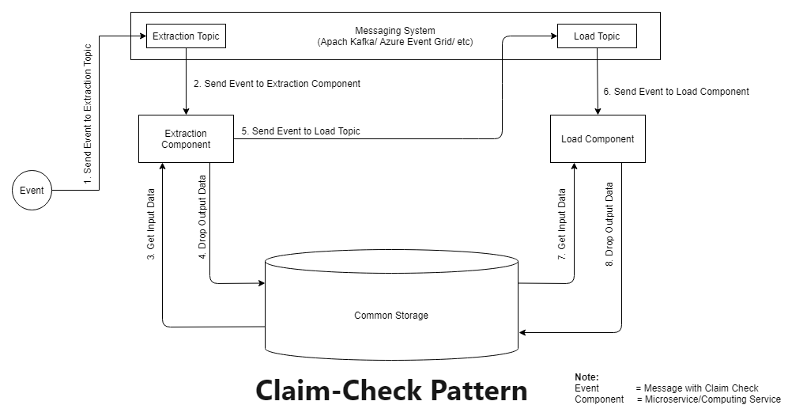

## Name
[Claim Check Pattern](https://docs.microsoft.com/en-us/azure/architecture/patterns/claim-check)

## Also known as
[Reference-Based Messaging](https://www.enterpriseintegrationpatterns.com/patterns/messaging/StoreInLibrary.html)

## Intent
- Reduce load of data transfer through internet
- Data security

## Explaination
Real World Example
> Suppose if you want to build a photo processing system. You give images as input to process and create different photos of the same image. Once the image is received by the first microservice/rest API, it will store that in persistent storage. To create 10 different images, there are 10 microservices. The first microservice will create a message with a header and body. The header contains the next process to call, the location of input data and the body contains actual data(here it is an image). The first microservice will send 10 different headers to the messaging platform and store the entire message with data in persistent storage. Messaging platform will send the respective message header to the respective microservice. Then these microservices will read the entire message from persistent storage. It will then perform its operation and again store the entire message with a new image. 


In Plain words
> Split a large message into a claim check and a payload. Send the claim check to the messaging platform and store the payload to an external service. This pattern allows large messages to be processed, while protecting the message bus and the client from being overwhelmed or slowed down. This pattern also helps to reduce costs, as storage is usually cheaper than resource units used by the messaging platform.([ref](https://docs.microsoft.com/en-us/azure/architecture/patterns/claim-check))

## Class diagram


## Applicability
Use the Claim Check Pattern when
- processing data is huge and don't want to consume bandwidth
- secure your data transfer
- cloud platform - Azure Functions or AWS Lambda, Azure EventGrid or AWS Event Bridge, Azure Blob Storage or AWS S3 Bucket
- each service must be independant. It means it will perform its operations and drop data to storage.

## Tutorials
### Setup
- Make sure your system is windows.
- Run everything as administrator.
- Install Java JDK and setup environmental variables.
- Install git bash.
- Download Apache kafka binaries and extract.
- Install Spring Tool Suite 4 LTS

### Command for Apache Kafka

I am using git bash for the following commands to execute.
1. First, go to the Kafka root folder

        cd C:\kafka_2.13-2.7.0

2. Run Zookeeper server

        bin/windows/zookeeper-server-start.bat config/zookeeper.properties
3. Then Run Kafka Server.

        bin/windows/kafka-server-start.bat config/server.properties

### Run your services
1. Open Spring Tool Suite
2. Import existing project as POM file
3. Run usage-detail-sender as spring boot application
4. Run usage-cost-processor as spring boot application

### Events check command
```
bin/windows/kafka-console-consumer.bat --topic usage-detail --from-beginning --bootstrap-server localhost:9092
```
### Storage Data
The data is stored in windows C drive. Exact location is C:\Users\USERNAME\AppData\Local\claim-check-pattern. In this directory, folders with GUID name are  generated. Each folder contains input json file droped by usage-detail-sender service and output json file droped by usage-cost-processor service.

### Workflow
First usage-detail-sender create message, send message header to Kafka topic usage-detail and drop entire message to local file system. Kafka then sent this message header to usage-cost-processor service. It will read entire message with the help of header, do its operation and drop result to local system.


## Known uses
1. Extract-Transform-Load workflow
2. Input-Process-Output workflow


## Credits
- [Messaging Pattern - Claim Check](https://www.enterpriseintegrationpatterns.com/patterns/messaging/StoreInLibrary.html)
- [Azure Architecture Pattern - Claim Check Pattern](https://docs.microsoft.com/en-us/azure/architecture/patterns/claim-check)
