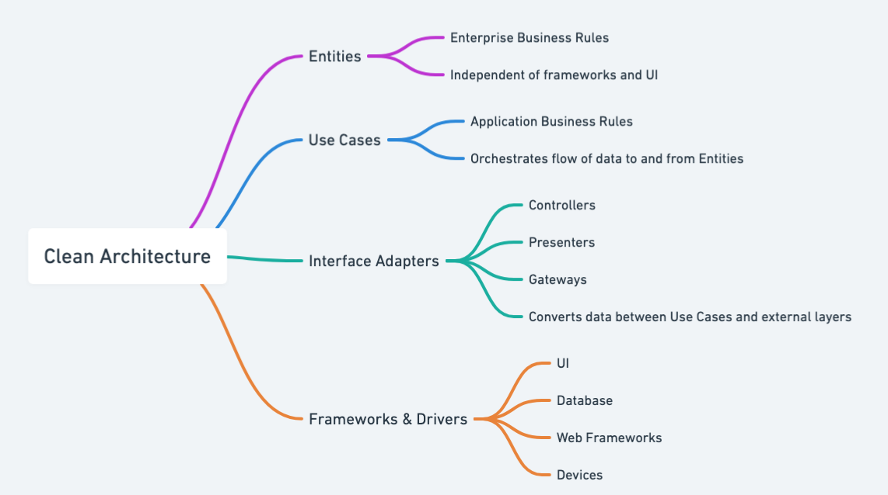
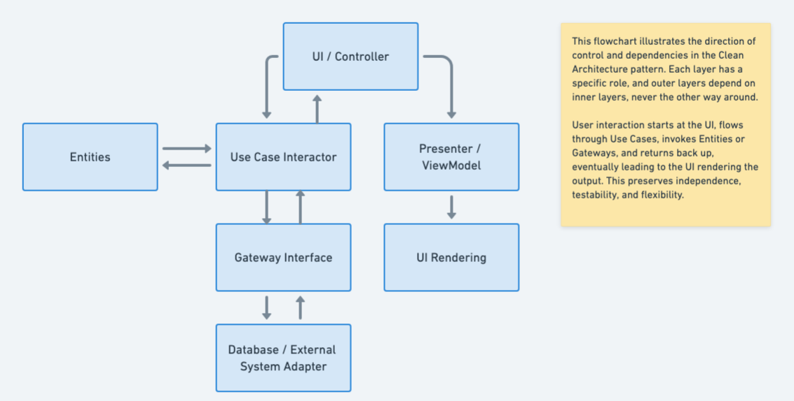

## Intent of Clean Architecture.

To organize the system so that the core business logic remains independent from external concerns and frameworks.

## Detailed Explanation of Clean Architecture Pattern with Real-World Examples

Real-world example

> Imagine a large pizza chain with multiple ordering channels—web, mobile app, phone calls, and in-store kiosks. The core “pizza domain” logic (calculating prices, preparing orders, managing loyalty points) is kept entirely separate from the user interfaces and storage mechanisms. As a result, the chain can add or change the ordering channel (for example, introducing a chatbot or swapping out the database) without altering the fundamental pizza-ordering rules, thanks to the layered boundaries and strict dependency rules of Clean Architecture.

In plain words

> Clean Architecture is a software design approach that isolates the core business logic from external concerns (like databases, frameworks, or UI) through strict layering and clear boundaries, ensuring that changes in one layer don't ripple through the entire system.

Wikipedia says

> The clean architecture proposed by Robert C. Martin in 2012 combines the principles of the hexagonal architecture, the onion architecture and several other variants. It provides additional levels of detail of the component, which are presented as concentric rings. It isolates adapters and interfaces (user interface, databases, external systems, devices) in the outer rings of the architecture and leaves the inner rings for use cases and entities. The clean architecture uses the principle of dependency inversion with the strict rule that dependencies shall only exist between an outer ring to an inner ring and never the contrary.

Mind map



Flowchart



## Programmatic Example of Clean Architecture Pattern

First, we define the core domain entities: `Product`, `Order`, and `Cart`. These classes capture the fundamental business logic and state.

```java
public class Product {
    private String id;
    private String name;
    private double price;

    public Product(String id, String name, double price) {
        this.id = id;
        this.name = name;
        this.price = price;
    }
}
```

```java
public class Cart {
    private Product product;
    private int quantity;

    public Cart(Product product, int quantity) {
        this.product = product;
        this.quantity = quantity;
    }

    public double getTotalPrice() {
        return product.getPrice() * quantity;
    }
}
```

```java
public class Order {
    private String orderId;
    private List<CartItem> items;
    private double totalPrice;

    public Order(String orderId, List<CartItem> items) {
        this.orderId = orderId;
        this.items = items;
        this.totalPrice = items.stream().mapToDouble(CartItem::getTotalPrice).sum();
    }
}
```

The repository interfaces are created to abstract data operations for each domain object, allowing us to switch out storage or persistence mechanisms without changing higher-level logic.

```java
public interface CartRepository {
    void addItemToCart(String userId, Product product, int quantity);
    void removeItemFromCart(String userId, String productId);
    List<Cart> getItemsInCart(String userId);
    double calculateTotal(String userId);
    void clearCart(String userId);
}
```
```java
public interface ProductRepository {
    Product getProductById(String productId);
}
```
```java
public interface OrderRepository {
    void saveOrder(Order order);
}
```

The in-memory data store implementations use simple collections to hold state. They demonstrate how easily we can replace or extend the data layer (e.g., swapping in a database) without affecting the domain logic.

```java
public class InMemoryCartRepository implements CartRepository {
  private final Map<String, List<Cart>> userCarts = new HashMap<>();

  @Override
  public void addItemToCart(String userId, Product product, int quantity) {
    List<Cart> cart = userCarts.getOrDefault(userId, new ArrayList<>());
    cart.add(new Cart(product, quantity));
    userCarts.put(userId, cart);
  }

  @Override
  public void removeItemFromCart(String userId, String productId) {
    List<Cart> cart = userCarts.get(userId);
    if (cart != null) {
      cart.removeIf(item -> item.getProduct().getId().equals(productId));
    }
  }

  @Override
  public List<Cart> getItemsInCart(String userId) {
    return userCarts.getOrDefault(userId, new ArrayList<>());
  }

  @Override
  public double calculateTotal(String userId) {
    return userCarts.getOrDefault(userId, new ArrayList<>())
        .stream()
        .mapToDouble(Cart::getTotalPrice)
        .sum();
  }

  @Override
  public void clearCart(String userId) {
    userCarts.remove(userId);
  }
}
```
```java
public class InMemoryOrderRepository implements OrderRepository {
    private final List<Order> orders = new ArrayList<>();

    @Override
    public void saveOrder(Order order) {
        orders.add(order);
    }
}
```

```java
public class InMemoryProductRepository implements ProductRepository {
    private final Map<String, Product> products = new HashMap<>();

    public InMemoryProductRepository() {
        products.put("1", new Product("1", "Laptop", 1000.0));
        products.put("2", new Product("2", "Smartphone", 500.0));
    }

    @Override
    public Product getProductById(String productId) {
        return products.get(productId);
    }
}
```

The order controller coordinates the checkout process by using the use-case or service layer (`ShoppingCartService`).

```java
public class OrderController{
  private final ShoppingCartService shoppingCartUseCase;

  public OrderController(ShoppingCartService shoppingCartUseCase) {
    this.shoppingCartUseCase = shoppingCartUseCase;
  }

  public Order checkout(String userId) {
    return shoppingCartUseCase.checkout(userId);
  }
}
```

The cart controller focuses on cart-related actions like adding or removing items and calculating totals.


```java
public class CartController {
  private final ShoppingCartService shoppingCartUseCase;

  public CartController(ShoppingCartService shoppingCartUseCase) {
    this.shoppingCartUseCase = shoppingCartUseCase;
  }

  public void addItemToCart(String userId, String productId, int quantity) {
    shoppingCartUseCase.addItemToCart(userId, productId, quantity);
  }

  public void removeItemFromCart(String userId, String productId) {
    shoppingCartUseCase.removeItemFromCart(userId, productId);
  }

  public double calculateTotal(String userId) {
    return shoppingCartUseCase.calculateTotal(userId);
  }
}
```

The clean architecture in action. In the `main` method, we wire up everything, simulating a typical user flow: items are added to the cart, the total is calculated, and finally an order is placed.

```java
public static void main(String[] args) {

    ProductRepository productRepository = new InMemoryProductRepository();
    CartRepository cartRepository = new InMemoryCartRepository();
    OrderRepository orderRepository = new InMemoryOrderRepository();

    ShoppingCartService shoppingCartUseCase =
        new ShoppingCartService(productRepository, cartRepository, orderRepository);

    CartController cartController = new CartController(shoppingCartUseCase);
    OrderController orderController = new OrderController(shoppingCartUseCase);

    String userId = "user123";
    cartController.addItemToCart(userId, "1", 1); 
    cartController.addItemToCart(userId, "2", 2);

    System.out.println("Total: $" + cartController.calculateTotal(userId));

    Order order = orderController.checkout(userId);
    System.out.println(
        "Order placed! Order ID: " + order.getOrderId() + ", Total: $" + order.getTotalPrice());
  }
```

The output of the code.

```md
Total: $2000.0
Order placed! Order ID: ORDER-1743349969254, Total: $2000.0
```

## When to Use the Clean Architecture Pattern in Java

* When you want to keep business rules independent of UI, database, or any other external agency
* When you need a high level of maintainability and testability in large Java applications
* When you aim to enforce clear boundaries among application layers

## Real-World Applications of Clean Architecture Pattern in Java

* Large-scale enterprise systems in finance and insurance domains
* Microservices-based architectures that prioritize decoupling and modular design
* Java systems requiring stringent separation of concerns and domain-centered design

## Benefits and Trade-offs of Clean Architecture Pattern

Benefits: 

* High maintainability by isolating core logic from infrastructure details
* Enhanced testability through clear boundaries around the domain model
* Flexibility in replacing or upgrading external components without affecting core logic

Trade-Offs:

* Initial complexity from enforcing strict layers and boundaries
* Potential overhead in smaller projects not requiring such rigid separation
* Requires disciplined team adherence to architecture rules

## Related Java Design Patterns

* [Dependency Injection](https://java-design-patterns.com/patterns/dependency-injection/): Facilitates decoupling layers by injecting dependencies rather than hard-coding them
* [Layered Architecture](https://java-design-patterns.com/patterns/layered-architecture/): Both separate concerns into distinct tiers but Clean Architecture emphasizes strict dependency rules
* [Hexagonal Architecture](https://java-design-patterns.com/patterns/hexagonal-architecture/): Similar focus on isolating core logic with ports and adapters

## References and Credits

* [Clean Architecture: A Craftsman's Guide to Software Structure and Design](https://amzn.to/3UoKkaR)
* [Clean Code: A Handbook of Agile Software Craftsmanship](https://amzn.to/3wRnjp5)
* [Domain-Driven Design: Tackling Complexity in the Heart of Software](https://amzn.to/3wlDrze)
