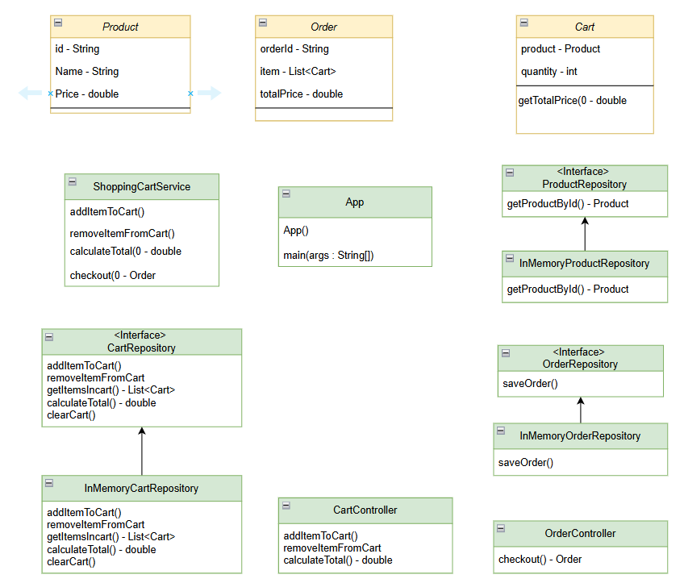

## Also known as

* Hexagonal Architecture.

## Intent of Clean Architecture.

The clean architecture is a software design architectural style which ensures the software application is easy to understand, maintainable and can be extend easily as per business requirement.

## Detailed Explanation of Clean Architecture Pattern with Real-World Examples

Real World.

A real world example of clean architecture is like teh shopping mall example. There some employee is assigned to work on the filling of the products in the counter, one person is responsible for the billing purpose, one person is taking care of the security, one person is taking care of the product they have in storage. The work of every individual is separate and they are focussed on the specific task. Clean architecture also suggests to make the component separate and each component should perform some task. Clean Architecture proposes a layered architecture with clear boundaries between different system components to achieve independence of frameworks, UI, databases, and delivery mechanisms and the possibility to test in isolation.

In plain word

It helps to make the system more maintainable and easy to extend.

Wikipedia says

> The clean architecture proposed by Robert C. Martin in 2012 combines the principles of the hexagonal architecture, the onion architecture and several other variants. It provides additional levels of detail of the component, which are presented as concentric rings. It isolates adapters and interfaces (user interface, databases, external systems, devices) in the outer rings of the architecture and leaves the inner rings for use cases and entities.
> 
> The clean architecture uses the principle of dependency inversion with the strict rule that dependencies shall only exist between an outer ring to an inner ring and never the contrary.


## Clean architecture Class Diagram



## When to Use the Clean Architecture Pattern in Java

In all application we can use the clean architecture style and make the component separate and business logic separate from the UI and database.

## Real-World Applications of Chain of Responsibility Pattern in Java.

In the application say Ecommerce application user gives teh order and the application is represented using teh clean architecture pattern.

There are facility like the **product** where user can see the product details like the price and the features, **Cart** user can add the product they have selected and the **Order** where user can see the total order and calculate the price of the order. Learn how to implement this design pattern in Java with the following code snippet.  

## Programmatic Example of Clean Architecture Pattern

First we have the entity class like the `Product`, `Order` and teh `Cart`
```java
public class Product {
    private String id;
    private String name;
    private double price;

    public Product(String id, String name, double price) {
        this.id = id;
        this.name = name;
        this.price = price;
    }
}
```

```java
public class Cart {
    private Product product;
    private int quantity;

    public CartItem(Product product, int quantity) {
        this.product = product;
        this.quantity = quantity;
    }

    public double getTotalPrice() {
        return product.getPrice() * quantity;
    }
}
```

```java
public class Order {
    private String orderId;
    private List<CartItem> items;
    private double totalPrice;

    public Order(String orderId, List<CartItem> items) {
        this.orderId = orderId;
        this.items = items;
        this.totalPrice = items.stream().mapToDouble(CartItem::getTotalPrice).sum();
    }
}
```
The repository interfaces are created.
```java
public interface CartRepository {
    void addItemToCart(String userId, Product product, int quantity);
    void removeItemFromCart(String userId, String productId);
    List<Cart> getItemsInCart(String userId);
    double calculateTotal(String userId);
    void clearCart(String userId);
}
```
```java
public interface ProductRepository {
    Product getProductById(String productId);
}
```
```java
public interface OrderRepository {
    void saveOrder(Order order);
}
```


The in memory data store in the cart and order.
```java
public class InMemoryCartRepository implements CartRepository {
  private final Map<String, List<Cart>> userCarts = new HashMap<>();

  @Override
  public void addItemToCart(String userId, Product product, int quantity) {
    List<Cart> cart = userCarts.getOrDefault(userId, new ArrayList<>());
    cart.add(new Cart(product, quantity));
    userCarts.put(userId, cart);
  }

  @Override
  public void removeItemFromCart(String userId, String productId) {
    List<Cart> cart = userCarts.get(userId);
    if (cart != null) {
      cart.removeIf(item -> item.getProduct().getId().equals(productId));
    }
  }

  @Override
  public List<Cart> getItemsInCart(String userId) {
    return userCarts.getOrDefault(userId, new ArrayList<>());
  }

  @Override
  public double calculateTotal(String userId) {
    return userCarts.getOrDefault(userId, new ArrayList<>())
        .stream()
        .mapToDouble(Cart::getTotalPrice)
        .sum();
  }

  @Override
  public void clearCart(String userId) {
    userCarts.remove(userId);
  }
}
```
```java
public class InMemoryOrderRepository implements OrderRepository {
    private final List<Order> orders = new ArrayList<>();

    @Override
    public void saveOrder(Order order) {
        orders.add(order);
    }
}
```

```java
public class InMemoryProductRepository implements ProductRepository {
    private final Map<String, Product> products = new HashMap<>();

    public InMemoryProductRepository() {
        products.put("1", new Product("1", "Laptop", 1000.0));
        products.put("2", new Product("2", "Smartphone", 500.0));
    }

    @Override
    public Product getProductById(String productId) {
        return products.get(productId);
    }
}
```

The order controller. 
```java
public class OrderController{
  private final ShoppingCartService shoppingCartUseCase;

  public OrderController(ShoppingCartService shoppingCartUseCase) {
    this.shoppingCartUseCase = shoppingCartUseCase;
  }

  public Order checkout(String userId) {
    return shoppingCartUseCase.checkout(userId);
  }
}
```
The cart controller.
```java
public class CartController {
  private final ShoppingCartService shoppingCartUseCase;

  public CartController(ShoppingCartService shoppingCartUseCase) {
    this.shoppingCartUseCase = shoppingCartUseCase;
  }

  public void addItemToCart(String userId, String productId, int quantity) {
    shoppingCartUseCase.addItemToCart(userId, productId, quantity);
  }

  public void removeItemFromCart(String userId, String productId) {
    shoppingCartUseCase.removeItemFromCart(userId, productId);
  }

  public double calculateTotal(String userId) {
    return shoppingCartUseCase.calculateTotal(userId);
  }
}
```

The clean architecture in action.
```java
public static void main(String[] args) {

    ProductRepository productRepository = new InMemoryProductRepository();
    CartRepository cartRepository = new InMemoryCartRepository();
    OrderRepository orderRepository = new InMemoryOrderRepository();

    ShoppingCartService shoppingCartUseCase =
        new ShoppingCartService(productRepository, cartRepository, orderRepository);

    CartController cartController = new CartController(shoppingCartUseCase);
    OrderController orderController = new OrderController(shoppingCartUseCase);

    String userId = "user123";
    cartController.addItemToCart(userId, "1", 1); 
    cartController.addItemToCart(userId, "2", 2);

    System.out.println("Total: $" + cartController.calculateTotal(userId));

    Order order = orderController.checkout(userId);
    System.out.println(
        "Order placed! Order ID: " + order.getOrderId() + ", Total: $" + order.getTotalPrice());
  }
```

The output of the code.
```md
Total: $2000.0
Order placed! Order ID: ORDER-1743349969254, Total: $2000.0
```

## Benefits and Trade-offs of Clean Architecture Pattern.

Benefits: 

The main benefits of the Clean Architecture involves -   
**Scalability** - It allows to add new features without any issue.  
**Modularity** - It makes the code loosely coupled and making the change in any component becomes easier.  
**Testability** - The architecture promotes unit testing, integration testing, and acceptance testing of different layers independently.

Trade-Offs:

Initially the design needs to be done with high precision and the UML diagram should cover all the architectural structure. It will in return help to make it more channelised and the code extensibility will increase.

## Related Java Design Patterns

* Dependency Injection - Dependency Injection (DI) is a key concept in Clean Architecture. It promotes loose coupling between classes by allowing dependencies to be injected rather than directly created by the class itself.
* Singleton Pattern - The Singleton pattern ensures that a class has only one instance and provides a global point of access to that instance. This is often used for shared services or resources, such as a configuration manager, logging service, or database connection pool.

## References and Credits

* [Design Patterns: Elements of Reusable Object-Oriented Software](https://amzn.to/3w0pvKI)
* [Head First Design Patterns: Building Extensible and Maintainable Object-Oriented Software](https://amzn.to/49NGldq)
* [Pattern-Oriented Software Architecture, Volume 1: A System of Patterns](https://amzn.to/3PAJUg5)
* [Refactoring to Patterns](https://amzn.to/3VOO4F5)
* [Pattern languages of program design 3](https://amzn.to/4a4NxTH)