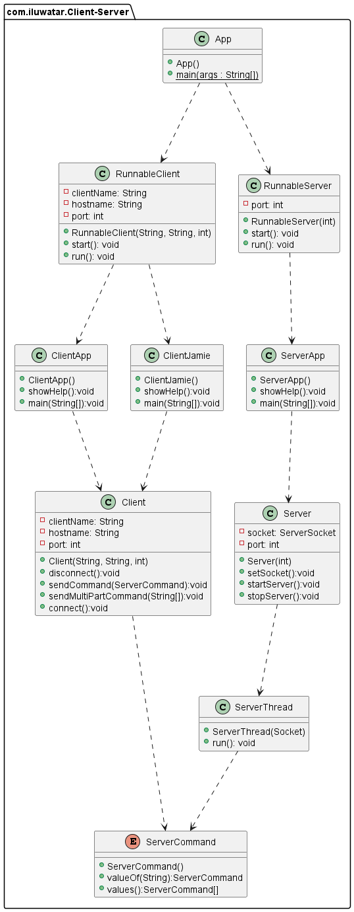

## Intent

Client-server pattern consists of two parties; a server and multiple clients. The server component will provide services to multiple client components. Clients request services from the server and the server provides relevant services to those clients.```


## Explanation

Real world example

> Email, World Wide Web, etc.

In plain words

> Server dispatch resources and clients request them.

Wikipedia says

> **Client–server model** is a [distributed application](https://en.wikipedia.org/wiki/Distributed_application) structure that partitions tasks or workloads between the providers of a resource or service, called servers, and service requesters, called clients. Often clients and servers communicate over a computer network on separate hardware, but both client and server may reside in the same system. A server [host](https://en.wikipedia.org/wiki/Host_(network)) runs one or more server programs, which share their resources with clients. A client usually does not share any of its resources, but it requests content or service from a server. 

## Model diagram



## Applicability

Use the Client-Server pattern when

* A server may receive requests from many distinct clients in a short period of time.
* a service is an abstraction of computer resources and a client does not have to be concerned with how the server performs while fulfilling the request and delivering the response.

## Real world examples

* java.net.ServerSocket
* java.net.Socket


## Consequences

* Clients are prone to viruses, Trojans and worms if present in the Server or uploaded into the Server.
* Server are prone to Denial of Service (DOS) attacks.
* Data packets may be spoofed or modified during transmission.
* Phishing or capturing login credentials or other useful information of the user are common and MITM(Man in the Middle) attacks are common.

## Credits

* [Client-Server Model](https://www.geeksforgeeks.org/client-server-model/)
* [Head First Design Patterns: A Brain-Friendly Guide](https://www.amazon.com/gp/product/0596007124/ref=as_li_tl?ie=UTF8&camp=1789&creative=9325&creativeASIN=0596007124&linkCode=as2&tag=javadesignpat-20&linkId=6b8b6eea86021af6c8e3cd3fc382cb5b)
