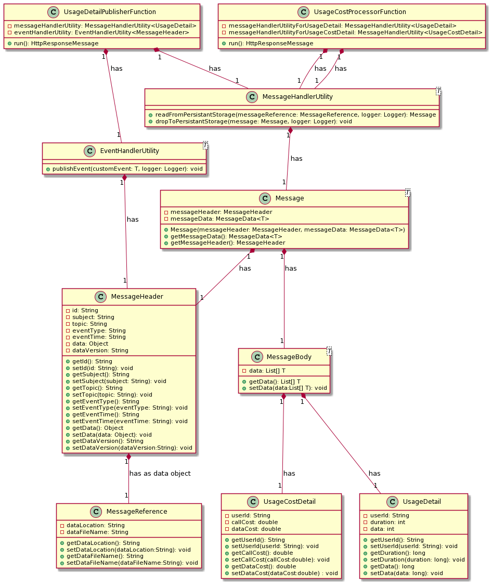

## Name

[Claim Check Pattern](https://docs.microsoft.com/en-us/azure/architecture/patterns/claim-check)

## Also known as

[Reference-Based Messaging](https://www.enterpriseintegrationpatterns.com/patterns/messaging/StoreInLibrary.html)

## Intent

- Reduce the load of data transfer through the Internet. Instead of sending actual data directly, just send the message reference.
- Improve data security. As only message reference is shared, no data is exposed to the Internet.

## Explanation

Real-World Example

> Suppose if you want to build a photo processing system. A photo processing system takes an image as input, processes it, and outputs a different set of images. Consider system has one persistent storage, one input component, ten processing components, messaging platform. Once a photo is given to the input component, it stores that image on persistent storage. It then creates ten different messages/events with the same image location and publishes them to the messaging platform. The messaging platform triggers ten different processing components. The ten processing components extract information about image location from the received event and then read an image from persistent storage. They generate ten different images from the original image and drop these images again to persistent storage.

In Plain words

> Split a large message into a claim check and a payload. Send the claim check to the messaging platform and store the payload to an external service. This pattern allows large messages to be processed while protecting the message bus and the client from being overwhelmed or slowed down. This pattern also helps to reduce costs, as storage is usually cheaper than resource units used by the messaging platform.([ref](https://docs.microsoft.com/en-us/azure/architecture/patterns/claim-check))

## Architecture Diagram

## Applicability

Use the Claim Check Pattern when

- Huge processing data causes a lot of bandwidth consumption to transfer data through the Internet.
- To secure your data transfer by storing in common persistent storage.
- Using a cloud platform - Azure Functions or AWS Lambda, Azure EventGrid or AWS Event Bridge, Azure Blob Storage or AWS S3 Bucket.
- Each service must be independent and idempotent. Output data is dropped to persistent storage by the service.
- Publish-subscribe messaging pattern needs to be used.

## Consequences

- This pattern is stateless. Any compute API will not store any data.
- You must have persistent storage and a reliable messaging platform.

## Tutorials

### Workflow

Suppose a telecom company wants to build call cost calculator system which generate the call cost daily. At the end of each day, details of the calls made by the consumers are stored somewhere. The call calculator system will read this data and generate call cost data for each user. Consumers will be billed using this generated data in case of postpaid service.

Producer class( `UsageDetailPublisherFunction` Azure Function) will generate call usage details (here we are generating call data in producer class itself. In real world scenario, it will read from storage). `UsageDetailPublisherFunction` creates a message. Message consists of message header and message body. Message header is basically an event grid event or claim or message reference. Message body contains actual data. `UsageDetailPublisherFunction` sends a message header to Event Grid topic `usage-detail` and drops an entire message to the blob storage. Event Grid then sent this message header to the `UsageCostProcessorFunction` Azure function. It will read the entire message from blob storage with the help of the header, will calculate call cost and drop the result to the blob storage.

### Class Diagrams

### Setup

- Any operating system can be used macOS, Windows, Linux as everything is deployed on Azure.
- Install Java JDK 11 and set up Java environmental variables.
- Install Git.
- Install Visual Studio Code.
- Install [ Azure Functions extension](https://marketplace.visualstudio.com/items?itemName=ms-azuretools.vscode-azurefunctions) to be able to deploy using Visual studio.

### Storage Data

The data is stored in the Azure blob storage in the container `callusageapp`. For every trigger, one GUID is created. Under the `GUID folder`, 2 files will be created `input.json` and `output.json`.
`Input.json` is dropped `producer` azure function which contains call usage details.` Output.json` contains call cost details which are dropped by the `consumer` azure function.

## Credits

- [Messaging Pattern - Claim Check](https://www.enterpriseintegrationpatterns.com/patterns/messaging/StoreInLibrary.html)
- [Azure Architecture Pattern - Claim Check Pattern](https://docs.microsoft.com/en-us/azure/architecture/patterns/claim-check)
