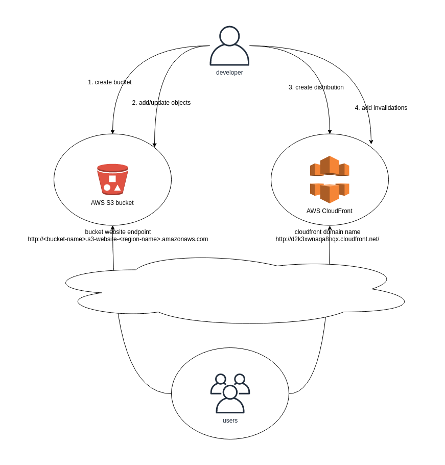

## Intent

Deploy static content to a cloud-based storage service that can deliver them directly to the client. 
This can reduce the need for potentially expensive compute instances.

## Explanation

Real world example

> A global marketing web site with static content needs to be quickly deployed to start attracting
> potential customers. To keep the hosting expenses and maintenance minimum, a cloud hosted storage 
> service along with content delivery network is used.

In plain words

> Static Content Hosting pattern utilizes cloud native storage service to store the content and
> global content delivery network to cache it in multiple data centers around the world.
> 
> On a static website, individual webpages include static content. They might also contain 
> client-side scripts such as Javascript. By contrast, a dynamic website relies on server-side 
> processing, including server-side scripts such as PHP, JSP, or ASP.NET.

Wikipedia says

> A static web page (sometimes called a flat page or a stationary page) is a web page that is 
> delivered to the user's web browser exactly as stored, in contrast to dynamic web pages which are 
> generated by a web application.
> 
> Static web pages are suitable for content that never or rarely needs to be updated, though modern 
> web template systems are changing this. Maintaining large numbers of static pages as files can be 
> impractical without automated tools, such as static site generators.

**Example**



In this example we create a static web site using AWS S3 and utilize AWS Cloudfront to distribute
the content globally.

1. First you will need an AWS account. You can create a free one here: [AWS Free Tier](https://aws.amazon.com/free/free-tier/)

2. Login to the [AWS Console](https://console.aws.amazon.com/console/home?nc2=h_ct&src=header-signin)

3. Go to Identity and Access Management (IAM) service.

4. Create IAM user that has only the necessary rights for this application.

   * Click `Users`
   * Click `Add user`. Choose `User name` as you wish and `Access type` should be `Programmatic access`. Click `Next: Permissions`.
   * Choose `Attach existing policies directly`. Select `AmazonS3FullAccess` and `CloudFrontFullAccess`. Click `Next: Tags`.
   * No tags are necessarily needed, so just click `Next: Review`.
   * Review the presented information and if all seems good click `Create user`.
   * You are presented with `Access key ID` and `Secret access key` which you will need to complete this example, so store them safely.
   * Click `Close`.

5. [Install AWS Command Line Interface (AWS CLI)](https://docs.aws.amazon.com/cli/latest/userguide/install-cliv1.html) to gain programmic access to AWS cloud.

6. Configure AWS CLI with command `aws configure` as desribed in the [instructions](https://docs.aws.amazon.com/cli/latest/userguide/cli-configure-quickstart.html#cli-configure-quickstart-config)

7. Create AWS S3 bucket for the web site content. Note that the S3 bucket names must be globally unique.

   * The syntax is `aws s3 mb <bucket name>` as described in the [instructions](https://docs.aws.amazon.com/cli/latest/userguide/cli-services-s3-commands.html#using-s3-commands-managing-buckets-creating)
   * For example `aws s3 mb s3://my-static-website-jh34jsjmg`
   * Verify that the bucket was successfully created with command `aws s3 ls` which list the existing buckets

8. Configure the bucket as a web site with command `aws s3 website` as described in the [instructions](https://docs.aws.amazon.com/cli/latest/reference/s3/website.html).

   * E.g. `aws s3 website s3://my-static-website-jh34jsjmg --index-document index.html --error-document error.html`

9. Upload content to the bucket.

   * First create the content, at least `index.html` and `error.html` documents.
   * Upload the content to your bucket as described [here](https://docs.aws.amazon.com/cli/latest/userguide/cli-services-s3-commands.html#using-s3-commands-managing-objects-copy)
   * E.g. `aws s3 cp index.html s3://my-static-website-jh34jsjmg` and `aws s3 cp error.html s3://my-static-website-jh34jsjmg`

10. Next we need to set the bucket policy to allow read access.

    * Create `policy.json` with the following contents (note that you need to replace the bucket name with your own).

    ```json
    {
        "Version": "2012-10-17",
        "Statement": [
            {
                "Sid": "PublicReadGetObject",
                "Effect": "Allow",
                "Principal": "*",
                "Action": "s3:GetObject",
                "Resource": "arn:aws:s3:::my-static-website-jh34jsjmg/*"
            }
        ]
    }
    ```

    * Set the bucket policy according to these [instructions](https://docs.aws.amazon.com/cli/latest/reference/s3api/put-bucket-policy.html)
    * E.g. `aws s3api put-bucket-policy --bucket my-static-website-jh34jsjmg --policy file://policy.json`

11. Test the web site in your browser.

    * The web site URL format is `http://<bucket-name>.s3-website-<region-name>.amazonaws.com`
    * E.g. this web site was created in `eu-west-1` region with name `my-static-website-jh34jsjmg` so it can be accessed via url `http://my-static-website-jh34jsjmg.s3-website-eu-west-1.amazonaws.com`

12. Create CloudFormation distribution for the web site.

    * The syntax is described in [this reference](https://docs.aws.amazon.com/cli/latest/reference/cloudfront/create-distribution.html)
    * E.g. the easiest way is to call `aws cloudfront create-distribution --origin-domain-name my-static-website-jh34jsjmg.s3.amazonaws.com --default-root-object index.html`
    * There's also JSON syntax e.g. `--distribution-config file://dist-config.json` to pass distribution configuration arguments in file
    * The output of the call will show you the exact distribution settings including the generated CloudFront domain name you can use for testing e.g. `d2k3xwnaqa8nqx.cloudfront.net` 
    * CloudFormation distribution deployment takes some time, but once it's completed your web site is served from data centers all around the globe!

13. That's it! You have implemented a static web site with content distribution network serving it lightning fast all around the world.

    * To update the web site you need to update the objects in S3 bucket and invalidate the objects in the CloudFront distribution
    * To do it from AWS CLI see [this reference](https://docs.aws.amazon.com/cli/latest/reference/cloudfront/create-invalidation.html)
    * Some further development you might want to do is serve the content over https and add a domain name for your site

## Applicability

Use the Static Content Hosting pattern when you want to:

* Minimize the hosting cost for websites and applications that contain some static resources.
* Build a globally available web site with static content
* Monitor the web site traffic, bandwidth usage, costs etc.

## Typical Use Case

* Web sites with global reach
* Content produced by static web site generators
* Web sites with no dynamic content requirements

## Real world examples

* [Java Design Patterns web site](https://java-design-patterns.com)

## Credits

* [Static Content Hosting pattern](https://docs.microsoft.com/en-us/azure/architecture/patterns/static-content-hosting)
