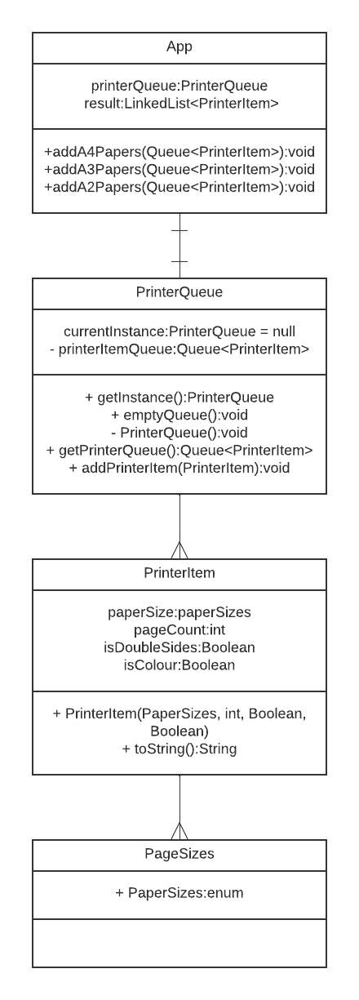

## Name / classification
Collecting Parameter

## Intent
To store the collaborative result of numerous methods within a collection.

## Explanation
### Real-world example
Joshua Kerivsky gives a real-world example in his book 'Refactoring to Patterns'. He gives an example of using the
Collecting Parameter Design Pattern to create a `toString()` method for an XML tree. Without using this design pattern,
this would require a bulky function with conditionals and concatenation that would worsen code readability. Such a method
can be broken down into smaller methods, each appending their own set of information to the collecting parameter. 

### In plain words
Instead of having one giant method that contains numerous policies for collecting information into a variable, we can
create numerous smaller functions that each take parameter, and append new information. We can pass the parameter to
all of these smaller functions and by the end, we will have what we wanted originally. This time, the code is cleaner
and easier to understand. Because the larger function has been broken down, the code is also easier to modify as changes
are localised to the smaller functions.

### Wikipedia says
In the CollectingParameter idiom a collection (list, map, etc.) is passed repeatedly as a parameter to a method which adds items to the collection.

### Programmatic example
Taking the example from Joshua Kerivsky, our `toString()` method for an XML tree may originally be:
```java
class TagNode {
public String toString() {
    String result = new String();
    result += "<" + tagName + " " + attributes + ">";
    Iterator it = children.iterator();
    while (it.hasNext()) {
        TagNode node = (TagNode) it.next();
        result += node.toString();
    }
    if (!tagValue.equals(""))
        result += tagValue;
    result += "</" + tagName + ">";
    return result;
}
}
```

Notice how this can be difficult to understand and customise. We can convert it using the Collecting Parameter design
pattern. It now looks like this,

```java
public class TagNode {
    public String toString() {
        return toStringHelper(new StringBuffer(""));
    }

    private String toStringHelper(StringBuffer result) {
        writeOpenTagTo(result);
        writeChildrenTo(result);
        writeValueTo(result);
        writeEndTagTo(result);
        return result.toString();
    }

    private void writeOpenTagTo(StringBuffer result) {
        result.append("<");
        result.append(name);
        result.append(attributes.toString());
        result.append(">");
    }

    private void writeChildrenTo(StringBuffer result) {
        Iterator it = children.iterator();
        while (it.hasNext()) {
            TagNode node = (TagNode) it.next();
            node.toStringHelper(result);
        }
    }

    private void writeValueTo(StringBuffer result) {
        if (!value.equals(""))
            result.append(value);
    }

    private void writeEndTagTo(StringBuffer result) {
        result.append("</");
        result.append(name);
        result.append(">");
    }
}
```

Notice how the `toString()` method has essentially been broken down into five functions. Each function takes a collecting
parameter, `result` in this case, and appends to this string. The result is the same, however, the code is easier to understand
and maintain.

## Class diagram


## Applicability
Use the Collecting Parameter design pattern when
- you want to return a collection or object that is the collaborative result of several methods
- You want to simplify a method that accumulates data as the original method is too complex

## Tutorials
Tutorials for this method are found in:
- 'Refactoring to Patterns' by Joshua Kerivsky
- 'Smalltalk Best Practice Patterns' by Kent Beck

## Consequences
Pros:
- Makes code more readable
- Avoids 'linkages', where numerous methods reference the same global variable
- Increases maintainability by decomposing larger functions

Cons:
- May increase code length
- Adds 'layers' of methods

## Related patterns
Compose Method design pattern

## Credits
Following books were used:
- 'Refactoring to Patterns' by Joshua Kerivsky
- 'Smalltalk Best Practice Patterns' by Kent Beck