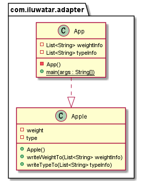

## Intent
A Collecting Parameter is an object that you pass to methods in order to collect information from those methods. This pattern is often coupled with Composed Method

In the CollectingParameter idiom a collection (list, map, etc.) is passed repeatedly as a parameter to a method which adds items to the collection.

## Explanation

Real world example

> Consider that You have a single bulky method that accumulates information to a local variable.
> A Collecting Parameter may also be passed to methods on multiple objects
> Collecting parameter pattern lets you make the accumulating method into some simple method.

Wikipedia says

**Programmatic Example**

Consider that we need to collect information of a group of apples.

First we have class `Apple` with weight and name information

```java
public class Apple {
  int weight;
  String type;

  public Apple(int weight, String type) {
    this.weight = weight;
    this.type = type;
  }
}
```

If we do not use collecting parameter pattern, we should use a bulky method to get the information of the apples.

```java
public class App {

  public static void main(String[] args) {
    List<Apple> apples = new ArrayList<>();

    apples.add(new Apple(10, "a"));
    apples.add(new Apple(20, "b"));
    apples.add(new Apple(15, "c"));

    StringBuilder result = new StringBuilder();
    for(Apple iter : apples) {
      result.append("apple weight: ");
      result.append(iter.weight);
      result.append(" \n");
    }
  }
}
```

Some times the way we want to accumulate the information in the object might be very complicated, or we want to collect information from different kinds of objects .We can use collecting parameter pattern to simplify it.

First modify the `Apple.java`:
```java
public class Apple {
  int weight;
  String type;

  public Apple(int weight, String type) {
    this.weight = weight;
    this.type = type;
  }

  public void writeWeightTo(List<String> weightInfo) {
    String appleWeight = "apple weight: " + weight + " \n";
    weightInfo.add(appleWeight);
  }

  public void writeTypeTo(List<String> typeInfo) {
    String appleType = "apple type: " + type + " \n";
    typeInfo.add(appleType);
  }
}
```

And now we can accumulate the information in targets easier by passing an object to their collecting methods.

```java
public class App {
  /**
   * Program entry point.
   *
   * @param args command line args
   */
  public static void main(String[] args) {
    List<Apple> apples = new ArrayList<>();

    apples.add(new Apple(10, "a"));
    apples.add(new Apple(20, "b"));
    apples.add(new Apple(15, "c"));

    collectType(apples);
    collectWeight(apples);
  }

  /**
   * collect the Apple weight information by throwing weightInfo to apples.
   *
   * @param apples the apple list need to collect information from
   */
  public static void collectWeight(List<Apple> apples) {
    List<String> weightInfo = new ArrayList<>();
    for (Apple apple : apples) {
      apple.writeWeightTo(weightInfo);
    }
    for (String message : weightInfo) {
      LOGGER.info(message);
    }
  }

  /**
   * collect the Apple type information by throwing typeInfo to apples.
   *
   * @param apples the apple list need to collect information from
   */
  public static void collectType(List<Apple> apples) {
    List<String> typeInfo = new ArrayList<>();
    for (Apple apple : apples) {
      apple.writeTypeTo(typeInfo);
    }
    for (String message : typeInfo) {
      LOGGER.info(message);
    }
  }
}


```

## Class diagram


## Applicability
Use the collecting parameter pattern when

* You have a single bulky method that accumulates information to a local variable
## Consequences:
Collecting parameter pattern can:

*	Helps transform bulky methods into smaller, simpler methods.
*   make resulting code run faster.
## Real world examples

* [junit.framework.TestResult](http://junit.sourceforge.net/junit3.8.1/javadoc/junit/framework/TestResult.html)

## Credits

* [Design Patterns: Elements of Reusable Object-Oriented Software](https://www.amazon.com/gp/product/0201633612/ref=as_li_tl?ie=UTF8&camp=1789&creative=9325&creativeASIN=0201633612&linkCode=as2&tag=javadesignpat-20&linkId=675d49790ce11db99d90bde47f1aeb59)
* [J2EE Design Patterns](https://www.amazon.com/gp/product/0596004273/ref=as_li_tl?ie=UTF8&camp=1789&creative=9325&creativeASIN=0596004273&linkCode=as2&tag=javadesignpat-20&linkId=48d37c67fb3d845b802fa9b619ad8f31)
* [Head First Design Patterns: A Brain-Friendly Guide](https://www.amazon.com/gp/product/0596007124/ref=as_li_tl?ie=UTF8&camp=1789&creative=9325&creativeASIN=0596007124&linkCode=as2&tag=javadesignpat-20&linkId=6b8b6eea86021af6c8e3cd3fc382cb5b)
* [Refactoring to Patterns](https://www.amazon.com/gp/product/0321213351/ref=as_li_tl?ie=UTF8&camp=1789&creative=9325&creativeASIN=0321213351&linkCode=as2&tag=javadesignpat-20&linkId=2a76fcb387234bc71b1c61150b3cc3a7)
* [Collecting Parameter](http://wiki.c2.com/?CollectingParameter)