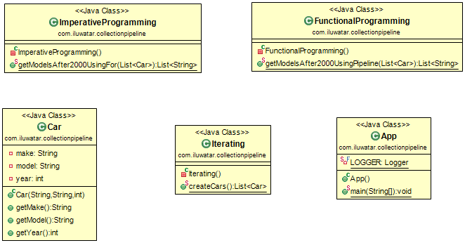

## Intent
Collection Pipeline introduces Function Composition and Collection Pipeline, two functional-style patterns that you can combine to iterate collections in your code. 
In functional programming, it's common to sequence complex operations through a series of smaller modular functions or operations. The series is called a composition of functions, or a function composition. When a collection of data flows through a function composition, it becomes a collection pipeline. Function Composition and Collection Pipeline are two design patterns frequently used in functional-style programming.

## Class diagram

## Applicability
Use the Collection Pipeline pattern when

* When you want to perform a sequence of operations where one operation's collected output is fed into the next
* When you use a lot of statements in your code
* When you use a lot of loops in your code

## Credits

* [Function composition and the Collection Pipeline pattern](https://www.ibm.com/developerworks/library/j-java8idioms2/index.html)
* [Martin Fowler](https://martinfowler.com/articles/collection-pipeline/)
* [Java8 Streams](https://docs.oracle.com/javase/8/docs/api/java/util/stream/package-summary.html)
