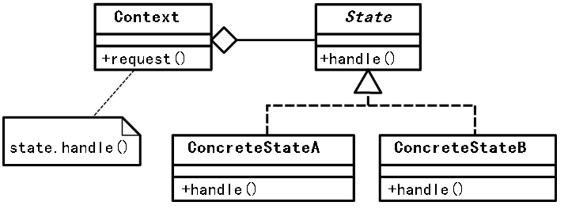

## Intent

The main intention here is to manage sequence of events of same type. For example, a Call object needs to collect all the digits to perform call routing. This will involve activities like a timer start before each digit, digit collection, timer stop at each digit collection, timeout on complete digit collection and call routing on complete digit collection.

## 

In plain words

> An object change its behavior when its internal state changes. In this case it's in collector state.

Wikipedia says

> The state pattern is a behavioral software design pattern that allows an object to alter its behavior when its internal state changes. This pattern is close to the concept of finite-state machines. The state pattern can be interpreted as a strategy pattern, which is able to switch a strategy through invocations of methods defined in the pattern's interface.

## Model diagram

## Applicability

Use the Collector-state pattern when

* An object should change its behavior when its internal state changes.
* State-specific behavior should be defined independently. That is, adding new states should not affect the behavior of existing states.

## Consequences

* The collector state pattern is used in computer programming to encapsulate varying behavior for the same object, based on its internal state. 
* This can be a cleaner way for an object to change its behavior at runtime without resorting to conditional statements and thus improve maintainability.
## Credits

* [State_pattern](https://en.wikipedia.org/wiki/State_pattern)
* [Head First Design Patterns: A Brain-Friendly Guide](https://www.amazon.com/gp/product/0596007124/ref=as_li_tl?ie=UTF8&camp=1789&creative=9325&creativeASIN=0596007124&linkCode=as2&tag=javadesignpat-20&linkId=6b8b6eea86021af6c8e3cd3fc382cb5b)
