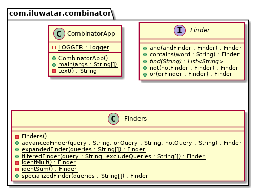

## Also known as
Composition pattern

## Intent
The functional pattern representing a style of organizing libraries centered around the idea of combining functions.  
Putting it simply, there is some type T, some functions for constructing "primitive" values of type T, 
and some "combinators" which can combine values of type T in various ways to build up more complex values of type T.

## Class diagram

## Applicability
Use the combinator pattern when:

- You are able to create a more complex value from more plain values but having the same type(a combination of them)

## Real world examples

- java.util.function.Function#compose
- java.util.function.Function#andThen

## Credits

- [Example for java](https://gtrefs.github.io/code/combinator-pattern/)
- [Combinator pattern](https://wiki.haskell.org/Combinator_pattern)
- [Combinatory logic](https://wiki.haskell.org/Combinatory_logic)
