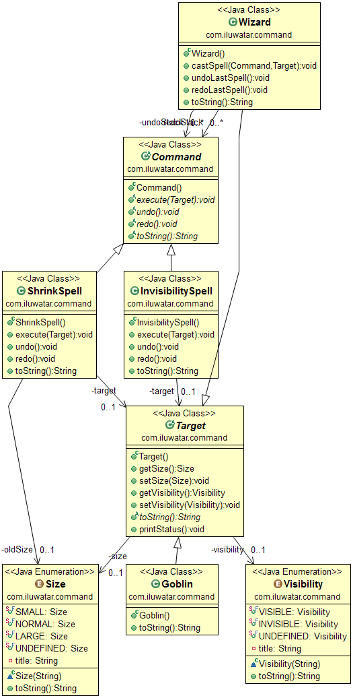

## Also known as

* Action
* Transaction

## Intent

The Command design pattern encapsulates a request as an object, thereby allowing for parameterization of clients with queues, requests, and operations. It also allows for the support of undoable operations.

## Explanation

Real-world example

> Imagine a smart home system where you can control various devices such as lights, thermostat, and security cameras through a central application. Each command to turn a device on or off, adjust temperature, or start recording is encapsulated as an object. This way, the application can queue commands, execute them in sequence, and even undo them if needed (like turning the lights back on or stopping the recording). The system thus decouples the control logic from the actual implementation of device operations, allowing for easy addition of new devices or features without altering the core application.

In plain words

> Storing requests as command objects allows performing an action or undoing it at a later time.

Wikipedia says

> In object-oriented programming, the command pattern is a behavioral design pattern in which an object is used to encapsulate all information needed to perform an action or trigger an event at a later time.

**Programmatic Example**

There is a wizard casting spells on a goblin. The spells are executed on the goblin one by one. The first spell shrinks the goblin and the second makes him invisible. Then the wizard reverses the spells one by one. Each spell here is a command object that can be undone.

Let's start from the `Wizard` class.

```java

@Slf4j
public class Wizard {

    private final Deque<Runnable> undoStack = new LinkedList<>();
    private final Deque<Runnable> redoStack = new LinkedList<>();

    public Wizard() {
    }

    public void castSpell(Runnable runnable) {
        runnable.run();
        undoStack.offerLast(runnable);
    }

    public void undoLastSpell() {
        if (!undoStack.isEmpty()) {
            var previousSpell = undoStack.pollLast();
            redoStack.offerLast(previousSpell);
            previousSpell.run();
        }
    }

    public void redoLastSpell() {
        if (!redoStack.isEmpty()) {
            var previousSpell = redoStack.pollLast();
            undoStack.offerLast(previousSpell);
            previousSpell.run();
        }
    }

    @Override
    public String toString() {
        return "Wizard";
    }
}
```

Next, we have the goblin who's the target of the spells.

```java
@Slf4j
@Getter
@Setter
public abstract class Target {

    private Size size;

    private Visibility visibility;

    /**
     * Print status.
     */
    public void printStatus() {
        LOGGER.info("{}, [size={}] [visibility={}]", this, getSize(), getVisibility());
    }

    /**
     * Changes the size of the target.
     */
    public void changeSize() {
        var oldSize = getSize() == Size.NORMAL ? Size.SMALL : Size.NORMAL;
        setSize(oldSize);
    }

    /**
     * Changes the visibility of the target.
     */
    public void changeVisibility() {
        var visible = getVisibility() == Visibility.INVISIBLE
                ? Visibility.VISIBLE : Visibility.INVISIBLE;
        setVisibility(visible);
    }
}

public class Goblin extends Target {

    public Goblin() {
        setSize(Size.NORMAL);
        setVisibility(Visibility.VISIBLE);
    }

    @Override
    public String toString() {
        return "Goblin";
    }
}
```

Finally, we have the wizard in the main function casting spells.

```java
public static void main(String[] args) {
    var wizard = new Wizard();
    var goblin = new Goblin();

    goblin.printStatus();

    wizard.castSpell(goblin::changeSize);
    goblin.printStatus();

    wizard.castSpell(goblin::changeVisibility);
    goblin.printStatus();

    wizard.undoLastSpell();
    goblin.printStatus();

    wizard.undoLastSpell();
    goblin.printStatus();

    wizard.redoLastSpell();
    goblin.printStatus();

    wizard.redoLastSpell();
    goblin.printStatus();
}
```

Here's the program output:

```
20:13:38.406 [main] INFO com.iluwatar.command.Target -- Goblin, [size=normal] [visibility=visible]
20:13:38.409 [main] INFO com.iluwatar.command.Target -- Goblin, [size=small] [visibility=visible]
20:13:38.409 [main] INFO com.iluwatar.command.Target -- Goblin, [size=small] [visibility=invisible]
20:13:38.409 [main] INFO com.iluwatar.command.Target -- Goblin, [size=small] [visibility=visible]
20:13:38.409 [main] INFO com.iluwatar.command.Target -- Goblin, [size=normal] [visibility=visible]
20:13:38.409 [main] INFO com.iluwatar.command.Target -- Goblin, [size=small] [visibility=visible]
20:13:38.409 [main] INFO com.iluwatar.command.Target -- Goblin, [size=small] [visibility=invisible]
```

## Class diagram



## Applicability

Use the Command pattern when you want to:

* Parameterize objects with actions to perform, offering an object-oriented alternative to callbacks found in procedural languages. Commands can be registered and executed later.
* Specify, queue, and execute requests at different times, allowing commands to exist independently of the original request and even be transferred across processes.
* Support undo functionality, where the Command’s execute operation stores state and includes an un-execute operation to reverse previous actions. This allows for unlimited undo and redo capabilities by maintaining a history list.
* Log changes to reapply them after a system crash. By adding load and store operations to the Command interface, you can maintain a persistent log of changes and recover by reloading and re-executing commands from this log.
* Structure a system around high-level operations built on primitive operations, which is common in transaction-based systems. The Command pattern models transactions by providing a common interface for invoking and extending operations.
* Keep a history of requests.
* Implement callback functionality.
* Implement undo functionality.

## Known uses

* GUI Buttons and menu items in desktop applications.
* Operations in database systems and transactional systems that support rollback.
* Macro recording in applications like text editors and spreadsheets.
* [java.lang.Runnable](http://docs.oracle.com/javase/8/docs/api/java/lang/Runnable.html)
* [org.junit.runners.model.Statement](https://github.com/junit-team/junit4/blob/master/src/main/java/org/junit/runners/model/Statement.java)
* [Netflix Hystrix](https://github.com/Netflix/Hystrix/wiki)
* [javax.swing.Action](http://docs.oracle.com/javase/8/docs/api/javax/swing/Action.html)

## Consequences

Benefits:

* Decouples the object that invokes the operation from the one that knows how to perform it.
* It's easy to add new Commands, because you don't have to change existing classes.
* You can assemble a set of commands into a composite command.

Trade-offs:

* Increases the number of classes for each individual command.
* Can complicate the design by adding multiple layers between senders and receivers.

## Related Patterns

* [Composite](https://java-design-patterns.com/patterns/composite/): Commands can be composed using the Composite pattern to create macro commands.
* [Memento](https://java-design-patterns.com/patterns/memento/): Can be used for implementing undo mechanisms.
* [Observer](https://java-design-patterns.com/patterns/observer/): The pattern can be observed for changes that trigger commands.

## Credits

* [Design Patterns: Elements of Reusable Object-Oriented Software](https://amzn.to/3w0pvKI)
* [Head First Design Patterns: Building Extensible and Maintainable Object-Oriented Software](https://amzn.to/49NGldq)
* [J2EE Design Patterns](https://amzn.to/4dpzgmx)
* [Pattern-Oriented Software Architecture, Volume 1: A System of Patterns](https://amzn.to/3PFUqSY)
* [Refactoring to Patterns](https://amzn.to/3VOO4F5)
