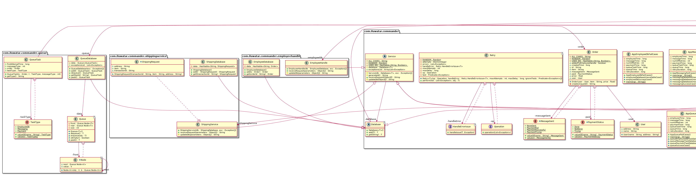

## Intent

> Used to handle all problems that can be encountered when doing distributed transactions.

## Class diagram

## Applicability
This pattern can be used when we need to make commits into 2 (or more) databases to complete transaction, which cannot be done atomically and can thereby create problems.

## Explanation
Handling distributed transactions can be tricky, but if we choose to not handle it carefully, there could be unwanted consequences. Say, we have an e-commerce website which has a Payment microservice and a Shipping microservice. If the shipping is available currently but payment service is not up, or vice versa, how would we deal with it after having already received the order from the user?
We need a mechanism in place which can handle these kinds of situations. We have to direct the order to either one of the services (in this example, shipping) and then add the order into the database of the other service (in this example, payment), since two databses cannot be updated atomically. If currently unable to do it, there should be a queue where this request can be queued, and there has to be a mechanism which allows for a failure in the queueing as well. All this needs to be done by constant retries while ensuring idempotence (even if the request is made several times, the change should only be applied once) by a commander class, to reach a state of eventual consistency.

## Credits

* [https://www.grahamlea.com/2016/08/distributed-transactions-microservices-icebergs/]
