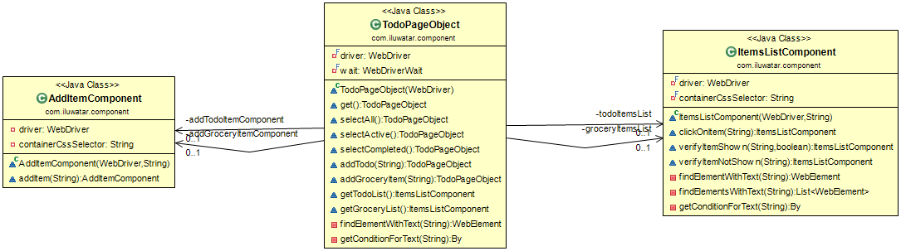

## Intent
Web development is shifting more and more towards reusable components. Frameworks like React, Polymer, Angular etc. provide various component friendly abstractions to make front-end code-bases more maintainable. So our web applications are now full of “widgets” that have same behavior. We can use component various times on single web page or re-use it on various web pages. Therefore it is logical to create abstraction which covers functionality of single component and reuse it across end-to-end tests.

## Applicability
Use the Component Object Pattern in the following situations:

* When you have various same components on single web page and you need to test the web page
* When you have multiple web pages using same component abstractions and you need to test the web pages

## Credits

* [Component Object](https://lkrnac.net/blog/2016/10/component-object-pattern-example/)
