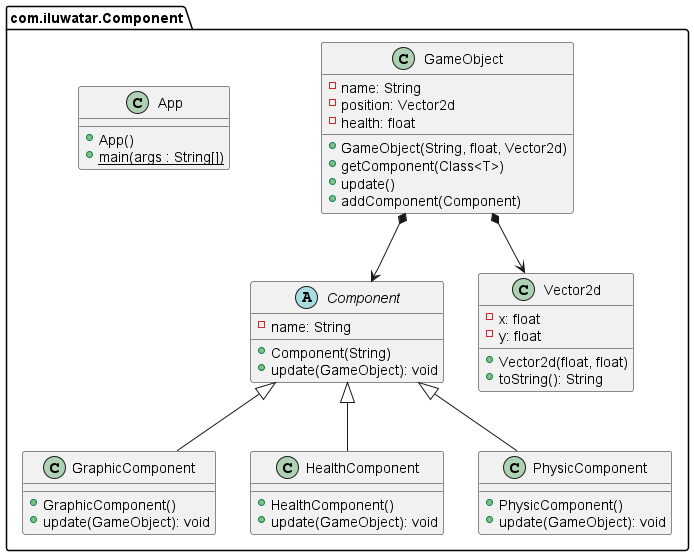

## Intent

Component Pattern decouple the domains from each other to improve the flexibility by allowing a single entity spanning multiple domains. 

## Class diagram

## Applicability

Use the Component pattern when

* you have a class that is massive and hard to work with due to it touches multiple domains, you can keep the class decoupled from each other through this pattern.
* having a core class to define the entities in game.

## Reference
* Component · Decoupling Patterns [http://gameprogrammingpatterns.com/component.html]
