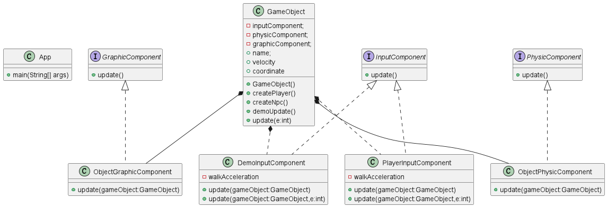

## Also known as

* Entity-Component-System (ECS)
* Component-Entity-System (CES)
* Component-Based Architecture (CBA)

## Intent

The Component design pattern aims to organize code into reusable, interchangeable components, promoting flexibility and ease of maintenance in game development by allowing entities to be configured with varying behaviors.

## Explanation

Real-world example

> Imagine your video game has a graphics component and a sound component. Combining the methods and attributes of both features into a single Java class can lead to several issues. Firstly, the resulting class could become very lengthy and difficult to maintain. Additionally, the graphics and sound components might be developed by separate teams. If both teams work on the same Java class simultaneously, it could cause conflicts and significant delays. By using the Component design pattern, the development team can create separate component classes for graphics and sound, while still allowing the main game object to access both sets of attributes.

In plain words

> The component design pattern provides a single attribute to be accessible by numerous objects without requiring the existence of a relationship between the objects themselves.

**Programmatic Example**

The `App` class creates a demonstration of the use of the component pattern by creating two different objects which inherit a small collection of individual components that are modifiable.

```java
public final class App {

    public static void main(String[] args) {
        final var player = GameObject.createPlayer();
        final var npc = GameObject.createNpc();

        LOGGER.info("Player Update:");
        player.update(KeyEvent.KEY_LOCATION_LEFT);
        LOGGER.info("NPC Update:");
        npc.demoUpdate();
    }
}
```

Much of the program exists within the `GameObject` class, within this class, the player and NPC object create methods are set up. Additionally, this class also consists of the method calls used to update/alter information of the object's components.

```java
public class GameObject {
    private final InputComponent inputComponent;
    private final PhysicComponent physicComponent;
    private final GraphicComponent graphicComponent;

    public String name;
    public int velocity = 0;
    public int coordinate = 0;

    public static GameObject createPlayer() {
        return new GameObject(new PlayerInputComponent(),
                new ObjectPhysicComponent(),
                new ObjectGraphicComponent(),
                "player");
    }

    public static GameObject createNpc() {
        return new GameObject(
                new DemoInputComponent(),
                new ObjectPhysicComponent(),
                new ObjectGraphicComponent(),
                "npc");
    }

    public void demoUpdate() {
        inputComponent.update(this);
        physicComponent.update(this);
        graphicComponent.update(this);
    }

    public void update(int e) {
        inputComponent.update(this, e);
        physicComponent.update(this);
        graphicComponent.update(this);
    }

    public void updateVelocity(int acceleration) {
        this.velocity += acceleration;
    }

    public void updateCoordinate() {
        this.coordinate += this.velocity;
    }
}
```

Upon opening the component package, the collection of components are revealed. These components provide the interface for objects to inherit these domains. The `PlayerInputComponent` class shown below updates the object's velocity characteristic based on user's key event input.

```java
public class PlayerInputComponent implements InputComponent {
    private static final int walkAcceleration = 1;

    /**
     * The update method to change the velocity based on the input key event.
     *
     * @param gameObject the gameObject instance
     * @param e          key event instance
     */
    @Override
    public void update(GameObject gameObject, int e) {
        switch (e) {
            case KeyEvent.KEY_LOCATION_LEFT -> {
                gameObject.updateVelocity(-WALK_ACCELERATION);
                LOGGER.info(gameObject.getName() + " has moved left.");
            }
            case KeyEvent.KEY_LOCATION_RIGHT -> {
                gameObject.updateVelocity(WALK_ACCELERATION);
                LOGGER.info(gameObject.getName() + " has moved right.");
            }
            default -> {
                LOGGER.info(gameObject.getName() + "'s velocity is unchanged due to the invalid input");
                gameObject.updateVelocity(0);
            } // incorrect input
        }
    }
}
```

## Class diagram



## Applicability

* Used in game development and simulations where game entities (e.g., characters, items) can have a dynamic set of abilities or states.
* Suitable for systems requiring high modularity and systems where entities might need to change behavior at runtime without inheritance hierarchies.

## Known Uses

* Game engines like Unity, Unreal Engine, and various custom engines in AAA and indie games.
* Simulation systems that require flexible, dynamic object composition.

## Consequences

Benefits:

* Flexibility and Reusability: Components can be reused across different entities, making it easier to add new features or modify existing ones.
* Decoupling: Reduces dependencies between game entity states and behaviors, facilitating easier changes and maintenance.
* Dynamic Composition: Entities can alter their behavior at runtime by adding or removing components, providing significant flexibility in game design.

Trade-offs:

* Complexity: Can introduce additional complexity in system architecture, particularly in managing dependencies and communications between components.
* Performance Considerations: Depending on implementation, may incur a performance overhead due to indirection and dynamic behavior, especially critical in high-performance game loops.

## Related Patterns

* [Decorator](https://java-design-patterns.com/patterns/decorator/): Similar concept of adding responsibilities dynamically, but without the focus on game entities.
* [Flyweight](https://java-design-patterns.com/patterns/flyweight/): Can be used in conjunction with the Component pattern to share component instances among many entities to save memory.
* [Observer](https://java-design-patterns.com/patterns/observer/): Often used in Component systems to communicate state changes between components.

## Credits

* [Game Programming Patterns](https://amzn.to/4cDRWhV)
* [Procedural Content Generation for Unity Game Development](https://amzn.to/3vBKCTp)
* [Unity in Action: Multiplatform Game Development in C#](https://amzn.to/3THO6vw)
* [Component (Game Programming Patterns)](https://gameprogrammingpatterns.com/component.html)
* [Component pattern - game programming series (Tutemic)](https://www.youtube.com/watch?v=n92GBp2WMkg&ab_channel=Tutemic)
