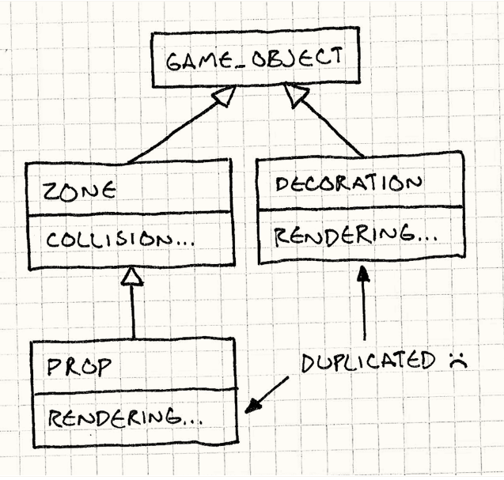

## Intent

The component design pattern enables developers to decouple attributes of an objects. Essentially allowing a single
component to be inheritable by multiple domains/objects without linking the objects to each other. In addition to this
benefit, the component design pattern allows developer to write maintainable and comprehensible code which is less
likely to result in monolithic classes.



## Explanation

Real world example
> Suppose your video game consists of a graphics component and a sound component. Including the methods and attributes of both of these features in a single java class can be problematic due to many reasons. Firstly, the graphics and sound code can create an extremely long java class which can be hard to maintain. Furthermore, graphics components may be written and implemented by a separate team as to the sound contents. If both parties work simultaneously on the same java class, this may cause conflicts and major delay. Using the component design pattern, the development team is able to create individual component classes for graphics and sound whilst providing the domain/object the reach to both of these attributes.


In plain words
> The component design pattern provides a single attribute to be accessible by numerous objects without requiring the
> existence of a relationship between the objects themselves.

Key drawback
> With the implementation of the component design pattern, it can be very difficult to create a relationship
> between components. For example, suppose we require the sound component to be aware of the current animation in order
> create a certain sound based upon the animation; this can be quite tricky as the component design pattern makes
> components 'unaware' of other components' existence due to its decoupling nature.

**Programmatic Example**

The App class creates a demonstration of the use of the component pattern by creating two different objects which
inherit a small collection of individual components that are modifiable.

```java
public final class App {
    /**
     * Program entry point.
     *
     * @param args args command line args.
     */
    public static void main(String[] args) {
        final var player = GameObject.createPlayer();
        final var npc = GameObject.createNpc();


        LOGGER.info("Player Update:");
        player.update(KeyEvent.KEY_LOCATION_LEFT);
        LOGGER.info("NPC Update:");
        npc.demoUpdate();
    }
}
```

Much of the program exists within the GameObject class, within this class, the player and NPC object create methods are
set up. Additionally, this class also consists of the method calls used to update/alter information of the object's
components.

```java
public class GameObject {
  private final InputComponent inputComponent;
  private final PhysicComponent physicComponent;
  private final GraphicComponent graphicComponent;

  public String name;
  public int velocity = 0;
  public int coordinate = 0;

  public static GameObject createPlayer() {
    return new GameObject(new PlayerInputComponent(),
        new ObjectPhysicComponent(),
        new ObjectGraphicComponent(),
        "player");
  }

  public static GameObject createNpc() {
    return new GameObject(
        new DemoInputComponent(),
        new ObjectPhysicComponent(),
        new ObjectGraphicComponent(),
        "npc");
  }

  public void demoUpdate() {
    inputComponent.update(this);
    physicComponent.update(this);
    graphicComponent.update(this);
  }

  public void update(int e) {
    inputComponent.update(this, e);
    physicComponent.update(this);
    graphicComponent.update(this);
  }

  public void updateVelocity(int acceleration) {
    this.velocity += acceleration;
  }
  
  public void updateCoordinate() {
    this.coordinate += this.velocity;
  }
}
```

Upon opening the component package, the collection of components are revealed. These components provide the interface
for objects to inherit these domains. The PlayerInputComponent class shown below updates the object's velocity
characteristic based on user's key event input.

```java
public class PlayerInputComponent implements InputComponent {
    private static final int walkAcceleration = 1;

    /**
     * The update method to change the velocity based on the input key event.
     *
     * @param gameObject the gameObject instance
     * @param e          key event instance
     */
    @Override
    public void update(GameObject gameObject, int e) {
        switch (e) {
            case KeyEvent.KEY_LOCATION_LEFT -> {
                gameObject.updateVelocity(-WALK_ACCELERATION);
                LOGGER.info(gameObject.getName() + " has moved left.");
            }
            case KeyEvent.KEY_LOCATION_RIGHT -> {
                gameObject.updateVelocity(WALK_ACCELERATION);
                LOGGER.info(gameObject.getName() + " has moved right.");
            }
            default -> {
                LOGGER.info(gameObject.getName() + "'s velocity is unchanged due to the invalid input");
                gameObject.updateVelocity(0);
            } // incorrect input
        }
    }
}
```

## Class diagram


## Applicability

Use the component design pattern when

- you have a class which access multiple features which you would like to keep separate.
- you want to reduce the length of a class.
- you require a variety of objects to share a collection of components but the use of inheritance isn't specific enough.

## Credits

- [Component Design Pattern] (https://gameprogrammingpatterns.com/component.html)
- [Component pattern - game programming series - Tutemic] (https://www.youtube.com/watch?v=n92GBp2WMkg&ab_channel=Tutemic)