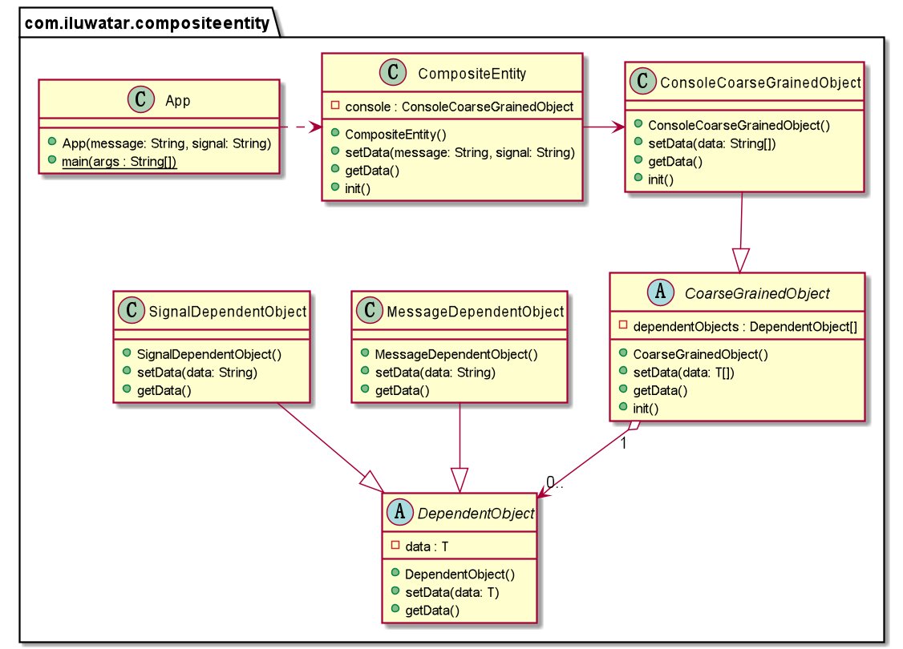

## Also known as

* Coarse-Grained Entity

## Intent

The Composite Entity design pattern is aimed at managing a set of interrelated persistent objects as if they were a single entity. It is commonly used in the context of Enterprise JavaBeans (EJB) and similar enterprise frameworks to represent graph-based data structures within business models, enabling clients to treat them as a single unit.

## Explanation

Real world example

> For a console, there may be many interfaces that need to be managed and controlled. Using the composite entity pattern, dependent objects such as messages and signals can be combined and controlled using a single object.

In plain words

> Composite entity pattern allows a set of related objects to be represented and managed by a unified object.

**Programmatic Example**

We need a generic solution for the problem. To achieve this, let's introduce a generic Composite Entity Pattern.

```java
public abstract class DependentObject<T> {

    T data;

    public void setData(T message) {
        this.data = message;
    }

    public T getData() {
        return data;
    }
}

public abstract class CoarseGrainedObject<T> {

    DependentObject<T>[] dependentObjects;

    public void setData(T... data) {
        IntStream.range(0, data.length).forEach(i -> dependentObjects[i].setData(data[i]));
    }

    public T[] getData() {
        return (T[]) Arrays.stream(dependentObjects).map(DependentObject::getData).toArray();
    }
}

```

The specialized composite entity `console` inherit from this base class as follows.

```java
public class MessageDependentObject extends DependentObject<String> {

}

public class SignalDependentObject extends DependentObject<String> {

}

public class ConsoleCoarseGrainedObject extends CoarseGrainedObject<String> {

    @Override
    public String[] getData() {
        super.getData();
        return new String[] {
                dependentObjects[0].getData(), dependentObjects[1].getData()
        };
    }

    public void init() {
        dependentObjects = new DependentObject[] {
                new MessageDependentObject(), new SignalDependentObject()};
    }
}

public class CompositeEntity {

    private final ConsoleCoarseGrainedObject console = new ConsoleCoarseGrainedObject();

    public void setData(String message, String signal) {
        console.setData(message, signal);
    }

    public String[] getData() {
        return console.getData();
    }
}
```

Now managing the assignment of message and signal objects with the composite entity `console`.

```java
var console=new CompositeEntity();
        console.init();
        console.setData("No Danger","Green Light");
        Arrays.stream(console.getData()).forEach(LOGGER::info);
        console.setData("Danger","Red Light");
        Arrays.stream(console.getData()).forEach(LOGGER::info);
```

## Class diagram



## Applicability

* Useful in enterprise applications where business objects are complex and involve various interdependent objects.
* Ideal for scenarios where clients need to work with a unified interface to a set of objects rather than individual entities.
* Applicable in systems that require a simplified view of a complex data model for external clients or services.

## Known Uses

* Enterprise applications with complex business models, particularly those using EJB or similar enterprise frameworks.
* Systems requiring abstraction over complex database schemas to simplify client interactions.
* Applications that need to enforce consistency or transactions across multiple objects in a business entity.

## Consequences

Benefits:

* Simplifies client interactions with complex entity models by providing a unified interface.
* Enhances reusability and maintainability of the business layer by decoupling client code from the complex internals of business entities.
* Facilitates easier transaction management and consistency enforcement across a set of related objects.

Trade-offs:

* May introduce a level of indirection that could impact performance.
* Can lead to overly coarse-grained interfaces that might not be as flexible for all client needs.
* Requires careful design to avoid bloated composite entities that are difficult to manage.

## Related Patterns

* [Decorator](https://java-design-patterns.com/patterns/decorator/): For dynamically adding behavior to individual objects within the composite entity without affecting the structure.
* [Facade](https://java-design-patterns.com/patterns/facade/): Provides a simplified interface to a complex subsystem, similar to how a composite entity simplifies access to a set of objects.
* [Flyweight](https://java-design-patterns.com/patterns/flyweight/): Useful for managing shared objects within a composite entity to reduce memory footprint.

## Credits

* [Composite Entity Pattern in wikipedia](https://en.wikipedia.org/wiki/Composite_entity_pattern)
* [Core J2EE Patterns: Best Practices and Design Strategies](https://amzn.to/4cAbDap)
* [Enterprise Patterns and MDA: Building Better Software with Archetype Patterns and UML](https://amzn.to/49mslqS)
* [Patterns of Enterprise Application Architecture](https://amzn.to/3xjKdpe)
