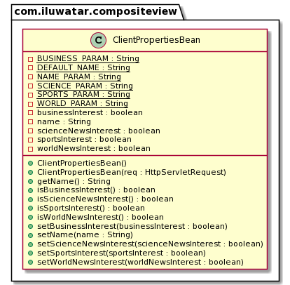

## Intent

The primary goal of the Composite View design pattern is to compose objects into tree structures to represent part-whole hierarchies. This allows clients to treat individual objects and compositions of objects uniformly, simplifying the management of complex structures.

## Explanation

Real World Example

> A news site wants to display the current date and news to different users based on that user's preferences. The news site will substitute in different news feed components depending on the user's interest, defaulting to local news.

In Plain Words

> Composite View Pattern is having a main view being composed of smaller subviews. The layout of this composite view is based on a template. A View-manager then decides which subviews to include in this template.

Wikipedia Says

> Composite views that are composed of multiple atomic subviews. Each component of the template may be included dynamically into the whole and the layout of the page may be managed independently of the content. This solution provides for the creation of a composite view based on the inclusion and substitution of modular dynamic and static template fragments. It promotes the reuse of atomic portions of the view by encouraging modular design.

**Programmatic Example**

Since this is a web development pattern, a server is required to demonstrate it. This example uses Tomcat 10.0.13 to run the servlet, and this programmatic example will only work with Tomcat 10+.

Firstly, there is `AppServlet` which is an `HttpServlet` that runs on Tomcat 10+.

```java
public class AppServlet extends HttpServlet {
    private String msgPartOne = "<h1>This Server Doesn't Support";
    private String msgPartTwo = "Requests</h1>\n"
            + "<h2>Use a GET request with boolean values for the following parameters<h2>\n"
            + "<h3>'name'</h3>\n<h3>'bus'</h3>\n<h3>'sports'</h3>\n<h3>'sci'</h3>\n<h3>'world'</h3>";

    private String destination = "newsDisplay.jsp";

    public AppServlet() {

    }

    @Override
    public void doGet(HttpServletRequest req, HttpServletResponse resp)
            throws ServletException, IOException {
        RequestDispatcher requestDispatcher = req.getRequestDispatcher(destination);
        ClientPropertiesBean reqParams = new ClientPropertiesBean(req);
        req.setAttribute("properties", reqParams);
        requestDispatcher.forward(req, resp);
    }

    @Override
    public void doPost(HttpServletRequest req, HttpServletResponse resp)
            throws ServletException, IOException {
        resp.setContentType("text/html");
        PrintWriter out = resp.getWriter();
        out.println(msgPartOne + " Post " + msgPartTwo);

    }

    @Override
    public void doDelete(HttpServletRequest req, HttpServletResponse resp)
            throws ServletException, IOException {
        resp.setContentType("text/html");
        PrintWriter out = resp.getWriter();
        out.println(msgPartOne + " Delete " + msgPartTwo);

    }

    @Override
    public void doPut(HttpServletRequest req, HttpServletResponse resp)
            throws ServletException, IOException {
        resp.setContentType("text/html");
        PrintWriter out = resp.getWriter();
        out.println(msgPartOne + " Put " + msgPartTwo);

    }
}

```

This servlet is not part of the pattern, and simply forwards GET requests to the correct JSP. PUT, POST, and DELETE requests are not supported and will simply show an error message.

The view management in this example is done via a javabean class: `ClientPropertiesBean`, which stores user preferences.

```java
public class ClientPropertiesBean implements Serializable {

    private static final String WORLD_PARAM = "world";
    private static final String SCIENCE_PARAM = "sci";
    private static final String SPORTS_PARAM = "sport";
    private static final String BUSINESS_PARAM = "bus";
    private static final String NAME_PARAM = "name";

    private static final String DEFAULT_NAME = "DEFAULT_NAME";
    private boolean worldNewsInterest;
    private boolean sportsInterest;
    private boolean businessInterest;
    private boolean scienceNewsInterest;
    private String name;

    public ClientPropertiesBean() {
        worldNewsInterest = true;
        sportsInterest = true;
        businessInterest = true;
        scienceNewsInterest = true;
        name = DEFAULT_NAME;

    }

    public ClientPropertiesBean(HttpServletRequest req) {
        worldNewsInterest = Boolean.parseBoolean(req.getParameter(WORLD_PARAM));
        sportsInterest = Boolean.parseBoolean(req.getParameter(SPORTS_PARAM));
        businessInterest = Boolean.parseBoolean(req.getParameter(BUSINESS_PARAM));
        scienceNewsInterest = Boolean.parseBoolean(req.getParameter(SCIENCE_PARAM));
        String tempName = req.getParameter(NAME_PARAM);
        if (tempName == null || tempName == "") {
            tempName = DEFAULT_NAME;
        }
        name = tempName;
    }
    // getters and setters generated by Lombok 
}
```

This javabean has a default constructor, and another that takes an `HttpServletRequest`.

This second constructor takes the request object, parses out the request parameters which contain the user preferences for different types of news.

The template for the news page is in `newsDisplay.jsp`

```html

<html>
<head>
    <style>
        h1 {
            text-align: center;
        }

        h2 {
            text-align: center;
        }

        h3 {
            text-align: center;
        }

        .centerTable {
            margin-left: auto;
            margin-right: auto;
        }

        table {
            border: 1px solid black;
        }

        tr {
            text-align: center;
        }

        td {
            text-align: center;
        }
    </style>
</head>
<body>
<%ClientPropertiesBean propertiesBean = (ClientPropertiesBean) request.getAttribute("properties");%>
<h1>Welcome <%= propertiesBean.getName()%></h1>
<jsp:include page="header.jsp"></jsp:include>
<table class="centerTable">

    <tr>
        <td></td>
        <% if(propertiesBean.isWorldNewsInterest()) { %>
        <td><%@include file="worldNews.jsp"%></td>
        <% } else { %>
        <td><%@include file="localNews.jsp"%></td>
        <% } %>
        <td></td>
    </tr>
    <tr>
        <% if(propertiesBean.isBusinessInterest()) { %>
        <td><%@include file="businessNews.jsp"%></td>
        <% } else { %>
        <td><%@include file="localNews.jsp"%></td>
        <% } %>
        <td></td>
        <% if(propertiesBean.isSportsInterest()) { %>
        <td><%@include file="sportsNews.jsp"%></td>
        <% } else { %>
        <td><%@include file="localNews.jsp"%></td>
        <% } %>
    </tr>
    <tr>
        <td></td>
        <% if(propertiesBean.isScienceNewsInterest()) { %>
        <td><%@include file="scienceNews.jsp"%></td>
        <% } else { %>
        <td><%@include file="localNews.jsp"%></td>
        <% } %>
        <td></td>
    </tr>
</table>
</body>
</html>
```

This JSP page is the template. It declares a table with three rows, with one component in the first row, two components in the second row, and one component in the third row.

The scriplets in the file are part of the view management strategy that include different atomic subviews based on the user preferences in the Javabean.

Here are two examples of the mock atomic subviews used in the composite: `businessNews.jsp`

```html

<html>
<head>
    <style>
        h2 {
            text-align: center;
        }

        table {
            border: 1px solid black;
        }

        tr {
            text-align: center;
        }

        td {
            text-align: center;
        }
    </style>
</head>
<body>
<h2>
    Generic Business News
</h2>
<table style="margin-right: auto; margin-left: auto">
    <tr>
        <td>Stock prices up across the world</td>
        <td>New tech companies to invest in</td>
    </tr>
    <tr>
        <td>Industry leaders unveil new project</td>
        <td>Price fluctuations and what they mean</td>
    </tr>
</table>
</body>
</html>
```

`localNews.jsp`

```html

<html>
<body>
<div style="text-align: center">
    <h3>
        Generic Local News
    </h3>
    <ul style="list-style-type: none">
        <li>
            Mayoral elections coming up in 2 weeks
        </li>
        <li>
            New parking meter rates downtown coming tomorrow
        </li>
        <li>
            Park renovations to finish by the next year
        </li>
        <li>
            Annual marathon sign ups available online
        </li>
    </ul>
</div>
</body>
</html>
```

The results are as such:

1) The user has put their name as `Tammy` in the request parameters and no preferences: 
2) The user has put their name as `Johnny` in the request parameters and has a preference for world, business, and science news: 

The different subviews such as `worldNews.jsp`, `businessNews.jsp`, etc. are included conditionally based on the request parameters.

**How To Use**

To try this example, make sure you have Tomcat 10+ installed. Set up your IDE to build a WAR file from the module and deploy that file to the server

IntelliJ:

Under `Run` and `edit configurations` Make sure Tomcat server is one of the run configurations. Go to the deployment tab, and make sure there is one artifact being built called `composite-view:war exploded`. If not present, add one.

Ensure that the artifact is being built from the content of the `web` directory and the compilation results of the module. Point the output of the artifact to a convenient place. Run the configuration and view the landing page, follow instructions on that page to continue.

## Class diagram



The class diagram here displays the Javabean which is the view manager. The views are JSP's held inside the web directory.

## Applicability:

Use the Composite View design pattern when:

* You want to represent part-whole hierarchies of objects.
* You expect that the composite structures might include any new components in the future.
* You want clients to be able to ignore the difference between compositions of objects and individual objects. Clients will treat all objects in the composite structure uniformly.

## Known Uses

* Graphical User Interfaces (GUIs) where widgets can contain other widgets (e.g., a window containing panels, buttons, and text fields).
* Document structures, such as the representation of tables containing rows, which in turn contain cells, all of which can be treated as elements in a unified hierarchy.

## Consequences

Benefits:

* High flexibility in adding new components: Since composites and leaf nodes are treated uniformly, it's easier to add new kinds of components.
* Simplified client code: Clients can treat composite structures and individual elements uniformly, reducing the complexity in client code.

Trade-offs:

* Overgeneralization: Designing the system might become more complex if you make everything composite, especially if your application doesn't require it.
* Difficulty in constraint enforcement: It can be harder to restrict the components of a composite to only certain types.

## Related Patterns

* [Decorator](https://java-design-patterns.com/patterns/decorator/): While Decorator is used to add responsibilities to objects, Composite is meant for building structures of objects.
* [Flyweight](https://java-design-patterns.com/patterns/flyweight/): Composite can often be combined with Flyweight to implement shared leaf nodes in a composite structure, reducing the memory footprint.
* [Chain of Responsibility](https://java-design-patterns.com/patterns/chain-of-responsibility/): Can be used with Composite to let components pass requests through the hierarchy.
* [Composite](https://java-design-patterns.com/patterns/composite/)
* [View Helper](https://www.oracle.com/java/technologies/viewhelper.html)

## Credits

* [Core J2EE Patterns - Composite View](https://www.oracle.com/java/technologies/composite-view.html)
* [Composite View Design Pattern – Core J2EE Patterns](https://www.dineshonjava.com/composite-view-design-pattern/)
* [Patterns of Enterprise Application Architecture](https://amzn.to/49jpQG3)
* [Head First Design Patterns: Building Extensible and Maintainable Object-Oriented Software](https://amzn.to/3xfntGJ)
