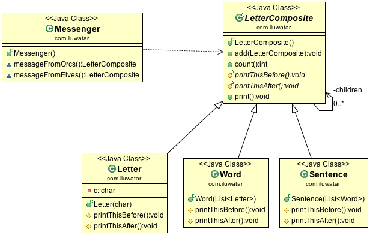

**Intent:** Compose objects into tree structures to represent part-whole
hierarchies. Composite lets clients treat individual objects and compositions
of objects uniformly.

**Applicability:** Use the Composite pattern when

* you want to represent part-whole hierarchies of objects
* you want clients to be able to ignore the difference between compositions of objects and individual objects. Clients will treat all objects in the composite structure uniformly

**Real world examples:**

* [java.awt.Container](http://docs.oracle.com/javase/8/docs/api/java/awt/Container.html) and [java.awt.Component](http://docs.oracle.com/javase/8/docs/api/java/awt/Component.html)
* [Apache Wicket](https://github.com/apache/wicket) component tree, see [Component](https://github.com/apache/wicket/blob/91e154702ab1ff3481ef6cbb04c6044814b7e130/wicket-core/src/main/java/org/apache/wicket/Component.java) and [MarkupContainer](https://github.com/apache/wicket/blob/b60ec64d0b50a611a9549809c9ab216f0ffa3ae3/wicket-core/src/main/java/org/apache/wicket/MarkupContainer.java)
