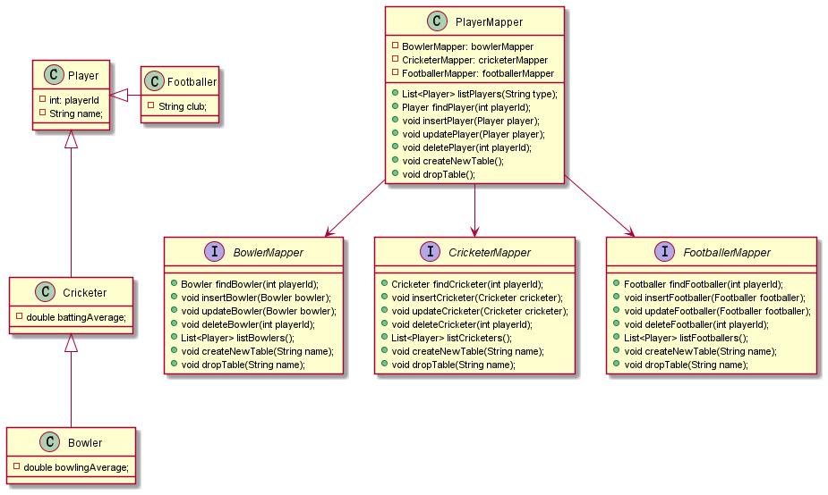

## Name
Concrete Table Inheritance
## Also known as
Leaf Table Inheritance
## Intent
Relational databases do not support inheritance relationships between tables. But by using classes to represent tables, we can create a hierarchy of tables.

## Explanation

In plain words

> It uses a concrete java class to represent a database table.

**Programmatic Example**

We have three tables, **bowler**, **cricketer**, and **footballer**. We extract same columns from these tables and create an inheritance hierarchy. We have four java classes, **Bowler**, **Cricketer**, **Footballer**, and **Player**, using an inheritance relationship to represent those tables.

## Class diagram

## Applicability
Use the Concrete-Table-Inheritance pattern when

* figuring out how to map inheritance.
 