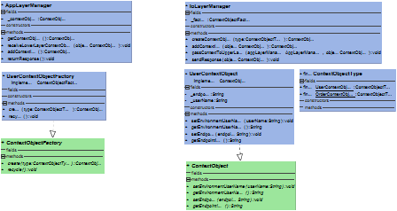

## Also known as

* Context
* Context Encapsulation
* Context Holder
* Encapsulate Context

## Intent

Encapsulate the context (state and behaviors) relevant to the user or the request being processed in order to decouple application components from the complexities of the environment.

## Explanation

Real-world example

> Imagine a busy airport where multiple services need to access and share passenger information throughout their journey. Instead of each service requesting and passing passenger details separately, the airport uses a "Passenger Context Object." This context object holds all relevant passenger information, such as identity, flight details, and preferences. Various services like check-in, security, boarding, and customer service access this context object to get or update passenger data as needed. This approach ensures consistent and efficient information handling without tightly coupling the services, similar to how the Context Object design pattern works in software.

In plain words

> Create an object to store the context data and pass it where needed.

[Core J2EE Patterns](http://corej2eepatterns.com/ContextObject.htm) says

> Use a Context Object to encapsulate state in a protocol-independent way to be shared throughout your application.

**Programmatic Example**

This application has different layers labelled A, B and C with each extracting specific information from a similar context for further use in the software. Passing down each pieces of information individually would be inefficient, a method to efficiently store and pass information is needed.

Define the data that the service context object contains.

```Java
@Getter
@Setter
public class ServiceContext {

    String accountService;
    String sessionService;
    String searchService;
}
```

Create an interface used in parts of the application for context objects to be created.

```Java
public class ServiceContextFactory {

    public static ServiceContext createContext() {
        return new ServiceContext();
    }
}
```

Instantiate the context object in the first layer. The adjoining layer calls the context in the current layer, which then further structures the object.

```Java
@Getter
public class LayerA {

    private static ServiceContext context;

    public LayerA() {
        context = ServiceContextFactory.createContext();
    }

    public void addAccountInfo(String accountService) {
        context.setACCOUNT_SERVICE(accountService);
    }
}

@Getter
public class LayerB {

    private static ServiceContext context;

    public LayerB(LayerA layerA) {
        this.context = layerA.getContext();
    }

    public void addSessionInfo(String sessionService) {
        context.setSESSION_SERVICE(sessionService);
    }
}

@Getter
public class LayerC {

    public static ServiceContext context;

    public LayerC(LayerB layerB) {
        this.context = layerB.getContext();
    }

    public void addSearchInfo(String searchService) {
        context.setSEARCH_SERVICE(searchService);
    }
}
```

Here is the context object and layers in action.

```Java
@Slf4j
public class App {

    private static final String SERVICE = "SERVICE";

    public static void main(String[] args) {
        //Initiate first layer and add service information into context
        var layerA = new LayerA();
        layerA.addAccountInfo(SERVICE);

        logContext(layerA.getContext());

        //Initiate second layer and preserving information retrieved in first layer through passing context object
        var layerB = new LayerB(layerA);
        layerB.addSessionInfo(SERVICE);

        logContext(layerB.getContext());

        //Initiate third layer and preserving information retrieved in first and second layer through passing context object
        var layerC = new LayerC(layerB);
        layerC.addSearchInfo(SERVICE);

        logContext(layerC.getContext());
    }

    private static void logContext(ServiceContext context) {
        LOGGER.info("Context = {}", context);
    }
}
```

Program output:

```
08:15:32.134 [main] INFO com.iluwatar.context.object.App -- Context = com.iluwatar.context.object.ServiceContext@5577140b
08:15:32.136 [main] INFO com.iluwatar.context.object.App -- Context = com.iluwatar.context.object.ServiceContext@5577140b
08:15:32.137 [main] INFO com.iluwatar.context.object.App -- Context = com.iluwatar.context.object.ServiceContext@5577140b
```

## Class diagram



## Applicability

* When there is a need to abstract and encapsulate context information from different parts of an application to avoid cluttering the business logic with environment-specific code.
* In web applications, to encapsulate request-specific information and make it easily accessible throughout the application without passing it explicitly between functions or components.
* In distributed systems, to encapsulate contextual information about the task being performed, user preferences, or security credentials, facilitating their propagation across different components and services.

## Known uses

* Web application frameworks often implement a Context Object to encapsulate HTTP request and response objects, session information, and other request-specific data.
* Enterprise applications use Context Objects to manage and propagate transactional information, security credentials, and user-specific settings across different layers and services.
* [Spring: ApplicationContext](https://docs.spring.io/spring-framework/docs/current/javadoc-api/org/springframework/context/ApplicationContext.html)
* [Oracle: SecurityContext](https://docs.oracle.com/javaee/7/api/javax/ws/rs/core/SecurityContext.html)
* [Oracle: ServletContext](https://docs.oracle.com/javaee/6/api/javax/servlet/ServletContext.html)

## Consequences

Benefits:

* Decoupling: Components and services are decoupled from the specificities of the execution environment, enhancing modularity and maintainability.
* Centralization: Contextual information is centralized in one place, making it easier to manage, access, and debug.
* Flexibility: The pattern allows for flexible and dynamic context management, which can adapt to changes in the environment or requirements.

Trade-offs:

* Overhead: Introducing a Context Object can add overhead in terms of performance, especially if not implemented efficiently.
* Complexity: If the Context Object is not well-designed, it can become a bloated and complex monolith, difficult to manage and understand.

## Related Patterns

* [Singleton](https://java-design-patterns.com/patterns/singleton/): The Context Object is often implemented as a Singleton to ensure a global point of access.
* [Strategy](https://java-design-patterns.com/patterns/strategy/): Context Objects can use Strategies to adapt their behavior based on the context they encapsulate.
* [Decorator](https://java-design-patterns.com/patterns/decorator/): Can be used to dynamically add responsibilities to the Context Object.

## Credits

* [Core J2EE Design Patterns](https://amzn.to/3IhcY9w)
* [Context Object (Core J2EE Patterns)](http://corej2eepatterns.com/ContextObject.htm)
* [The Encapsulate Context Pattern (Accu)](https://accu.org/journals/overload/12/63/kelly_246/)
* [Context Object - A Design Pattern for Efficient Information Sharing across Multiple System Layers (Arvid S. Krishna et al.)](https://www.dre.vanderbilt.edu/~schmidt/PDF/Context-Object-Pattern.pdf)
