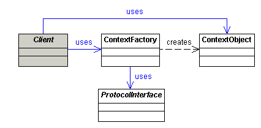

**Intent:** t's purpose is to decouple, as much as possible,
application data and logic from protocol/presentation-technology
specific classes such as HttpSession and HttpRequest.

**Applicability:** Use the Context-object pattern when

* you want to avoid using protocol-specific system information outside of its relevant context
* you want to share common information between multiple layers of your application

**Real world examples:**

* [CORBA Object Request Brokers (ORBs)](https://en.wikipedia.org/wiki/Object_request_broker)
