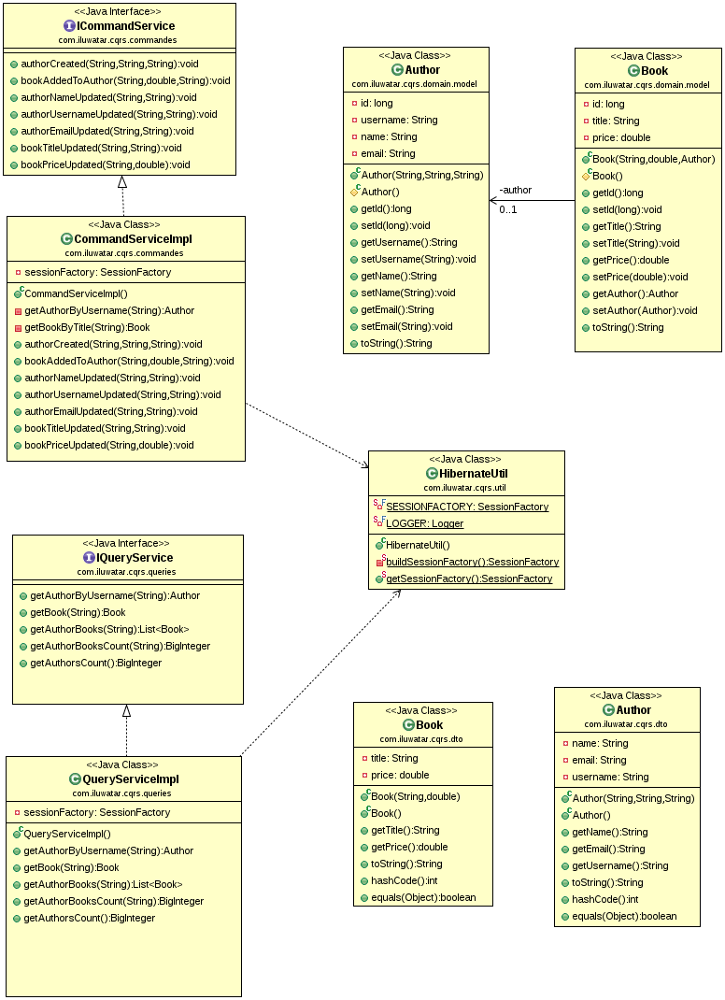

## Intent

Command Query Responsibility Segregation (CQRS) aims to segregate the operations that modify the state of an application (commands) from the operations that read the state (queries). This separation allows for more flexible and optimized designs, especially in complex systems.

## Explanation

Real world example

> Imagine a modern library where the tasks of borrowing and returning books (commands) are handled at the front desk, while the task of searching for books and reading them (queries) happens in the reading area. The front desk optimizes for transaction efficiency and record-keeping, ensuring books are properly checked in and out. Meanwhile, the reading area is optimized for comfort and accessibility, making it easy for readers to find and engage with the books. This separation improves the library's overall efficiency and user experience, much like the CQRS pattern enhances a software system's performance and maintainability.

In plain words

> The CQRS design pattern separates the actions of modifying data (commands) from the actions of retrieving data (queries) to enhance performance, scalability, and maintainability in software systems.

**Programmatic Example**

One way to implement the Command Query Responsibility Segregation (CQRS) pattern is to separate the read and write operations into different services.

1. Command Service: The `CommandServiceImpl` class is used for write operations. It provides methods to create authors and books, and to add books to authors. Here's a snippet of how it's used:

```java
var commands=new CommandServiceImpl();
        commands.authorCreated(AppConstants.E_EVANS,"Eric Evans","evans@email.com");
        commands.bookAddedToAuthor("Domain-Driven Design",60.08,AppConstants.E_EVANS);
```

2. Query Service: The `QueryServiceImpl` class is used for read operations. It provides methods to get author and book details. Here's a snippet of how it's used:

```java
var queries=new QueryServiceImpl();
        var evans=queries.getAuthorByUsername(AppConstants.E_EVANS);
        var dddBook=queries.getBook("Domain-Driven Design");
```

This separation of concerns allows for flexibility in how the application handles data access and manipulation, and is a key aspect of the CQRS pattern.

## Class diagram



## Applicability

* Systems requiring distinct models for read and write operations for scalability and maintainability.
* Complex domain models where the task of updating objects differs significantly from the task of reading object data.
* Scenarios where performance optimization for read operations is crucial, and the system can benefit from different data models or databases for reads and writes.

## Known Uses

* Distributed Systems and Microservices Architecture, where different services manage read and write responsibilities.
* Event-Sourced Systems, where changes to the application state are stored as a sequence of events.
* High-Performance Web Applications, segregating read and write databases to optimize load handling.

## Consequences

Benefits:

* Scalability: By separating read and write models, each can be scaled independently according to their specific demands.
* Optimization: Allows for the optimization of read models for query efficiency and write models for transactional integrity.
* Maintainability: Reduces complexity by separating the concerns, leading to cleaner, more maintainable code.
* Flexibility: Offers the flexibility to choose different technologies for the read and write sides according to their requirements.

Trade-Offs:

* Complexity: Introduces complexity due to synchronization between read and write models, especially in consistency maintenance.
* Overhead: Might be an overkill for simple systems where the benefits do not outweigh the additional complexity.
* Learning Curve: Requires a deeper understanding and careful design to implement effectively, increasing the initial learning curve.

## Related Patterns

* [Event Sourcing](https://java-design-patterns.com/patterns/event-sourcing/): Often used in conjunction with CQRS, where changes to the application state are stored as a sequence of events.
* Domain-Driven Design (DDD): CQRS fits well within the DDD context, providing clear boundaries and separation of concerns.
* [Repository](https://java-design-patterns.com/patterns/repository/): Can be used to abstract the data layer, providing a more seamless integration between the command and query sides.

## Credits

* [Patterns, Principles, and Practices of Domain-Driven Design](https://amzn.to/3vNV4Hm)
* [Implementing Domain-Driven Design](https://amzn.to/3TJN2HH)
* [Microsoft .NET: Architecting Applications for the Enterprise](https://amzn.to/4aktRes)
* [Greg Young - CQRS, Task Based UIs, Event Sourcing agh!](http://codebetter.com/gregyoung/2010/02/16/cqrs-task-based-uis-event-sourcing-agh/)
* [Martin Fowler - CQRS](https://martinfowler.com/bliki/CQRS.html)
* [Oliver Wolf - CQRS for Great Good](https://www.youtube.com/watch?v=Ge53swja9Dw)
* [Command and Query Responsibility Segregation (CQRS) pattern](https://docs.microsoft.com/en-us/azure/architecture/patterns/cqrs)
