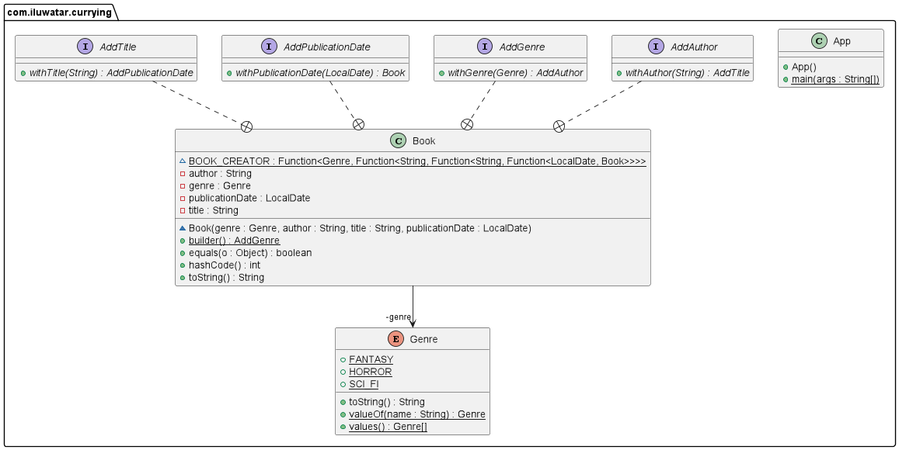

## Name / classification
Currying

## Intent
Currying decomposes a function that takes multiple arguments into a sequence of functions that each take a single argument. 
Curried functions are useful since they can be used to create new functions with lower arity to perform more specialised tasks
in a concise and readable manner. This is done via partial application.

## Explanation
Real-world example
> Consider a librarian who wants to populate their library with books. The librarian wants functions which can create 
> books corresponding to specific genres and authors. Currying makes this possible by writing a curried book builder 
> function and utilising partial application.

In plain words
> Decompose a function that take multiple arguments into multiple functions that take a single argument. 

Wikipedia says
> Currying is the technique of converting a function that takes multiple arguments into a sequence of functions that
> each take a single argument. Given a function $f:(X \times Y) \rightarrow Z$, currying constructs a new function 
> $h:X \rightarrow (Y\rightarrow Z)$. $h$ takes an argument from $X$ and returns a function which maps $Y$ to $Z$. Hence,
> $h(x)(y) = f(x, y)$.

Programmatic example  
We have a `Book` class and `Genre` enum.
```java
public class Book {
  private final Genre genre;
  private final String author;
  private final String title;
  private final LocalDate publicationDate;

  Book(Genre genre, String author, String title, LocalDate publicationDate) {
    this.genre = genre;
    this.author = author;
    this.title = title;
    this.publicationDate = publicationDate;
  }
}

public enum Genre {
  FANTASY,
  HORROR,
  SCI_FI;
}
```
We could easily create a `Book` object with the following method:
```java
Book createBook(Genre genre, String author, String title, LocalDate publicationDate) {
    return new Book(genre, author, title, publicationDate);
}
```
However, what if we only wanted to create books from the `FANTASY` genre? We could pass in the `FANTASY` parameter on each method call; however, this is repetitive. We could define a new method specifically for creating `FANTASY` books; however, it is infeasible to create a new method for each book genre. The solution is to create a curried function.
```java
static Function<Genre, Function<String, Function<String, Function<LocalDate, Book>>>> book_creator
      = genre
      -> author
      -> title
      -> publicationDate
      -> new Book(genre, author, title, publicationDate);
```
Note that the order of the parameters is important. `genre` must come before `author`, `author` must come before `title` and so on. We must be considerate of this when writing curried functions to take full advantage of partial application. Using the above function, we can define a new function `fantasyBookFunc`, to generate `FANTASY` books as follows:
```java
Function<String, Function<String, Function<LocalDate, Book>>> fantasyBookFunc = Book.book_creator.apply(Genre.FANTASY);
```
Unfortunately, the type signature of `BOOK_CREATOR` and `fantasyBookFunc` are difficult to read and understand. We can improve this by using the [builder pattern](https://java-design-patterns.com/patterns/builder/) and [functional interfaces](https://www.geeksforgeeks.org/functional-interfaces-java/#:~:text=A%20functional%20interface%20is%20an,any%20number%20of%20default%20methods). 
```java
public static AddGenre builder() {
    return genre
        -> author
        -> title
        -> publicationDate
        -> new Book(genre, author, title, publicationDate);
}

public interface AddGenre {
Book.AddAuthor withGenre(Genre genre);
}

public interface AddAuthor {
Book.AddTitle withAuthor(String author);
}

public interface AddTitle {
Book.AddPublicationDate withTitle(String title);
}

public interface AddPublicationDate {
Book withPublicationDate(LocalDate publicationDate);
}
```
The semantics of the `builder` function can easily be understood. The `builder` function returns a function `AddGenre`, which adds the genre to the book. Similarity, the `AddGenre` function returns another function `AddTitle`, which adds the title to the book and so on, until the `AddPublicationDate` function returns a `Book`. 
For example, we could create a `Book` as follows:
```java
Book book = Book.builder().withGenre(Genre.FANTAST)
        .withAuthor("Author")
        .withTitle("Title")
        .withPublicationDate(LocalDate.of(2000, 7, 2));
```
The below example demonstrates how partial application can be used with the `builder` function to create specialised book builder functions.
```java
public static void main(String[] args) {
    LOGGER.info("Librarian begins their work.");
    
    // Defining genre book functions
    Book.AddAuthor fantasyBookFunc = Book.builder().withGenre(Genre.FANTASY);
    Book.AddAuthor horrorBookFunc = Book.builder().withGenre(Genre.HORROR);
    Book.AddAuthor scifiBookFunc = Book.builder().withGenre(Genre.SCI_FI);

    // Defining author book functions
    Book.AddTitle kingFantasyBooksFunc = fantasyBookFunc.withAuthor("Stephen King");
    Book.AddTitle kingHorrorBooksFunc = horrorBookFunc.withAuthor("Stephen King");
    Book.AddTitle rowlingFantasyBooksFunc = fantasyBookFunc.withAuthor("J.K. Rowling");

    // Creates books by Stephen King (horror and fantasy genres)
    Book shining = kingHorrorBooksFunc.withTitle("The Shining")
    .withPublicationDate(LocalDate.of(1977, 1, 28));
    Book darkTower = kingFantasyBooksFunc.withTitle("The Dark Tower: Gunslinger")
    .withPublicationDate(LocalDate.of(1982, 6, 10));

    // Creates fantasy books by J.K. Rowling
    Book chamberOfSecrets = rowlingFantasyBooksFunc.withTitle("Harry Potter and the Chamber of Secrets")
    .withPublicationDate(LocalDate.of(1998, 7, 2));

    // Create sci-fi books
    Book dune = scifiBookFunc.withAuthor("Frank Herbert")
    .withTitle("Dune")
    .withPublicationDate(LocalDate.of(1965, 8, 1));
    Book foundation = scifiBookFunc.withAuthor("Isaac Asimov")
    .withTitle("Foundation")
    .withPublicationDate(LocalDate.of(1942, 5, 1));

    LOGGER.info("Stephen King Books:");
    LOGGER.info(shining.toString());
    LOGGER.info(darkTower.toString());

    LOGGER.info("J.K. Rowling Books:");
    LOGGER.info(chamberOfSecrets.toString());

    LOGGER.info("Sci-fi Books:");
    LOGGER.info(dune.toString());
    LOGGER.info(foundation.toString());
}
```
Program output:
```
Librarian begins their work.
Stephen King Books:
Book{genre=HORROR, author='Stephen King', title='The Shining', publicationDate=1977-01-28}
Book{genre=FANTASY, author='Stephen King', title='The Dark Tower: Gunslinger', publicationDate=1982-06-10}
J.K. Rowling Books:
Book{genre=FANTASY, author='J.K. Rowling', title='Harry Potter and the Chamber of Secrets', publicationDate=1998-07-02}
Sci-fi Books:
Book{genre=SCI_FI, author='Frank Herbert', title='Dune', publicationDate=1965-08-01}
Book{genre=SCI_FI, author='Isaac Asimov', title='Foundation', publicationDate=1942-05-01}
```

## Class diagram


## Applicability
A curried function which has only been passed some of its arguments is called a partial application. Partial application 
allows for the creation of functions with some pre-defined data in their scope, since partial application can be used to
create specialised functions with lower arity. This abstraction can help keep code readable and concise. Therefore, currying is useful when frequently calling functions with fixed parameters.

## Known uses
Most functional programming languages support curried functions. A popular example is [Haskell](https://www.haskell.org/), in which all functions are considered curried. 

## Consequences
Pros
* Currying allows for partial application, which can be used to create specialised functions concisely.

Cons
* The order of the parameters in a curried function is important since we want to take advantage of partial application. It is best to input the most general parameters first and input specific parameters last. 
* As shown in the programmatic example above, curried functions with several parameters have a cumbersome type signature (in Java).

## Related patterns
* [Builder patter](https://java-design-patterns.com/patterns/builder/)

## Credits
* [Currying in Java](https://www.baeldung.com/java-currying)
* [What Is Currying in Programming](https://towardsdatascience.com/what-is-currying-in-programming-56fd57103431#:~:text=Currying%20is%20helpful%20when%20you,concise%2C%20and%20more%20readable%20solution.)
* [Why the fudge should I use currying?](https://medium.com/dailyjs/why-the-fudge-should-i-use-currying-84e4000c8743)