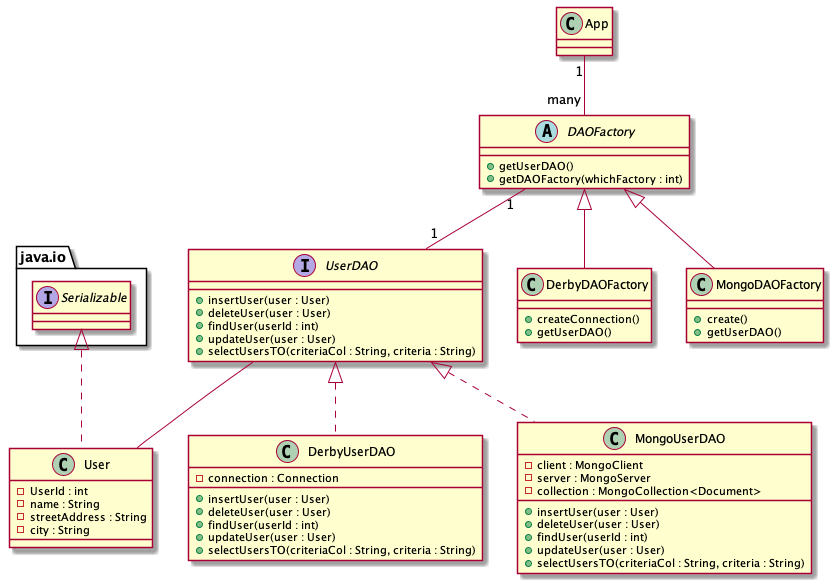

## Intent
The Dao Factory Pattern provides an abstract DAO factory object (Abstract Factory) that can construct various types of concrete DAO factories, each factory supporting a different type of persistent storage implementation. Once you obtain the concrete DAO factory for a specific implementation, you use it to produce DAOs supported and implemented in that implementation.

## Explanation

Real world example

> There are a few databases and if the implementation changes from Derby to another product, the only required change is the getDAOFactory() method call to the DAO factory to obtain a different factory.
> 

In plain words

> By using this pattern, we can switch between underlying databases.
> 
**Programmatic Example**

Walking through our example, we have User entity `User`.

```java
@Getter
@Setter
public class User implements java.io.Serializable {
    private int UserId;
    private String name;
    private String streetAddress;
    private String city;

}
```

Here's the `UserDAO` interface that all UserDAOs must support. The DAO methods for User persistent object that are implemented by all concrete DAO implementations, such as DerbyUserDao and MongoUserDao.
```java
public interface UserDAO {
  int insertUser(User user);
  boolean deleteUser(User user);
  User findUser(int newUserNo);
  boolean updateUser(User user);
  Collection selectUsersTO(String criteriaCol, String criteria);
}
```

The `DerbyUserDAO` implements the `UserDAO`.

```java
public class DerbyUserDAO implements UserDAO{
  Connection con = DerbyDAOFactory.createConnection();

  /**
   * Creates a table DERBYUSER in DerbyDB.
   */
  public DerbyUserDAO() {
    // initialization 
  }

  /**
   * Insert user to DerbyUser.
   *
   * @param user
   * @return newly created user number or -1 on error
   */
  @Override
  public int insertUser(User user) {
    ...
  }

  /**
   * Delete user in DerbyUser.
   *
   * @param user
   * @return true on success, false on failure
   */
  @Override
  public boolean deleteUser(User user) {
    ...
  }

  /**
   * Find a user in DerbyUser using userId.
   *
   * @param userId
   * @return a User Object if found, return null on error or if not found
   */
  @Override
  public User findUser(int userId) {
    ...
  }

  /**
   * Update record here using data from the User Object
   *
   * @param user
   * @return true on success, false on failure or error
   */
  @Override
  public boolean updateUser(User user) {
    ...
  }

  /**
   * Search users here using the supplied criteria.
   *
   * @param criteriaCol, criteria
   * @return Collection of users found using the criteria
   */
  @Override
  public Collection selectUsersTO(String criteriaCol, String criteria) {
    ...
}
```

This factory produces DAOs such as UserDAO. This strategy uses the Factory Method implementation in the factories produced by the Abstract Factory.
```java
public abstract class DAOFactory {
    public static final int DERBY = 1;
    public static final int MONGO = 2;

    public abstract UserDAO getUserDAO();

    /**
     * There will be a method for each DAO that can be
     * created. The concrete factories will have to
     * implement these methods.
     *
     * @return a DAOFactory
     */
    public static DAOFactory getDAOFactory(
            int whichFactory) {

        switch (whichFactory) {
            case DERBY    :
                return new DerbyDAOFactory();
            case MONGO    :
                return new MongoDAOFactory();
            default        :
                return null;
        }
    }
}

```

Here's our DerbyDAOFactory. The implementation for MongoDAOFactory is similar except for specifics of each implementation, such as JDBC driver, database URL, and differences in SQL syntax, if any.

```java
@Slf4j
public class DerbyDAOFactory extends DAOFactory {

  /**
   * method to create Derby connections
   *
   * @return a Connection
   */
  static Connection createConnection() {
    ...
  }

  /**
   * Override getUserDAO method
   *
   * @return DerbyUserDAO
   */
  @Override
  public UserDAO getUserDAO() {
    // DerbyUserDAO implements UserDAO
    return new DerbyUserDAO();
  }

}

```

Here's the full example in action.

```java
public static void main(String[] args) {
    // create the required DAO Factory
    DAOFactory derbyFactory = DAOFactory.getDAOFactory(DAOFactory.DERBY);

    // Create a DAO for Derby
    UserDAO derbyUserDAO = derbyFactory.getUserDAO();
    DerbyDAOFactory.createConnection();

    // create, update, find a customer, or search by criteria
    int userId = createUser(derbyUserDAO);
    User user = findUser(userId, derbyUserDAO);
    updateUser(user, derbyUserDAO);
    deleteUser(user, derbyUserDAO);
    String criteriaCol = "City";
    String criteria = "Seattle";
    findUserWithCriteria(derbyUserDAO, criteriaCol, criteria);

    }
```
The program output:
```java
    22:43:08.631 [main] INFO com.iluwatar.daofactory.DerbyDAOFactory - Connected to database #1
    22:43:09.132 [main] INFO com.iluwatar.daofactory.App - User Created: 4401
    22:43:09.168 [main] INFO com.iluwatar.daofactory.App - User Updated: 4401
    22:43:09.181 [main] INFO com.iluwatar.daofactory.App - User Deleted: 4401
    22:43:09.200 [main] INFO com.iluwatar.daofactory.App - Found 12 Users With City = Seattle:
    22:43:09.201 [main] INFO com.iluwatar.daofactory.App - User 1401
    22:43:09.201 [main] INFO com.iluwatar.daofactory.App - User 1501
    22:43:09.201 [main] INFO com.iluwatar.daofactory.App - User 1601```
```


## Class Diagram





## Applicability

Use the Dao Factory pattern in the following situation:

* When the underlying storage is subject to change from one implementation to another.


## Related patterns

**Transfer Object**: A DAO uses Transfer Objects to transport data to and from its clients.

**Factory Method [GoF] and Abstract Factory [GoF]**: The Factory for Data Access Objects Strategy uses the Factory Method pattern to implement the concrete factories and its products (DAOs). For added flexibility, the Abstract Factory pattern may be employed as discussed in the strategies.

**Broker [POSA1]**: The DAO pattern is related to the Broker pattern, which describes approaches for decoupling clients and servers in distributed systems. The DAO pattern more specifically applies this pattern to decouple the resource tier from clients in another tier, such as the business or presentation tier